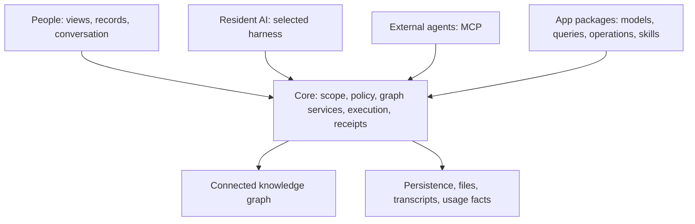

# Integral

**Give people and AI a shared place to understand work, shape software, and act together.**

A decision lives in a conversation. Its supporting facts live in a spreadsheet. The work it creates lives in another application. An AI assistant can help with each piece, yet still struggle to carry the whole thing forward.

Integral brings those pieces into one connected operational environment. People and AI work with the same records, relationships, application definitions, and permissions. A team can start with a few notes, give its work a structure, and develop that structure into an App with views, tools, skills, and governed actions.

The result is software that can grow around the work it serves.

## Start here

- [Meet Integral](docs/product/INTRODUCTION.md): a plain-language introduction to the experience and its possibilities.
- [The Integral white paper](docs/product/WHITE_PAPER.md): the extended guide to the concept, substrate, layers, and architecture of generative software.
- [Use Integral](docs/user-guide/README.md): workspaces, Apps, records, views, sharing, AI, and approvals.
- [Build an App](docs/developer/quickstart.md): from a package manifest to an installed application.
- [Explore the architecture](docs/product/ARCHITECTURE.md): implementation boundaries and current contracts.
- [Run Integral](docs/ops/DEPLOY.md): configuration, deployment, and qualification.

## What you can do

**Organize connected work.** Apps and Tracks collect typed records, link related information, attach files, and support collaboration without creating a separate data island for every workflow.

**Shape the application.** Operational Models describe record types, fields, relationships, tags, views, and reusable composition. App packages can add declared queries, operations, skills, tools, extensions, and an App Home.

**Work with a resident AI.** Ask questions grounded in accessible information, prepare changes, and review proposed actions. The default resident uses Integral's Pydantic AI harness. Core governs identity, access, execution, approvals, transcripts, and receipts around that harness.

**Connect agents and systems.** External agents use Integral's MCP surface. Connectors provide declared integration paths. Both remain subject to the relevant scope and policy; instructions alone cannot grant access.

**Keep applications separate from the foundation.** Core provides the domain-neutral substrate and extension contracts. Domain Apps, commercial packaging, pricing, checkout, and hosted offerings belong outside Core.

## Run your own Integral

With the launcher installed, run:

```bash
integral up
```

It starts a private PostgreSQL database, the API and the web interface, then opens your browser. Data and keys survive restarts. Use `integral status`, `logs`, `stop`, `backup`, `restore` and `upgrade` to manage it. The [local installation guide](docs/ops/LOCAL_INSTALLATION.md) covers the source preview, supported platforms and the future PyPI discovery command.

## Run from source

Integral is pre-1.0. The checked-in backend version is `0.1.1rc15`; a repository version does not establish that a matching package has been published. Use the frozen lock for source development.

Prerequisites: Python 3.11 or later, [uv](https://docs.astral.sh/uv/), and a Node.js version supported by the checked-in Vite release. Use the project lockfiles.

```bash
uv sync --directory backend --frozen --extra dev --extra test
./.ci/bundle_web_assets.sh
backend/.venv/bin/integral up
```

The UI build needs Node only on the source checkout. An installed wheel already contains it. The launcher creates the local database and private keys, uses production-mode auth, and opens the workspace. The [development guide](docs/developer/CONTRIBUTING.md) covers running Vite while editing the frontend.

When the launcher release and its dependencies are published, `pip install integral-core` installs the console command. Until then, use the source preview or exact reviewed wheels as described in the [installation guide](docs/ops/LOCAL_INSTALLATION.md). `integral init` creates an external App distribution; without a slug it leaves `integral-apps/` empty. `integral web` can serve the packaged UI against an independently managed API.

For a local container stack:

```bash
./scripts/bootstrap_env.sh .env .env.example
docker compose up --build -d
```

The bootstrap generates private keys including `JVSPATIAL_JWT_SECRET_KEY`. Keep `.env` private and retain those keys across upgrades. Review configuration before exposing the installation; the [deployment runbook](docs/ops/DEPLOY.md) covers containers and hosted environments.

## How it fits together



The backend uses Python, jvspatial, and FastAPI. The frontend uses React and TypeScript. Graph participants use rooted Nodes and explicit Edges; log-shaped records use Object persistence where appropriate. The [white paper](docs/product/WHITE_PAPER.md) explains why those choices matter.

## Development and quality

```bash
make verify
make verify-ci
make verify-core-only
```

`make verify` is the broad local gate. PR CI runs a narrower smoke suite with testing enabled and no developer `.env`; green local tests do not establish green CI. Read the [contributor guide](docs/developer/CONTRIBUTING.md) and [invariants](docs/INVARIANTS.md) before changing Core.

The [qualification record](docs/ops/QUALIFICATION.md) separates implementation from deployment evidence and remaining release work. Native durable chat is configuration-gated. Bounded work mandates are not a qualified public path to unattended execution.

## License

Integral Core uses [Apache 2.0](LICENSE). App packages and dependencies have their own licensing and trust requirements.
