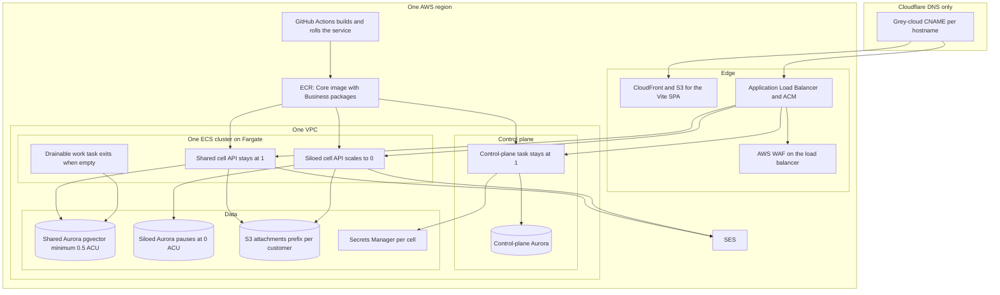
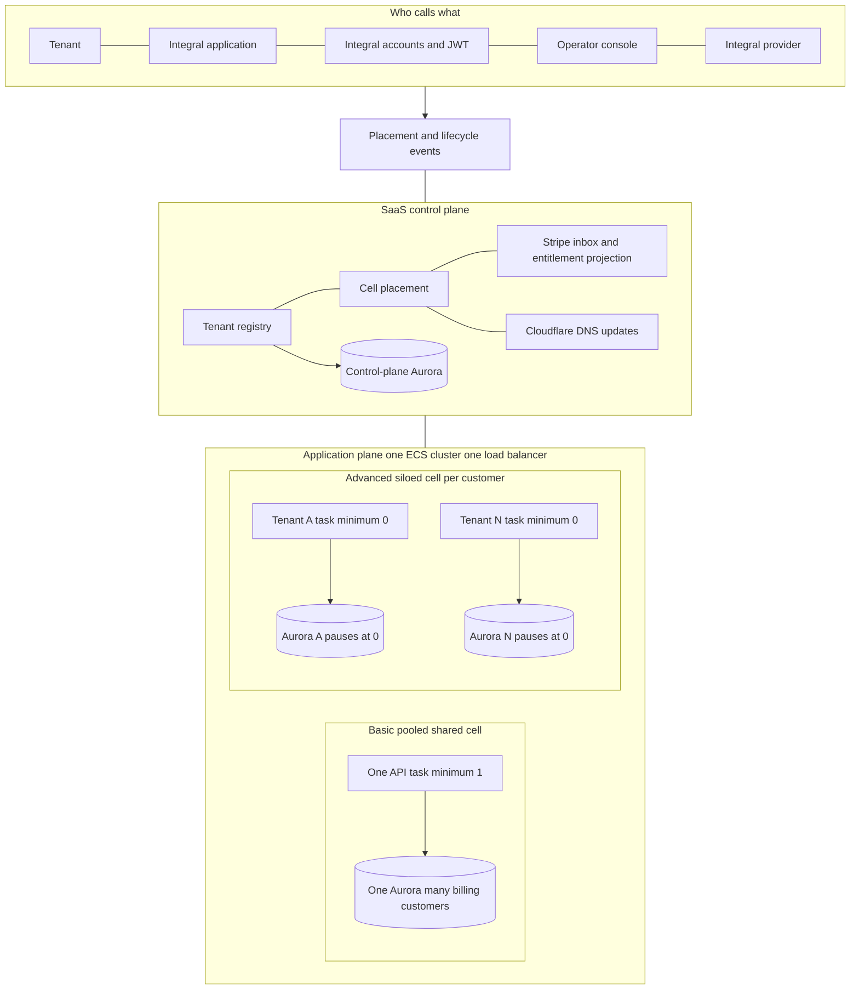
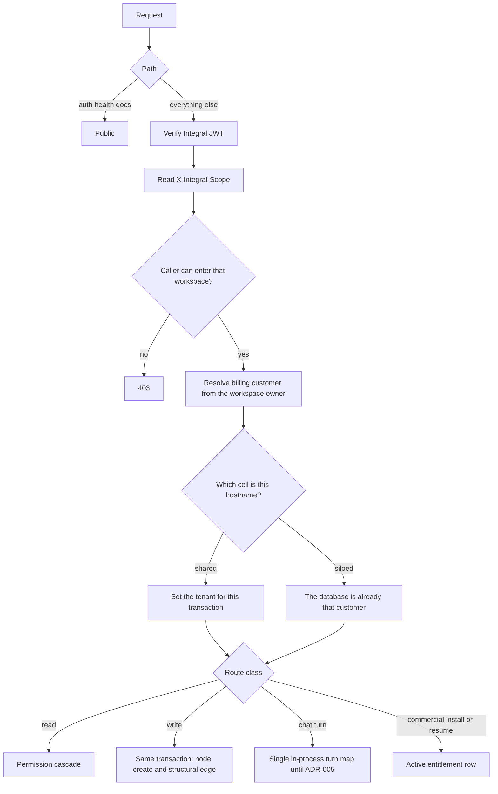
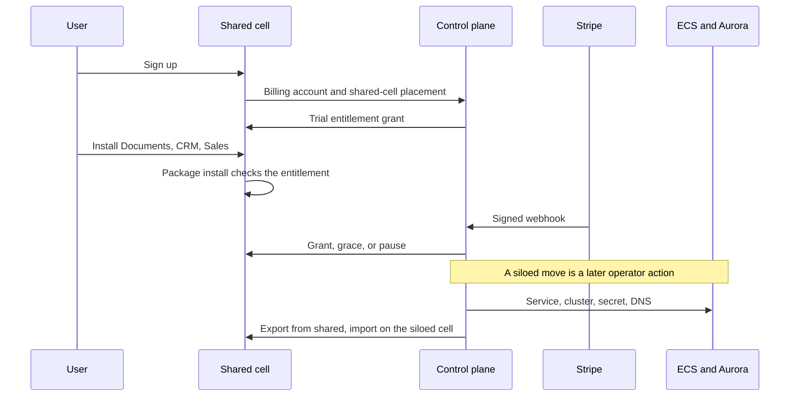
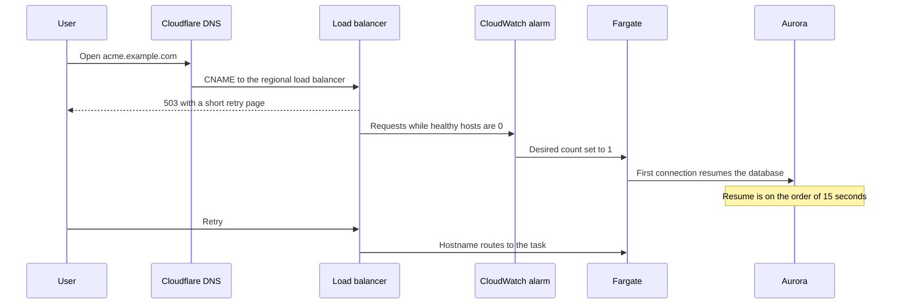

# Target architecture

**Status:** Decided
**Date:** 2026-09-25
**Decision:** Amazon ECS on Fargate. See [comparison.md](comparison.md).

The first cluster is in us-east-1. Cloudflare publishes hostnames. AWS runs
everything those hostnames point at, on one ECS cluster defined by the
CloudFormation template in [cloudformation.md](cloudformation.md). The shared
cell stays warm. A siloed cell is allowed to sleep,
and it is added when a customer needs their own database.

The diagrams follow the two sample posters: a platform flow with numbered
steps, then a control plane beside an application plane that has pooled and
siloed placement.

## Platform

### Architecture flow

1. **DNS.** Cloudflare holds CNAMEs only. `app` points at CloudFront. Each
   API hostname points at the regional load balancer. ACM validation records
   live here too. The proxy is off, so TLS terminates on AWS.
2. **Images.** GitHub Actions builds the API image with Documents, CRM, and
   Sales baked in, pushes it to ECR, and updates the ECS service. A sleeping
   cell picks up the new image the next time it starts. Tenant onboarding
   does not build an image.
3. **Placement.** The control plane records which cell a billing customer is
   on. The load balancer sends that hostname to that cell's target group.
   One wildcard certificate covers platform hostnames. A customer's own
   domain can wait.
4. **Product data.** The cell's API uses Aurora PostgreSQL with `pgvector`
   and S3. The control-plane database holds tenants, cells, and billing
   state. Customer graphs never live there.
5. **Cost.** Tag the siloed service, the Aurora cluster, and the S3 prefix
   with the billing-customer id. Read the result in Cost Explorer. A Cost
   and Usage Report into Athena is the later step, in the spirit of the EKS
   sample's cost pipeline, without a Lambda usage aggregator.

Operator access to AWS uses IAM. Product login stays Integral's own accounts
and JWT. The two directories are unrelated.

## Planes and tiers

This is the ECS sample's poster, redrawn for Integral. Basic and advanced
are real tiers. Premium, a cluster per tenant, stays off the diagram until
a contract requires an account boundary.

| ECS sample tier | Integral cell | Isolation | Idle |
| --- | --- | --- | --- |
| Basic, pooled services | Shared cell | Workspace scope today. Row-level security on the billing customer before this cell holds untrusted neighbors. | Stays warm. One sleeping task would take every customer on the cell offline, including open chat sockets. |
| Advanced, service per tenant on a shared cluster | Siloed cell | Own database, own task, own secret, own S3 prefix. Same VPC, cluster, and load balancer. | Task count 0 and Aurora minimum 0 ACU. |
| Premium, cluster per tenant | Held | Own AWS account when a contract requires a hard boundary. An own cluster inside the shared account still wants its own load balancer and NAT, which is the bill to avoid. | Same sleep rules as a siloed cell, paid on top of a second cluster. |

Self-hosted customers keep the compose bundle Integral Business already
ships. They are not a cell. License checks for commercial Apps on that
bundle are still an open product decision in the foundation doc.

## Request path

Every hosted request resolves the billing customer before it touches the
graph. A guest on a shared track still sits inside the customer who owns
that workspace.

Chat is the path that blocks a second API task. The in-flight turn map and
the websocket map are process-local. With two tasks, the same thread can
answer twice, and a staged change minted on one task never reaches a tab on
the other. Scale the hosted product by adding cells, and by making the
shared cell's database and task larger, until that shared state exists.

## Onboarding

Signup lands on the shared cell. Moving a customer to a siloed cell is an
explicit migration: dump the graph, copy the S3 prefix, and move the JWT
secret and the credential encryption key with it. Sessions and stored
connector secrets depend on those keys.

## Wake, with no Lambda

A siloed cell that is asleep has no task and no database connections. The
first visit fails, then the page retries. That is the cost of having no
function in front of the load balancer. The shared cell never takes this path.

`ActiveConnectionCount` is the idle signal, not request count alone. A quiet
websocket is still a live session. After the idle window, a second alarm
sets the desired count back to 0. Aurora pauses only once those connections
are gone. Skip RDS Proxy on a database you want to pause. A proxy keeps the
connection pattern that holds it awake.

The API has to retry Postgres during startup. A paused database can still be
resuming when the first connection attempt runs. Set the load balancer
health-check grace period longer than that cold boot. Fargate image pull
and Integral boot dominate the wait. Aurora's resume is the smaller part.

Staging and preview use a schedule instead of the first-request alarm:
EventBridge Scheduler sets the desired count to 0 outside working hours and
back to 1 before them. That path also uses no Lambda.
