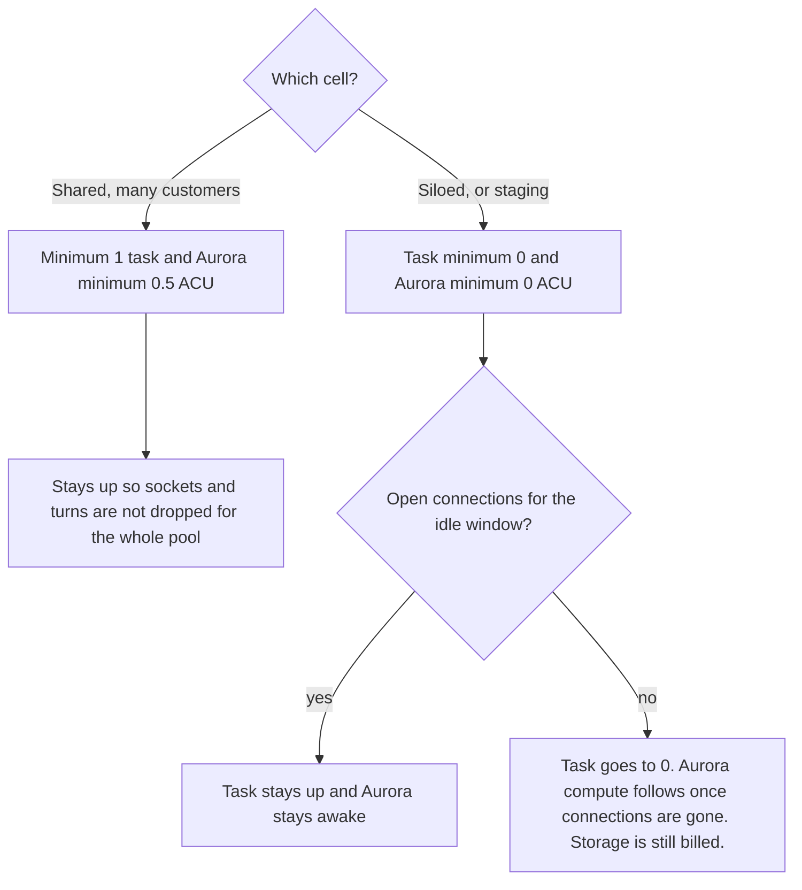
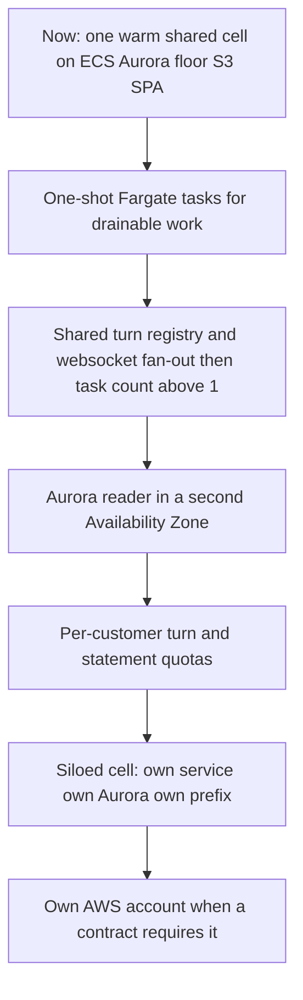

# Cells, sleep, and cost

**Status:** Decided
**Date:** 2026-09-25
**Decision:** Cells are ECS services on one Fargate cluster. See [comparison.md](comparison.md).

A cell is one running copy of Integral: an API task, an Aurora PostgreSQL
cluster with `pgvector`, a secret, and an S3 prefix. Customers on a cell
share that fate. The control plane decides which cell a billing customer is
on. It does not decide it per workspace inside the product.

## What each tier is made of

| Piece | Shared cell | Siloed cell |
| --- | --- | --- |
| Who is on it | Many billing customers. Workspaces stay separated by the access model, and later by row-level security. | One billing customer. Their workspaces, including production and sandbox, can share this cell. |
| API | ECS service on Fargate. Minimum 1, maximum 1 until ADR-005. | Same image and task definition. Minimum 0, maximum 1 until ADR-005. |
| Web | The regional SPA on S3 and CloudFront. The nginx `web` container from the Swarm stack is unnecessary. | Same SPA. The hostname selects the API. |
| Database | Aurora Serverless v2, PostgreSQL 16, `pgvector`. Minimum 0.5 ACU while the API holds a pool. | Own cluster. Minimum 0 ACU. Pauses when the task is gone and no connections remain. |
| Files | One regional bucket. Prefix per billing customer. Task role limited to that prefix. | Own prefix, or an own bucket when the contract wants a separate bucket policy. |
| Secrets | JWT secret and credential encryption key in Secrets Manager. | Own secret. Moving a customer means moving these keys with the dump. |
| Mail | SES. SPF, DKIM, and DMARC records live in Cloudflare. | Same sending domain unless the customer has their own. |
| Logs | CloudWatch for the process. Durable audit in Postgres. | Same. |

API tasks sit in a public subnet with a public IP for model-provider and
SES egress. The security group allows inbound traffic only from the load
balancer. That skips a NAT gateway, which is on the order of $32 a month
plus data. Add one NAT, and move the tasks private, when private egress is
worth that standing charge.
S3 gateway endpoints are free and keep attachment traffic off the public path.

One load balancer for the region, shared by the control plane, the shared
cell, and every siloed cell, using host-header rules. A second load balancer
is another standing charge for the same capability.

## What is allowed to sleep

Production database scale-to-zero does not happen on the shared cell. The
API pool is what keeps Aurora awake, and that pool is what makes requests
fast. Sleep is for a siloed customer overnight, and for staging.

Drainable work is the other sleep path. EventBridge Scheduler starts a
Fargate task. The task leases work in Postgres, finishes, and exits.
Fargate bills per second with a one-minute minimum. Between runs the count
is zero. The work kernel already leases rows, so this matches the code
better than a Lambda consumer. Add SQS only if you later need a sub-minute
wake for a separate worker service.

## Deploy rule until chat state is shared

A rolling deploy that runs two API tasks at once is unsafe. On ECS, set
minimum healthy percent to 0 and maximum percent to 100. Expect a short
outage on each API release, about as long as the new task takes to pass
its health check. After the shared turn registry and websocket publish
both exist, switch to a normal rolling deploy and raise the maximum.

While the maximum is 1, make the task larger before you add tasks. LLM
latency and provider rate limits will dominate long before vCPU does.
Cap concurrent turns per billing customer in the shared registry once it
exists. Meter seats, storage, and connectors first. Leave token metering
until bring-your-own-key versus a platform key is something an invoice
can explain.

## Cost floor

These are list-price orders of magnitude for us-east-1, the decided region,
for planning, not a quote. Recheck
[Aurora](https://aws.amazon.com/rds/aurora/pricing/) and
[Fargate](https://aws.amazon.com/fargate/pricing/) before you budget. The
EKS column is the rejected alternative: what the sample's two clusters would
have cost before any pod, node, or load balancer. It is here so the cost
reason for ECS stays visible.

| Item | Shared cell, always on | Siloed cell, idle | EKS sample, before workloads |
| --- | --- | --- | --- |
| Compute | One Fargate task, about $36 to $45 a month at 1 vCPU and 2 to 4 GB | $0 while desired count is 0 | Two control planes at $0.10 per cluster-hour, about $146 a month |
| Database compute | About $44 a month at a 0.5 ACU floor ($0.12 per ACU-hour) | $0 while paused. Storage still billed. | Not in the control-plane fee. The sample's data stores are DynamoDB and S3. |
| Load balancer | About $22 a month, shared by every cell in the region | Included in the regional balancer | Extra, on top of the control planes |
| NAT, ElastiCache, Lambda, RDS Proxy | $0 at the start | $0 | The sample's cost pipeline includes a Lambda |
| SPA, attachments, secrets, logs | Storage and requests. Low traffic is well under $15. | Storage only | Included in whatever the tenant resources are |

An active siloed cell adds its own task and the ACUs it actually uses.
The standing regional cost (load balancer, and later one NAT) is shared.
That is why a cluster, a load balancer, or a NAT per customer is the
layout to refuse.

Skip Performance Insights at the start. It raises the Aurora floor and
removes the cheap 0.5 ACU minimum the shared cell depends on.

## Scale sequence

Step `e` can happen before step `b` for a single customer. A siloed cell
with maximum 1 is honest under ADR-005. Step `b` is what lets the shared
cell grow past one process. A second region is an active-passive copy of
a cell for residency, with one writer. The graph has one primary.
