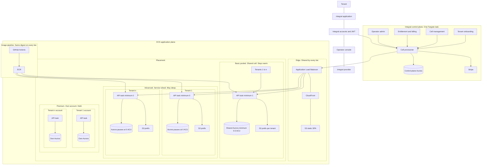

# Integral high-level infrastructure

**Status:** Decided
**Date:** 2026-09-25
**Decision:** Amazon ECS on Fargate. See [comparison.md](comparison.md).

This is Integral's version of the ECS reference poster, "ECS SaaS - High-level
infrastructure" ([saas-reference-architecture-ecs](https://github.com/aws-samples/saas-reference-architecture-ecs)).
The layout is the same: people across the top, a control plane on the left,
an application plane on the right, and three placement tiers. The boxes are
Integral's.

The sample's Product and Order services are one API here. Documents, CRM, and
Sales are packages inside that image. The sample's DynamoDB tables are Aurora
PostgreSQL with `pgvector`.

## How each sample box maps

| Sample box | Integral box |
| --- | --- |
| Tenant, SaaS application, admin console, SaaS provider | Same roles. The tenant uses the hosted app. The provider operates it. |
| Amazon Cognito | Integral accounts and JWT. IAM is only for the AWS console. |
| Four Lambda functions in the control plane | Four jobs inside one always-on Fargate task. |
| Amazon EventBridge | The cell provisioner. It calls ECS, Aurora, Secrets Manager, the Cloudflare DNS API, and the cell's entitlement API. |
| Control-plane DynamoDB | Control-plane Aurora. Customer graphs stay out of it. |
| API Gateway and PrivateLink | The Application Load Balancer, so chat sockets keep a long idle timeout. |
| CloudFront and the static bucket | The Vite SPA on S3 and CloudFront. |
| Step Functions and CodeBuild | GitHub Actions pushing one image to ECR. Onboarding a tenant does not build an image. |
| Basic pooled Product and Order, shared DynamoDB | One shared API task and one shared Aurora database for tenants 1 to n. Minimum 1 task, Aurora minimum 0.5 ACU. |
| Advanced, a service per tenant | One Fargate service and one Aurora cluster per billing customer, on the same ECS cluster and the same load balancer. Minimum 0 tasks. Aurora can pause at 0 ACU. |
| Premium, a cluster per tenant | Held. When a contract requires a hard boundary, that customer gets their own AWS account, still running the same image. A cluster per tenant inside the shared account is the layout to avoid. |

Basic and advanced are the tiers to build. Premium is on the diagram so the
reference stays recognizable. It is not part of the first hosted environment.
Signup lands on the basic cell. A move to advanced is an operator action:
copy the graph, the S3 prefix, and the cell's keys together.
