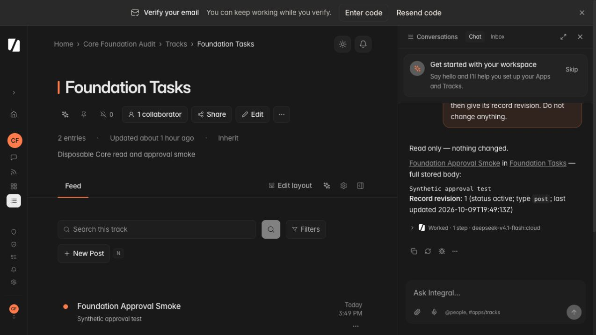

# Integral Core foundation and resident harness qualification

Date: 2026-10-09. Original baseline: `fabca0c7`; current base: `3987b3b9`; package metadata: `0.1.1rc16`.
Status: locally qualified release candidate; stable/hosted promotion remains subject to the explicit requirements below. Source publication is authorized on `codex/pr-113-staging` / existing PR #116. No package, tag, or deployment has been published by this audit.

## Scope and ownership

This assessment follows the agent-architecture-audit and browser-qa skills. It examines the resident Pydantic AI harness, Core skill overlay and tool discovery, substrate read/write authority, routines and worker boundaries, transcript/recovery state, model observations, browser projection, and distributable artifacts. Payroll is a reproduction fixture; App-specific planning is excluded from this report, as requested. Its package code and procedures are not changed. A copy of the external package is installed into a disposable, separate managed PostgreSQL installation with synthetic credentials and starter records; existing Business installations are not modified.

The initial checkout contained another task's staged build-field-identity repairs. Those changes are outside this audit's ownership and were subsequently committed by that task as `3987b3b9`. Qualification operates on that base plus this audit's patch; publication must review the final combined source and its exact Git revision.

The release standard is evidence for explicit scenarios, not a claim that every possible future App or provider interaction is defect-free. Each failure found here must have a concrete repair, recommendation, or remaining qualification requirement.

## Invariants preserved

| Invariant | How this change preserves it |
| --- | --- |
| I-GRAPH-01 / I-GRAPH-02 | No persisted entity, node attachment, edge, or record model is introduced or demoted. Existing rooted sessions, runs, receipts and work items remain the persistence authority. |
| I-CRUD-01 | Core service/broker paths remain the mutation boundary. Browser installation handling does not retry an uncertain write. |
| I-EXT-01 / I-SUBSTRATE-01 | Repairs use generic tool identifiers, declaration effects and execution scope; no Payroll slug, employee schema, or business calculation is added to Core. |
| I-WORK-01 / I-WORK-02 / I-WORK-03 | Worker leases, effect identity and atomic completion are unchanged. Fresh authorization contexts wrap those existing paths rather than replace them. |
| I-WORK-04 / I-WORK-05 | Existing idempotency and approval bindings remain intact. Read classification does not grant write permission. Mutating App operations remain blocked under an explicit no-write request. |
| I-WORK-06 / I-HARNESS-01 | PostgreSQL posture, encryption, and tenant/principal/thread/session bounds are retained. No unscoped or filesystem session fallback is added. |
| I-WORK-07 | Physical model observations retain unknown/unavailable provider cost as unknown. Token measurements are not converted to invented prices. |
| I-HARNESS-02 | Accepted user content and typed history remain unchanged. Discovery/recovery operates on structured tool results and verified identifiers, not a new user-intent classifier. |

## Reproduced findings and repairs

### F1 — Workflow loading eagerly disclosed unrelated schemas (high)

`_prepare_capability_tool` changed every active workflow-owned tool to `defer_loading=False`. Loading a record lookup skill therefore injected mutation schemas that were never searched for into subsequent model requests. Unified search simultaneously excluded skill-owned tools from its framework availability return. The two paths depended on each other and inflated every later request.

Repair: search discloses matching authorized tools through `ToolReturn.tools`. Procedures remain deferred; loading a skill does not automatically reveal its full schema catalog. Read tools are directly discoverable without loading unrelated owner procedures. Protected writes still require their applicable loaded procedure and pass through the live broker. Saved design approval/build continuations keep their existing explicit availability exception.

Regression: a real Pydantic `FunctionModel` searches, loads a lookup skill declaring both query and deletion, executes the query, and returns a no-match result. The deletion schema must never appear. Supporting identity reads must work without loading another workflow.

### F2 — Permission and inventory state leaked across execution boundaries (high)

HTTP middleware resets a ContextVar memo, but background tasks inherit its mutable dictionary. `execute_claimed_work` could carry prior item state into the next item. The production process cache can also retain a role/access aggregate for 20 seconds, including changes made by another process.

Repair: isolated, exception-safe permission scopes wrap worker items, native turn projection, native tool handlers, model admission authority checks, and the shared broker `invoke` entrypoint used by native and MCP callers. Within those scopes, process TTL reads/writes are bypassed; normal HTTP dashboard caching stays available. Nested and parallel calls receive independent dictionaries and restore their caller's state.

Regressions cover two successive items, successive broker calls, inherited parent state, exceptions, parallel tasks, native skill projection, and production-enabled TTL behavior.

### F3 — Exact recovery capability addresses were lost in approximate search (high)

A browser headcount request received `app_domain` refusals instructing it to call `integral_describe_capabilities`. Searches containing that exact identifier instead returned related skills and broad query tools. The model continued through refused queries and unrelated schema inspection until the token guard stopped it.

Repair: an exact authorized canonical tool identifier is resolved before approximate ranking, with result slots reserved for named tools. Substrings and unauthorized identifiers do not become addresses. Providers supporting forced choice follow the Core refusal's known read-only recovery contract before another broad query; unsupported profiles retain the explicit recovery instructions. This does not force an effect, replay a mutation, or grant authority.

The normal skill search remains hybrid semantic/lexical over a permission-filtered per-run corpus. Ranking remains advisory rather than an authorization rule.

### F4 — Generic App dispatcher was treated as a write even for declared reads (high)

`integral_invoke_app_operation` is conservatively cataloged as execute, but the shared broker already reclassifies verified declared App queries/read operations. The native wrapper rejected it before that classification under "do not change anything" and required a write procedure even for a read.

Repair: determine read classification from the server-owned run snapshot, bound to the actual principal, workspace, App and capability key. Make the dispatcher's schema discoverable; bypass the mutation procedure/no-write guard only for that verified read. The existing broker still checks current declarations, permission, schema, and receipts at execution. A missing, foreign, or execute declaration cannot gain read status through model arguments.

### F5 — Introspection returned the full App model and draft (high for large Apps)

A full model result can contain large view/configuration/operation bodies. Active-turn history intentionally retains exact tool outcomes, so that payload is sent again on each subsequent request. The reproduced Payroll turn jumped from 16,886 input tokens to 83,803 after full model inspection.

Repair: `integral_describe_model` defaults to an explicit bounded overview with resource identity, exact collection counts, bounded labels, and truncation markers. Full manifests/configuration remain available with `detail="full"`. Direct service calls retain their previous full default, preserving existing integrations. Core modeling skills explicitly request full detail before modifying schema. An overview cannot be mistaken for a complete authoring contract.

### F6 — Core skill instructions encouraged unnecessary expansion (medium)

The entries skill required track listing even for a direct record lookup and said never to stop after an empty search, conflicting with the host's exact no-match rule. It also described shipped comment listing as unavailable.

Repair: direct identifier/title reads can query immediately; a successful exact no-match ends the lookup unless user-provided or retrieved evidence identifies a concrete alternative. Comment reads use the shipped tool. Capability-map generation is rerun after skill/manifest edits.

### F7 — Browser installation timeout reported an uncertain write as failure (medium)

The unchanged fixture installed six tracks, eight skills, hooks and six seed settings in about 34 seconds. The shared browser client timed out at 30 seconds although the server completed with HTTP 200. Readback verified all six tracks and seeds; the installation was not replayed.

Repair: batch installation receives a 120-second deadline while ordinary reads retain their existing deadline. Timeout/network loss is described as an unconfirmed outcome, clears the selected retry action, and refreshes installed App state. No automatic retry or fabricated success is introduced. A later asynchronous WorkItem installation contract remains an architectural improvement for very large packages.

### F8 — Wheel dependencies permitted an unqualified typed harness API (high for reproducibility)

`uv.lock` selected Pydantic AI 2.54.0, but Core wheel metadata only pinned `pydantic-ai-harness`. Its transitive dependency could select a newer typed capability/history API on a fresh installation.

Repair: explicitly pin `pydantic-ai-slim==2.54.0` in public Core dependencies and regenerate the lock without upgrading other packages. Provider SDK dependencies remain supplied by Core's existing LiteLLM bridge. The upstream OpenAI extra requires a different SDK major from this LiteLLM release, so it is not added. Independent fresh dependency resolution is a separate release gate below.

### F9 — Nested verification selected a different interpreter (medium for release evidence)

The complete backend run exposed two guard tests launching bare `pytest` from PATH. With an outer parallel test override they inherited `-n/--dist` but selected an interpreter without xdist, making the full gate fail despite those guard assertions working in an ordinary serial run.

Repair: child checks use the current interpreter's `python -m pytest`, discard inherited pytest options, and select a distinct test database suffix so they cannot reset the parent's graph/log storage. The unchanged policy guard assertions remain enforced. All 24 policy audit tests pass under the previously failing outer override.

The final frontend run also exposed test-environment failures: CPU-wide jsdom concurrency made a 101-row projection test exceed its 5-second deadline (the same assertions passed in 417 ms alone), and Recharts Redux animation callbacks could fire after jsdom teardown. The runner now uses at most four workers, and chart tests drain queued animation frames before restoring their globals. Both affected files pass all 12 assertions; no assertions or deadlines are weakened. The full gate passed with these verification repairs.

### F10 — A live fenced quote retained an animation prefix (high for response integrity)

The final packaged browser continuation returned and persisted the entire body, but its live fenced block displayed only `Sy`; reloading displayed `Synthetic approval test`. This was an observable rendering defect, despite the earlier frontend suite passing.

Repair: when output settles or is interrupted, remount the markdown primitive from the authoritative message part. The running renderer keeps smooth output; the settled tree cannot reuse its stale code-block prefix. A real assistant-ui markdown lifecycle test supplements the existing mocked adapter tests, and the packaged browser fence scenario passed on the final wheel without a reload: full body, revision 1, one read tool step, two physical requests, 39,220 input tokens, 203 output tokens, no browser console warnings/errors.

### F11 — Declared minimum Python could not boot Core (high for distribution)

A clean wheel installation on the declared Python 3.10 minimum resolved dependencies but failed importing Core: notification routing and channel code use `datetime.UTC`, a Python 3.11 API. Local 3.14 tests and a working 3.11 browser alone could not expose that false compatibility claim.

Repair: declare Python >=3.11 in Core metadata and the frozen lock, and align README, backend setup, deployment and agent guidance. Existing SDK client requirements are unchanged. No dependency version is upgraded; obsolete 3.10-only lock branches are removed. Python 3.10 now fails at package resolution with the correct requirement; an isolated pytest import on the supported 3.11 floor passes, including native harness types, fresh permission context, model overview and all 16 bundled Core skills. The final floor correction changes only wheel metadata and RECORD, with runtime members byte-identical.

## Twelve-layer assessment

| Layer | Source/behavior inspected | Qualification and practical limit |
| --- | --- | --- |
| System prompt | Core host instructions, `integral-*` skill bodies, approval guidance | F6 repaired; no new intent classifier or hidden planning model. |
| Session history | Typed tool/capability history, scoped session and checkpoints | Current-turn results preserved; prior history has message/token compaction bounds. Warm history still increases prompt size and needs representative soak tests. |
| Long-term memory | Tenant-bound `ScopedStepStore`, conversation search, overlay composition | No store-wide conversation search. Fresh turn projection prevents inherited access inventory. |
| Distillation | ClearToolResults, typed compaction and checkpoint guards | Exact active outcomes and load/availability pairs retained; compaction must not manufacture live authority from old receipts. |
| Active recall | ConversationSearch and local capability embeddings | Search is conversation-scoped; local ranking does not invoke an unmetered auxiliary LLM. Cold catalog embedding latency remains distinct from provider tokens. |
| Tool selection | Search, deferred schema preparation, procedure guards, dynamic choice | F1/F3/F4 repaired; approximate relevance cannot hide an explicitly addressed recovery tool. |
| Tool execution | Shared broker, run snapshot, current declarations, approvals, worker effect fence | F2 repaired; no write is justified by skill loading or historical results. |
| Interpretation | Error envelopes, no-match, App boundary refusals, counts/pagination | Refusal differs from empty data. Payroll's authoritative roster semantics remain its team's responsibility. |
| Answer shaping | Resource link enrichment and streamed response parts | Opaque IDs and broker URLs retained; unavailable cost is not a free-cost claim. |
| Rendering | Managed wheel UI, login, install/readback, chat/debug, frontend tests | F10 repaired and rerun in the packaged browser; unit/build gates alone are insufficient. |
| Hidden repair/retry | LiteLLM transport, provider SDK, scaffold correction | SDK retries disabled; physical requests observed separately. Bounded pre-effect design-input correction is explicit. Unknown writes/model outcomes are not silently replayed. |
| Persistence | PostgreSQL workers, sessions, receipts, cancellation/recovery guards | Isolated PostgreSQL gate plus native failure/continuation tests. Provider-side process-kill and all BYOK vendor combinations require a separately recorded live matrix. |

## Browser evidence and gates

The preserved exhaustion evidence is in `core-foundation-evidence/payroll-exhaustion-summary.json`: 15 physical model requests, 20 tool steps, 621,301 reported input tokens, 4,621 output tokens, unavailable provider cost. The request was simply “How many employees are in Guyana Payroll? Use the current roster and do not change anything.” Full debug stays in the private disposable evidence directory rather than publishing synthetic installation credentials or full model configurations.

The same Payroll question on the repaired harness completed with a truthful refusal rather than exhausting: 10 requests, 11 tool steps and 126,850 input tokens (79.6% less in this observed pair). No full-model dump occurred. The App still does not expose a permitted roster query/operation, so this is recovery qualification, not proof that Payroll headcount now works. Functional App qualification remains outside this Core assessment.

The earlier generic record lookup on the existing 9140 qualification installation used five requests and 47,853 input tokens. It is an observational baseline from a different installation, not a controlled cross-version benchmark.

| Gate | Result |
| --- | --- |
| Failing reproductions before repair | Eager deletion schema and worker cache inheritance reproduced. |
| Targeted discovery/broker/introspection tests | Passed: 141 tests, including actual FunctionModel disclosure/recovery and authority boundaries. |
| Staged substrate guards | All 16 passed with the audit source staged. |
| `make verify` | Passed: all guards, hooks, pinned format/lint, types, artifacts, CI smoke, 278 frontend files / 1,581 tests, and the complete backend suite. Full backend uses two workers. Final Python floor is a metadata-only correction, separately installed/imported and rebuilt below. |
| Environment-free CI smoke | Passed with `TESTING=1`, `DEBUG=false`, `INTEGRAL_ENV_FILE=/dev/null`, smoke marker and xdist; local .env loading disabled, auto worker count capped at two. |
| Minimum Python / frozen dependencies | Passed on the corrected Python 3.11 floor; 3.10 installation rejected as required, frozen sync passed, no supported dependency version upgrades. |
| Isolated `make test-postgres` | Passed broad lane; final-source native/authority/recovery follow-up passed 449 tests. |
| Core-only and extension contracts | Passed `make verify-core-only verify-contract`; transaction contracts additionally exercised in the isolated PostgreSQL lane. |
| Backup and scratch restore | Passed supplementary socket-aware PostgreSQL 16.2 drill; matching counts and identity, scratch database removed. |
| Independent Core/SDK/reference App artifacts | Passed fresh dependency resolution/import, SDK boundary, and signed external Asset Register load. Final wheel verification passed separately after correcting descriptive manifest return keys: byte-identical rebuild, outside-checkout import, fresh environment installation and live browser continuation. |
| Dependency advisories | Passed existing policy: no unaccepted advisories. Existing accepted frontend high-severity exceptions and three backend ignored entries remain; this is not an assertion of zero advisories. |
| Browser repaired read / no-match / approval / cancellation / restart | Passed on a disposable synthetic installation. Final wheel fence read: 2 physical requests, 1 tool step, full body and revision without reload, no console warnings/errors. |

Additional browser qualification on the standalone Core track:

- Exact record lookup: five physical requests, seven tool steps, 67,259 input tokens; quoted the stored body and distinguished lifecycle status from text in that body.
- Warm exact no-match: two physical requests, one query step, 33,811 input tokens; no broad retry or write.
- Approval: proposal readback showed no new record before decision; explicit approval produced exactly one record and revision 1. Rejection produced no record and no automatic restaging.
- Cancellation: Stop generating ended the visible turn; the UI reported interruption and possible completed work, then accepted a fresh read request. Recovery quoted the persisted body in two tool steps.
- Packaged restart: a fresh Python 3.11 environment resolved public dependencies, continued the saved conversation, and read the original record at revision 1. Independent API readback verified exactly two records, one approved creation, and no rejected creation. The final live fenced quote remained complete without reloading.
- Live API perimeter: malformed scope 400, foreign workspace 403, unauthenticated resource 401, and a second synthetic principal denied workspace lists, track and entry reads with 403.

The above measurements show the remaining cost of warm transcript and procedure context. They are not a universal low-token guarantee. Provider observations report cost as unavailable.

The browser/runtime candidate is `dist/core-foundation/integral_core-0.1.1rc16-py3-none-any.whl`, SHA-256 `3d8f251bfcf2c58050a7e2d204cb80648f63fd0645787e681d13e35e7f04a200`. The artifact gate rebuilt it byte-for-byte with a fixed source timestamp. `core-foundation-evidence/candidate-manifest.json` records the source base, content fingerprint, build timestamp and fresh public dependency versions.

## Release boundary

A qualified source candidate is distinct from a published package, successful hosted deployment, or every-provider billing/recovery certification. Native durable chat remains an explicit rollout mode; managed CLI runtime currently selects direct chat. WorkItem model-admission and recovery tests do not by themselves prove that mode's live UI deployment. Existing facet-edge cleanup and queued agentive walker refactoring remain documented architecture work, not silently completed by this repair.

Before a stable promotion, record the intended deployment mode, exact source revision and wheel hash; run that candidate's browser scenarios; retain observed budget/cost uncertainty; and review the provider/BYOK/process-kill matrix appropriate to the deployment. Publishing or opening/updating a PR requires explicit user consent under this repository's AGENTS.md.

## Remaining qualification requirements

| Requirement | Boundary and recommendation |
| --- | --- |
| Payroll functional headcount | Outside Core qualification; the observed failure/recovery evidence does not prove a working roster question. |
| Deployment mode | Select direct or durable chat explicitly. This live browser qualification uses managed CLI direct mode; durable worker persistence/admission/recovery is tested on PostgreSQL. Qualify the selected hosted mode before promotion. |
| BYOK/provider recovery and billing | Record live keys/routes, vendor errors, incomplete usage, provider-side process kill, unknown mutation reconciliation and partial-batch outcomes for the supported deployment matrix. Keep unavailable cost distinct from zero. |
| Optional integrations | Atlas was unavailable without `ATLAS_TEST_URI`; this managed PostgreSQL server has no vector extension. Benchmarks and domain package tests are excluded by the documented broad gate. Do not claim those integrations qualified. |
| Backup/restore | The socket installation did not satisfy the historical localhost backup test. A separate matching PostgreSQL 16.2 client drill verified counts and identity and dropped its scratch database; retain that supplementary evidence. |
| Prompt scale | Track physical calls and input tokens for representative warm conversations and larger installed catalogs. The repaired pair demonstrates a reduction; it does not establish a universal low-token bound. |
| Existing architecture backlog | Wider principal facet journeys, facet-edge cleanup and agentive walker refactoring remain recorded work. This patch adds no new persisted graph entity and does not claim those migrations completed. |
| Publication | Inspect the updated PR #116 CI before release promotion. No hosted deployment or registry publication is inferred from local gates. |

## Push integration

The publication candidate combines audit revision `6e454147534c08164d0a2521ee6f0052f931bcd0` with the remote managed-environment isolation repair `74a95b7adb922dc7eccae6e3f1893aeb3d66256c`. The merge required no conflict resolution. The incoming repair confines launcher settings to the installation, validates interpolation, preserves real authentication, and makes the heartbeat regression wait for an observed heartbeat. Its separate evidence is in `2026-10-09-managed-environment-isolation.md`.

The earlier wheel hash and browser receipts above identify the original qualified audit snapshot. They do not identify a wheel containing this later launcher repair. The combined source passed `make verify` (including 278 frontend files / 1,581 tests and the full backend suite), the full isolated PostgreSQL lane, and a separate smoke run with local environment loading disabled. The wheel built twice byte-for-byte and imported outside the checkout. Combined-source fingerprints and gate results are recorded separately in `core-foundation-evidence/push-integration-summary.json`. PostgreSQL retained the previously documented optional-integration and historical localhost backup-test skips.

App-specific recommendations and captured setup advice were removed before the audit commit was published. They remain local only. The retained App reproduction evidence records Core budget and refusal behavior; no Payroll plan or package change is included.
