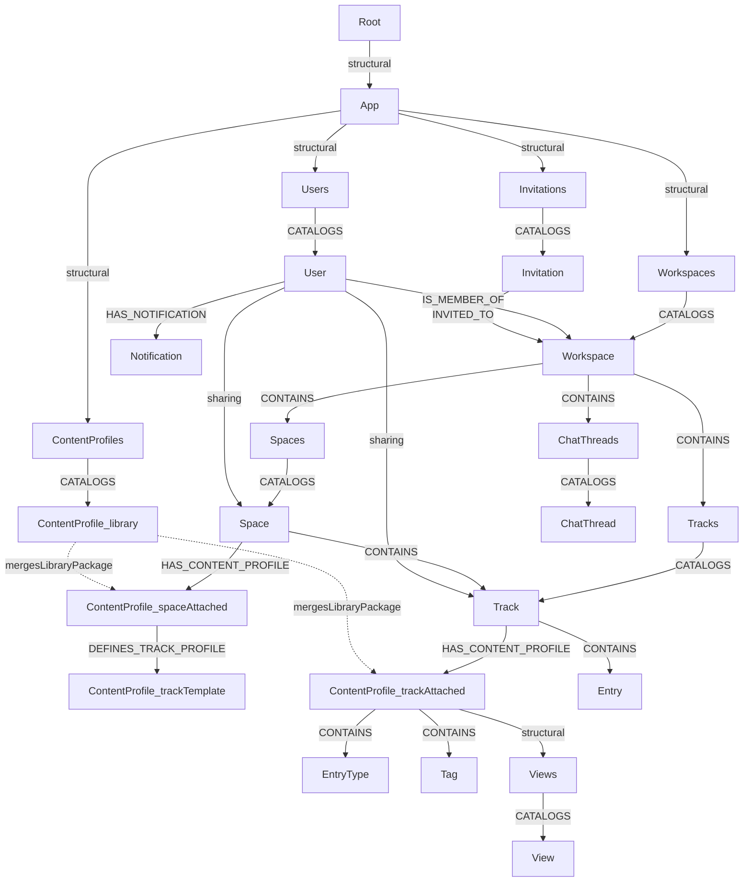
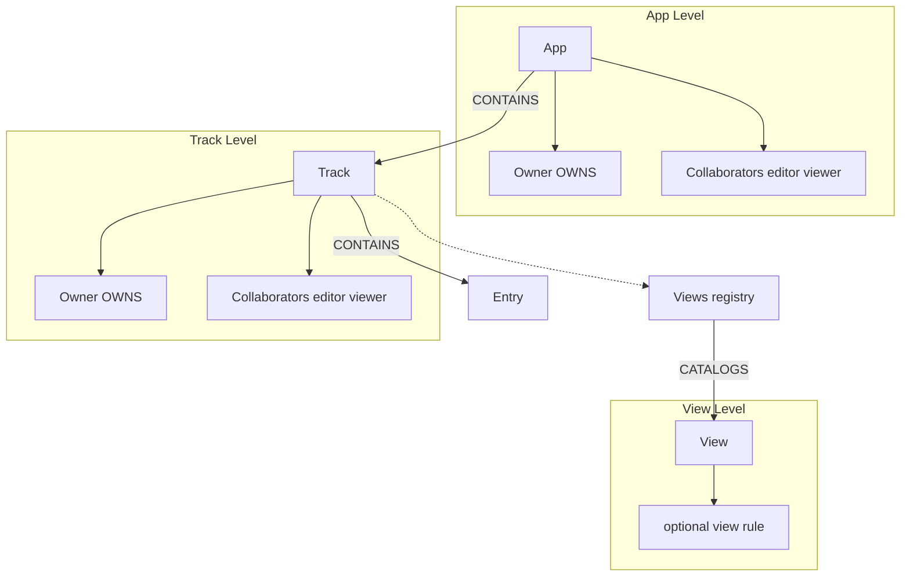

# Integral: Architecture Document

**Document Version:** 2.1
**Date:** 2026-05-06
**Author:** Architecture Team
**Status:** Aligned with CONCEPT v5.0 (AI-native knowledge platform)

> **Workspace primitive:** `Workspace{kind: "personal" | "organization"}`
> is the canonical top-level container. Personal is auto-created at
> signup; organization-kind workspaces own a member pool. Every Space,
> Track, ChatThread, and Invitation belongs to exactly one Workspace,
> and per-workspace branch registries (§3.0) give each workspace its
> own subtree.

---

## 1. Introduction

This document describes the system architecture of **Integral** — an **AI-native knowledge platform** that captures, organizes, and exposes domain knowledge as a unified graph for humans and AI agents to read, write, and coordinate over under one access model. The graph is composed of recombinable primitives (Space, Track, EntryType, Tag, View) configured via **Content Profiles**, which double as the published schema agents reason against. The backend is built on **jvspatial** — an object-spatial API and persistence framework providing native graph storage, real-time computation, and a unified runtime for both transactional data and AI workloads.

> The architecture below documents the current implementation. For directions in which the architecture should evolve to better serve the AI-native vision (semantic retrieval, provenance, connector framework, unified policy engine, resident proactivity + memory, schema migrations, MCP-first surface), see **§22 Vision-Aligned Architectural Directions**. (§22.7 "A2A Fabric" is retired — [ADR-003](../backend/adr/003-singular-resident-harness.md).)

The architecture is designed to support:
- A graph‑based data model where all entities are **Nodes** and relationships are explicit **Edges**.
- **Content Profiles** as declarative, composable, AI‑authorable specifications that drive runtime behavior — not static templates that stamp.
- User‑defined entry types and views defined in **YAML**, inspired by GRAV CMS.
- Real‑time synchronization across clients.
- Permissions at **Workspace**, **Space**, and **Track** levels (Workspace membership gates everything inside it; Google Docs–style **viewer** / **editor** collaborators and **owner** via **`OWNS`** for Space/Track); optional **view**-level rules; **no per-entry visibility** — entry access follows effective track access. Organization-kind workspace owners manage a **member pool** and **selective creation rights** (`canCreateSpaces`, `canCreateTracks`) for their workspace's Spaces/Tracks.
- AI augmentation services that operate on the graph, including **Content Profile authoring** by agents.
- A **singular resident harness** as the coworker mind Integral’s **ops layer** augments (always-on in `backend/app/agentive/`; Harness Switcher selects provider — default embedded jvagent). Faceted by principal (personal, org‑facing, system), **profile‑aware**: it applies Content Profiles when creating Tracks and Spaces, and can author new ones. External agents connect via the MCP surface only. See [RESIDENT_HARNESS.md](RESIDENT_HARNESS.md) / [ADR-003](../backend/adr/003-singular-resident-harness.md).

This document is intended for engineers, architects, and technical stakeholders who will implement, extend, or maintain the Integral platform.

---

## 2. Technology Stack & Platform

Integral’s backend is built entirely on **jvspatial**, a spatial computing framework that provides:

- **Native Graph Storage:** All entities are stored as nodes with properties; relationships are first‑class edges. jvspatial’s persistence layer is optimized for spatial and graph data, with built‑in indexing and partitioning.
- **Object‑Spatial API:** jvspatial exposes a rich API for defining node types, querying the graph, and performing transactional updates. This API is the foundation for all backend services.
- **Spatial Computation:** Dataflow programs (kernels) execute in parallel across the graph, enabling efficient view rendering and real‑time updates.
- **Unified Runtime:** The same environment handles both transactional data and AI/ML workloads, allowing AI services to directly query the graph without additional data movement.

**Additional components built on jvspatial:**
- **RESTful API Layer:** Exposed via jvspatial’s built‑in HTTP gateway or a custom service that uses jvspatial’s Java/Node.js bindings.
- **REST API:** Implemented via jvspatial's `@endpoint` decorator; endpoints are thin wrappers that delegate to jvspatial graph operations (node/edge queries, traversals).
- **Real‑time Subscriptions:** jvspatial emits change events that are pushed to clients via WebSockets.
- **AI Microservices:** Deployed as separate processes that interact with jvspatial’s graph API and optionally call external LLMs.

**Frontend:** React/TypeScript single‑page application; responsive web.

---

## 3. Core Data Model (Nodes)

All persistent entities are represented as **Nodes** in the jvspatial graph. Each node has a **type**, a unique **ID**, a set of **properties** (key‑value), and an optional **content** field for unstructured data. Node types are defined declaratively in jvspatial, and the framework enforces schema constraints.

### 3.0 App graph structure (registries, catalogs, content profiles)

Integral anchors the product graph under **jvspatial `Root`**: **`Root` → `App`** via a **structural** relationship, then **`App`** connects to each top-level **registry** host with an explicit **structural** edge type in implementation (e.g. `HOSTS_REGISTRY` or equivalent—diagram labels use **`structural`** for clarity).

**Top-level registries under `App`** (genuinely global — every workspace shares them):

| Registry | Catalogs |
|----------|----------|
| **`Users`** | `User` |
| **`Workspaces`** | `Workspace` (Personal + Organization) |
| **`ContentProfiles`** | **`ContentProfile`** library packages |
| **`Invitations`** | `Invitation` |

**Per-Workspace branch registries** (each `Workspace` owns its own subtree — keeps cross-workspace content physically separated in the graph):

| Branch | Source | Catalogs |
|--------|--------|----------|
| **`Spaces`** | each `Workspace` | `Space` |
| **`Tracks`** | each `Workspace` | `Track` (standalone — tracks contained by a Space inherit through it) |
| **`ChatThreads`** | each `Workspace` | `ChatThread` |

Branch ids are deterministic: `n.Spaces.{workspace_id}` / `n.Tracks.{workspace_id}` / `n.ChatThreads.{workspace_id}`. The `Workspace—CONTAINS→Branch` edge is materialised by `ensure_workspace_branches(workspace)` on every `catalog_workspace` write, so every Workspace always has its three branches. The branch registry is the **sole** linkage between a Workspace and its contained Spaces / Tracks / ChatThreads — no direct `Workspace—CONTAINS→Space|Track` edge is written.

Comments and Attachments don't get a per-Entry branch — `Entry—HAS_COMMENT→Comment` and `Entry—HAS_ATTACHMENT→Attachment` already form per-entry subgraphs and no consumer reads a cross-entry catalog. Same reasoning for entries under a Track: `Track—CONTAINS→Entry` is the per-track enumeration and a `TrackEntries` branch would only add write amplification on every entry create.

**Graph contiguousness invariants (I-GRAPH-01 + I-GRAPH-02).** Two-part rule:

- **I-GRAPH-01.** Every persisted `Node` MUST be reachable from `Root → IntegralApp → …` by walking named edges. At every `<NodeClass>.create(...)` site the writer wires the canonical structural edge (`CATALOGS`, `CONTAINS`, `OWNS`, `HAS_*`, or a domain-specific named edge) into the rooted subgraph in the same transaction. When an App-bound Node anchors a subsystem (`App —CONTAINS→ Track`, `App —CONTAINS→ Skill`, etc.), every other Node in that subsystem extends from the App-Node directly or indirectly (via the appropriate branch / registry / entity node). Scalar foreign-key fields are permitted as fast-path caches but never replace the edge.
- **I-GRAPH-02.** Records that don't benefit from graph inclusion are modelled as `jvspatial.core.Object`, not `Node`. `Object` is the persistence primitive for log-shaped, append-mostly, scalar-keyed records that participate in no cascade, no walker, no graph-walk read. `ChangeEvent` is the canonical example — persisted as `DBLog` rows, where `DBLog` itself is `class DBLog(Object)` in jvspatial. ChangeEvent persistence already conforms; no migration needed.

Together the two invariants admit zero carve-outs: every persisted entity is either a `Node` that is graph-reachable from Root, or an `Object` that lives outside the graph by design. Mis-modelling a graph-participant as `Object` or a log-shaped record as `Node` is equally wrong; conversion is a substrate-touching plan. Full specification and detached-node reconciliation scope: [docs/INVARIANTS.md](../INVARIANTS.md) § I-GRAPH-01 and § I-GRAPH-02.

The **`ContentProfiles`** registry holds the **shared app-wide library** of versioned **`ContentProfile`** **library packages** (manifests—see §5.3). **All authenticated users** may **read** (list/get) library packages for browsing at create time; **writes** (publish, update, deprecate) are restricted to **admins** or **publishers** per product policy. Listings may also be mirrored via **`GET /api/content-profiles`** or **`/api/meta/*`** for convenience.

**Attached `ContentProfile` (Space and Track):** In addition to **library** nodes under **`ContentProfiles`**, the product uses **attached** **`ContentProfile`** instances linked from **`Space`** and **`Track`**:

- **`Space` `HAS_CONTENT_PROFILE` → exactly one** **`ContentProfile`** (the space’s **Default** attached profile, created with the space). It may be **customized** in place. It **may** **`DEFINES_TRACK_PROFILE` →** zero or more **additional** **`ContentProfile`** nodes that act as **track-specific** options when **creating tracks** inside that space (each is a template-style package users can pick or merge from at child-track create).
- **`Track` `HAS_CONTENT_PROFILE` → exactly one** **`ContentProfile`** (the track’s **Default** attached profile, created with the track). It **owns** that track’s **EntryTypes**, **Tag** taxonomy, and **Views**: **`ContentProfile` `CONTAINS` `EntryType`**, **`ContentProfile` `CONTAINS` `Tag`**, and **`ContentProfile` → `Views`** (**structural**) **`CATALOGS` `View`**. The track **always** has at least **one default entry type** and a **default `feed` view** inside this attached profile (platform defaults at create). **`Track` `CONTAINS` `Entry`** only—entries stay on the **Track**.

**Library selection extends the Default:** When a user picks a package from the **library**, a **merge** transaction **extends** the relevant **attached** **`ContentProfile`** so its subgraph matches the chosen manifest **on top of** the existing default — **library nodes are not mutated** and are **not** traversed for normal reads/writes after merge. After merge, the attached profile is a **live, inspectable, modifiable specification** — users (and AI agents) can add, remove, reorder, or modify any element.

**Manifest scopes (`scope: track` vs `scope: space`):** A **`track`**-scoped package merges into the **track-attached** **`ContentProfile`** subgraph. A **`space`**-scoped package merges into the **space-attached** **`ContentProfile`** and/or its **`DEFINES_TRACK_PROFILE`** children and/or into the **track-attached** profile when a **new track** is created in that space — per product rules in §5.3.

**Provenance and customization tracking:** Use **node properties** **`libraryMergeSourceId`** (optional) on **`Space`** / **`Track`** for the last **library** **`ContentProfile`** id merged into their attached profile, plus **`attachedContentProfileId`** (required) pointing at the attached **`ContentProfile`** node. The attached profile's **`manifest`** property is the **living specification** — it is always the source of truth for what the Track/Space contains, regardless of how elements were originally authored. The manifest should be updated when elements are added, removed, or modified in-place. This enables: (1) inspecting what was applied vs. customized, (2) intelligent re-merge of upstream library updates with local customizations, and (3) AI agent authoring that reads and writes the manifest as the canonical spec.



### 3.1 Node Type: `User`
| Property | Type | Description |
|----------|------|-------------|
| `id` | UUID (immutable) | Primary identifier |
| `email` | String | Unique, used for login |
| `displayName` | String | User’s visible name |
| `avatarUrl` | String (optional) | URL to profile picture |
| `preferences` | JSON object | UI preferences, notification settings |
| `createdAt` | Timestamp | Auto‑set |
| `updatedAt` | Timestamp | Auto‑update |

### 3.2 Node Type: `Workspace` (top-level container)

The `Workspace` node is the canonical top-level container. Every Space, Track, ChatThread, and Invitation belongs to exactly one Workspace, and visibility is gated by Workspace membership before any space- or track-level check.

| Property | Type | Description |
|----------|------|-------------|
| `id` | UUID | |
| `kind` | Enum: `personal` \| `organization` | Discriminates the two workspace modes (set at create, immutable) |
| `name` | String | Workspace name |
| `name_fold` | String | `casefold(name.strip())` for index-friendly lookup |
| `owner_user_id` | UUID | Sole occupant for `personal`; sole admin/seed for `organization` (org workspaces also derive owner via `IS_MEMBER_OF{role:"owner"}`) |
| `description` | Markdown (optional) | |
| `accent_color` | String (optional) | `#RGB` / `#RRGGBB` brand color; empty = client default |
| `avatar_url` | String (optional) | Workspace avatar URL |
| `storage_bytes_used` | Integer | Denormalised attachment-storage counter |
| `storage_quota_bytes` | Integer | 0 = unlimited |
| `created_at` | Timestamp | |
| `updated_at` | Timestamp | |

**Kinds:**
- `personal` — exactly one per User, auto-created at signup, owned by them, no member pool, not deletable via API.
- `organization` — multi-user; member pool via `IS_MEMBER_OF` edges; invitations target this workspace; storage quota meaningful; owner is the `IS_MEMBER_OF{role:"owner"}` member.

**Member pool (org-kind only):** Users link via **`IS_MEMBER_OF`** (see §4). The edge carries `role` (`owner | admin | member | guest`) plus `canCreateSpaces` / `canCreateTracks` flags so admins control who may create workspace-scoped Spaces and Tracks.

An organization is a `Workspace` with `kind: "organization"`. Every reference to "an organization" in this document means such a workspace.

### 3.3 Node Type: `Space` (grouping of tracks)
| Property | Type | Description |
|----------|------|-------------|
| `id` | UUID | |
| `name` | String | Space name (e.g., "Q4 Initiatives", "Family Projects") |
| `ownerUserId` | UUID | User who owns the Space (**`OWNS`**) |
| `workspace_id` | UUID (required) | The Workspace this Space lives in. Set at create; immutable afterwards. |
| `attachedContentProfileId` | UUID (required) | Id of the **space-attached** **`ContentProfile`** (**`HAS_CONTENT_PROFILE`**); the space’s **Default** profile, customizable |
| `libraryMergeSourceId` | UUID (optional) | **Provenance:** last **library** **`ContentProfile`** package merged into the space-attached profile; not used for runtime resolution |
| `description` | Markdown (optional) | |
| `createdAt` | Timestamp | |
| `updatedAt` | Timestamp | |

Spaces are created inside a Workspace — Personal (`workspace.kind === "personal"`) or Organization (`workspace.kind === "organization"`, subject to member **`canCreateSpaces`** or equivalent). There is no longer a "no workspace" path; `workspace_id` is required.

### 3.4 Node Type: `Track`
| Property | Type | Description |
|----------|------|-------------|
| `id` | UUID | |
| `title` | String | Track name |
| `purpose` | Markdown (optional) | User‑defined description of the Track’s single purpose |
| `icon` | String (optional) | Emoji or icon name |
| `visibility` | Enum: `private`, `organization`, `public` | Who may **read** entries: collaborators per Space/Track ACL, plus **`public`** = any authenticated user; **`organization`** = members of the track's organization-kind workspace (excluding `guest`). **Not** overridden per entry. The literal `"organization"` is the visibility-enum value; it is independent of the `Workspace` node's `kind`. |
| `workspace_id` | UUID (required) | The Workspace this Track lives in. For tracks contained by a Space, equals the parent Space's `workspace_id` (single-parent rule, stamped on write). |
| `templateId` | UUID (optional) | If created from a template, reference to template node |
| `attachedContentProfileId` | UUID (required) | Id of the **track-attached** **`ContentProfile`** (**`HAS_CONTENT_PROFILE`**); owns **EntryType** / **Tag** / **Views** for this track |
| `libraryMergeSourceId` | UUID (optional) | **Provenance:** last **library** **`ContentProfile`** merged into the track-attached profile |
| `createdAt` | Timestamp | |
| `updatedAt` | Timestamp | |

**Built-in track configuration:** On create, every **`Track`** MUST receive **`HAS_CONTENT_PROFILE` →** a **Default** **`ContentProfile`** whose subgraph includes at least one **`EntryType`** (default), a **`Views`** registry with a **default `feed`** **`View`**, and an empty or seeded **`Tag`** set (**`ContentProfile` `CONTAINS`** **EntryType** / **Tag**; **`Views` `CATALOGS`** **View**). Optional **library** selection **merges** into this attached profile (§3.0, §5.3).

### 3.5 Node Type: `EntryType` (blueprint for entries)
| Property | Type | Description |
|----------|------|-------------|
| `id` | UUID | |
| `name` | String | e.g., “Bug Report”, “Meeting Note” |
| `icon` | String (optional) | |
| `formSchema` | JSON object | Defines the fields for entries of this type (see Section 5) |
| `trackId` | UUID | **Denormalized** owning **Track** id (must match the track whose **`HAS_CONTENT_PROFILE`** points at the **`ContentProfile`** that **`CONTAINS`** this type); kept for fast queries |
| `createdAt` | Timestamp | |
| `updatedAt` | Timestamp | |

### 3.6 Node Type: `Entry`
| Property | Type | Description |
|----------|------|-------------|
| `id` | UUID | |
| `typeId` | UUID | Reference to the `EntryType` node |
| `title` | String | Short title |
| `body` | Markdown (optional) | Unstructured content |
| `attachmentIds` | Array of UUIDs | **`Attachment`** nodes (**`HAS_ATTACHMENT`**); use URL-type attachments for external image/link references |
| `customFields` | JSON object | Values for fields defined in the `EntryType` schema |
| `tags` | Array of UUIDs | References to `Tag` nodes (denormalized for performance; **`TAGGED_WITH`** edges also) |
| `authorId` | UUID | User who created it |
| `createdAt` | Timestamp | |
| `updatedAt` | Timestamp | |

**Note:** **`visibilityRule`** on entries is **not** part of the product model. Whether a user can read or write an entry is determined only by **Space/Track** access and track **`visibility`**. External or historical datasets may need a one-time alignment pass (§13).

### 3.7 Node Type: `Tag`
| Property | Type | Description |
|----------|------|-------------|
| `id` | UUID | |
| `name` | String | Tag label |
| `color` | String (optional) | Hex code or CSS color |
| `scopeType` | Enum: `global`, `organization`, `space`, `track` | Namespace for the tag |
| `scopeId` | UUID (optional) | ID of org, space, or track when scoped; null when `scopeType` is `global` |
| `createdAt` | Timestamp | |

**`TAGGED_WITH`** may link **Tag** nodes from **Entry**, **Track**, **Space**, **Workspace**, **View**, or **ContentProfile** nodes (product surfaces which entity types are taggable in the UI).

### 3.8 Node Type: `Comment`
| Property | Type | Description |
|----------|------|-------------|
| `id` | UUID | |
| `text` | Markdown | Comment content |
| `authorId` | UUID | User who wrote it |
| `parentId` | UUID (optional) | If reply, references another `Comment` |
| `createdAt` | Timestamp | |
| `updatedAt` | Timestamp | |

### 3.9 Node Type: `Attachment`
| Property | Type | Description |
|----------|------|-------------|
| `id` | UUID | |
| `filename` | String | Original file name |
| `mimeType` | String | |
| `size` | Integer | Bytes |
| `storageKey` | String | Reference to blob storage (S3, etc.) |
| `sourceType` | String | `file` or `url` |
| `externalUrl` | String | Populated for URL-based attachments |
| `uploadedBy` | UUID | User |
| `createdAt` | Timestamp | |

### 3.10 Node Type: `View` (saved view configuration)
| Property | Type | Description |
|----------|------|-------------|
| `id` | UUID | |
| `name` | String | User‑given name (e.g., “Dev Board”) |
| `type` | Enum: `kanban`, `table`, `calendar`, `gallery`, `feed` | |
| `config` | JSON object | View‑specific settings (columns, filters, sort) |
| `trackId` | UUID | **Denormalized** owning **Track** id (views live under that track’s **attached** **`ContentProfile` → `Views`**) |
| `isDefault` | Boolean | Whether this is the default view for the Track |
| `createdBy` | UUID | User |
| `createdAt` | Timestamp | |
| `updatedAt` | Timestamp | |

### 3.11 Node Type: `ContentProfile` (library packages, attached instances, and track templates)

**Placement** distinguishes roles (same node type):

| Placement | Linked by | Purpose |
|-----------|-----------|---------|
| **Library** | **`ContentProfiles` registry `CATALOGS`** | Versioned **manifest** packages (§5.3); read-mostly; **mergesLibraryPackage** transactions extend attached profiles |
| **Space-attached** | **`Space` `HAS_CONTENT_PROFILE`** (exactly one per space) | **Living specification** for the space; customizable; **`DEFINES_TRACK_PROFILE` →** optional **track-template** **`ContentProfile`** nodes for **new-track** flows |
| **Track-template** (optional) | **`DEFINES_TRACK_PROFILE`** from space-attached **`ContentProfile`** | **Track-specific** preset used when creating tracks in that space |
| **Track-attached** | **`Track` `HAS_CONTENT_PROFILE`** (exactly one per track) | **Canonical living specification** that owns that track’s **EntryType** / **Tag** / **View** subgraph (**`CONTAINS`** + **`Views`**). The `manifest` property is always the source of truth. |

| Property | Type | Description |
|----------|------|-------------|
| `id` | UUID | |
| `name` | String | Display name |
| `version` | String (optional) | Semver or opaque version (common on **library** packages) |
| `manifest` | JSON object (optional) | Full **canonical v1** package body on **library** nodes (`content_profile_schema_version`, `scope`, `track` / `space`—§5.3). On **attached** nodes: the **living specification** — always reflects the current state of materialized EntryTypes, Tags, and Views, including customizations made after merge. Updated when elements are added, removed, or modified in-place. |
| `scope` | Enum: `platform`, `organization`, `community` (optional) | Typical of **library** packages |
| `workspace_id` | UUID (optional) | When scope is workspace-private (**library**) or workspace-scoped attachment |
| `createdAt` | Timestamp | |
| `updatedAt` | Timestamp | |

**Lifecycle:**
1. **Library** **`ContentProfile`** nodes are cataloged once under **`ContentProfiles`**. They are read-mostly and versioned.
2. **Attached** nodes are created with each **Space** / **Track**. They are **mutable** and their `manifest` is the **living specification** — the source of truth for what the Track/Space contains.
3. **Merge** extends the attached profile’s subgraph and updates its `manifest`. **Library** nodes are **never** mutated.
4. **In-place customization** (add/remove/modify EntryTypes, Tags, Views) updates both the materialized nodes and the `manifest` on the attached profile.
5. **AI agent authoring** reads and writes the `manifest` as the canonical spec. Agent modifications go through the same permission system as human actions.
6. There is **no** separate **`Profile`** node.

### 3.12 Node Type: `Invitation` (polymorphic — workspace or resource)

| Property | Type | Description |
|----------|------|-------------|
| `id` | UUID | |
| `token` | String | Opaque, unguessable invite token used by the preview/accept/decline endpoints |
| `target_resource_type` | Enum: `workspace \| space \| track \| entry` | Which graph node this invite targets |
| `target_resource_id` | UUID | The target node ID |
| `target_role` | Enum: `owner \| editor \| commenter \| viewer` (for resource invites) or `admin \| member \| guest` (for workspace invites) | Role the invitee will receive on acceptance |
| `invitee_email` / `invitee_user_id` | String / UUID | Either resolves the invite (existing users go straight to the resource on accept) |
| `inviter_user_id` | UUID | Who issued the invitation |
| `status` | Enum: `pending \| accepted \| declined \| revoked \| expired` | |
| `expiresAt` | Timestamp (optional) | |
| `createdAt`, `updatedAt` | Timestamp | |

`Invitation` is linked to its target via the polymorphic **`INVITED_TO`**
edge (§4). The acceptance flow writes the appropriate edge type on the
target — `IS_MEMBER_OF` for workspace invites, `COLLABORATES_ON` for
resource invites. Cross-workspace resource invites also auto-write a
`guest` `IS_MEMBER_OF` edge on the resource's workspace (§9.6).

### 3.13 Node Type: `ShareLink` (tokenized redeemable share)

| Property | Type | Description |
|----------|------|-------------|
| `id` | UUID | |
| `token` | String | Opaque token embedded in the share URL |
| `target_resource_type` | Enum: `space \| track \| entry` | What the link grants access to |
| `target_resource_id` | UUID | |
| `target_role` | Enum: `editor \| commenter \| viewer` | Role assigned on redemption |
| `creator_user_id` | UUID | Owner who minted the link |
| `expiresAt` | Timestamp (optional) | Hard expiry; redemptions past this are refused |
| `max_redemptions` / `redemption_count` | Int (optional) / Int | Cap on use |
| `revokedAt` | Timestamp (optional) | Soft delete; link no longer resolves |
| `createdAt` | Timestamp | |

Redemption is **signed-in-only**: `POST /shares/redeem` requires an
authenticated caller and writes a direct `COLLABORATES_ON` edge to the
target resource at `target_role`. If the resource lives in a different
workspace from the caller, an `IS_MEMBER_OF{role:"guest"}` edge is
idempotently added so the resource is reachable. Lifecycle endpoints:
`POST /{spaces|tracks|entries}/{id}/shares` (mint),
`GET /{spaces|tracks|entries}/{id}/shares` (list active),
`DELETE /shares/{id}` (revoke).

---

## 4. Relationship Model (Edges)

Relationships between nodes are represented as directed **Edges** in the graph. Edges are first‑class citizens in jvspatial and can have properties (e.g., role, timestamp). The following edge types are defined:

| Edge Type | From | To | Properties | Description |
|-----------|------|----|------------|-------------|
| `OWNS` | `User` | `Track`, `Workspace`, or `Space` | `role: "owner"`, `grantedAt` | Ownership |
| `IS_MEMBER_OF` | `User` | `Workspace` (org-kind) | `role: "owner" \| "admin" \| "member" \| "guest"`, `joinedAt`, `canCreateSpaces` (bool, optional), `canCreateTracks` (bool, optional) | User belongs to a workspace **member pool**; admin assigns selective creation rights. **`guest`** is auto-granted on cross-workspace share (§9.6). Personal-kind workspaces have no members (the owner is implicit). |
| `COLLABORATES_ON` | `User` | `Space`, `Track`, or `Entry` | `role: "owner" \| "editor" \| "commenter" \| "viewer"`, `invitedAt` | **Collaborator** (non-owner) access on any resource layer; **owner** is represented by **`OWNS`** on Space/Track and by `COLLABORATES_ON{role:"owner"}` on Entry. `commenter` = read + comment, no entry edits. |
| `EXCLUDED_FROM` | `User` | `Space`, `Track`, or `Entry` | `excludedAt`, `excluded_by` | **Explicit deny** for an inherited path; overrides cascade only — direct `OWNS`/`COLLABORATES_ON` always wins. Created/removed via `POST/DELETE /{spaces\|tracks\|entries}/{id}/exclusions`. |
| `INVITED_TO` | `Invitation` | `Workspace`, `Space`, `Track`, or `Entry` | `issuedAt` | Polymorphic — destination of a pending or consumed invite. Acceptance writes the appropriate downstream edge (`IS_MEMBER_OF` for workspace invites, `COLLABORATES_ON` for resource invites). |
| `CONTAINS` | `Workspace` | `Spaces` / `Tracks` / `ChatThreads` | `addedAt` | Structural per-workspace branch registries (§3.0). Sole linkage between a Workspace and its contained content. |
| `CONTAINS` | `Space` | `Track` | `addedAt` | Space contains a Track (single-parent rule — track-in-space tracks have no parallel Workspace→Track edge) |
| `CONTAINS` | `Track` | `Entry` | `addedAt` | Track contains an Entry |
| `HAS_CONTENT_PROFILE` | `Space` | `ContentProfile` | `attachedAt` | Exactly one **space-attached** **Default** profile per space |
| `HAS_CONTENT_PROFILE` | `Track` | `ContentProfile` | `attachedAt` | Exactly one **track-attached** profile per track (owns types, tags, views) |
| `DEFINES_TRACK_PROFILE` | `ContentProfile` (space-attached) | `ContentProfile` (track-template) | `definedAt` | Optional **track-specific** template profiles for creating tracks in that space |
| `CONTAINS` | `ContentProfile` (track-attached) | `EntryType` | `addedAt` | Entry-type taxonomy for that track |
| `CONTAINS` | `ContentProfile` (track-attached) | `Tag` | `addedAt` | Tag taxonomy for that track |
| *(structural)* | `ContentProfile` (track-attached) | `Views` | – | Host for **`Views` `CATALOGS` `View`** (§3.0) |
| `IS_OF_TYPE` | `Entry` | `EntryType` | – | Entry’s type |
| `TAGGED_WITH` | `Entry`, `Track`, `Space`, `Workspace`, `View`, `ContentProfile` | `Tag` | `taggedAt` | Entity tagged (**universal tagging**); enforce write access on the tagged entity |
| `HAS_COMMENT` | `Entry` or `Comment` | `Comment` | – | Parent‑child for comments |
| `AUTHORED_BY` | `Entry` or `Comment` | `User` | – | Who created the content |
| `MENTIONS` | `Comment` | `User` | – | @mention of a user |
| `HAS_ATTACHMENT` | `Entry` | `Attachment` | – | File or URL reference attached to entry |
| `REFERENCES` | `Entry` | `Entry` | `field_key`, `cross_track` (bool) | Relation-field edge — materializes a relation field on the source entry; `cross_track` flags references that escape the source track |
| `HAS_NOTIFICATION` | `User` | `Notification` record | `createdAt`, `read` | Notification routing — Notifications are tracked via this edge (no top-level `Notification` registry node) |
| `USES_TEMPLATE` | `Track` | `Track` (template) | – | If created from a template |
| `CATALOGS` | Top-level registries (`Users`, `Workspaces`, `ContentProfiles`, `Invitations`); per-workspace branch registries (`Spaces`, `Tracks`, `ChatThreads`); track-attached **`Views`** | `User`, `Workspace`, `ContentProfile` (library only), `Invitation`, `Space`, `Track`, `ChatThread`, `View` | `catalogedAt` | Top-level registries are global; per-workspace branches scope enumeration to one Workspace. **EntryType** / **Tag** are **`CONTAINS`**-ed by their **track-attached** **`ContentProfile`** (no registry). |

All edges are stored and indexed in jvspatial’s graph engine, enabling efficient multi‑hop queries (e.g., “find all entries in tracks where user has track access, tagged with X”).

**Structural (track views host):** **Track-attached** **`ContentProfile` → `Views`** via a **structural** edge (diagram §3.0); **`Views` `CATALOGS` `View`**.

**Content profile provenance:** **`Space.attachedContentProfileId`**, **`Track.attachedContentProfileId`** (required); optional **`libraryMergeSourceId`** for last **library** merge. Do **not** persist an **`INITIALIZED_FROM`** edge to **library** **`ContentProfile`**—keeps the library read-mostly.

### 4.1 Ownership transfer (Space / Track)
Transfer is a **transaction**: remove **`OWNS`** from the previous owner (or demote to **`COLLABORATES_ON`** with chosen role), add **`OWNS`** to the new owner, and normalize **`COLLABORATES_ON`** edges so the promoted user is not still listed only as viewer/editor. **Audit** events SHOULD be emitted. Exact idempotency and billing hooks are product/backend policy (§13).

---

## 5. YAML Definition Language

Integral allows power users and developers to define **Entry Types** and **Views** using YAML. These definitions are validated and stored as node properties (e.g., `formSchema` on `EntryType` nodes). The system includes a parser that converts YAML into the internal JSON representation.

### 5.1 Entry Type Schema

An entry type definition includes:
- `name`: Display name
- `icon`: Optional emoji
- `fields`: Array of custom field definitions
- `base_fields` (optional): presentation overrides for canonical base fields (`body`, `attachments`)

Each field has:
- `key`: Field identifier (used in `customFields` JSON)
- `name`: Display label
- `type`: One of `text`, `number`, `boolean`, `date`, `datetime`, `markdown`, `json`, `select`, `multi_select`, `relation`, `computed`
- `required`: boolean
- `enum`: For select/multi_select, an array of allowed values
- `default`: optional default value

`base_fields` supports:
- `body`: `{ enabled, label, placeholder, help }`
- `attachments`: `{ enabled, label, help, allow_file_upload, allow_url_reference }`

**Example:**
```yaml
name: Bug Report
icon: 🐛
fields:
  - key: severity
    name: Severity
    type: select
    required: true
    enum: [low, medium, high]
    default: medium
  - key: steps
    name: Steps to Reproduce
    type: markdown
    required: true
base_fields:
  body:
    label: Reproduction details
  attachments:
    label: Supporting evidence
    allow_url_reference: true
```

### 5.2 View Definition Schema

A view definition includes:
- `name`: View name
- `type`: `kanban`, `table`, `calendar`, `gallery`, `feed`
- `config`: Type‑specific configuration

**Kanban Example:**
```yaml
name: Development Board
type: kanban
config:
  columns:
    - id: todo
      title: To Do
      filter: { status: "todo" }
    - id: doing
      title: In Progress
      filter: { status: "doing" }
    - id: done
      title: Done
      filter: { status: "done" }
  groupBy: status   # field to group by (optional)
  sort: [createdAt, desc]
```

**Table Example:**
```yaml
name: All Tasks
type: table
config:
  columns:
    - field: title
      label: Title
      width: 200
    - field: customFields.severity
      label: Severity
    - field: tags
      label: Tags
    - field: authorId
      label: Author
  filters:
    - { field: typeId, operator: eq, value: "bug-report-type-id" }
  sort: [createdAt, desc]
```

These YAML files can be uploaded via API or created through the UI (which generates the YAML behind the scenes). The system validates them against JSON schemas.

### 5.3 Content Profile Package (modular library standard)

A **ContentProfile** **`manifest`** (YAML or JSON, stored as JSON) on **library** nodes describes a reusable **package**. **Merging** a library package into an **attached** **`ContentProfile`** is **optional** and **extends** that profile’s **Default** subgraph (default **EntryType**, **feed** **View**, **Tag** set—§3.4). **Library** **`ContentProfile`** nodes are **unchanged** by merge.

**Scopes (flexible applicability):**

- **`scope: track`:** Under **`track`**, **`entry_types`**, **`views`**, and **`taxonomy.tag_groups`** (tags per group) merge into the **track-attached** **`ContentProfile`** (**`CONTAINS`** **EntryType** / **Tag**; **`Views` `CATALOGS`** **View**). Does not remove the default entry type or default feed unless product explicitly replaces them.
- **`scope: space`:** Under **`space`**, **`tracks[]`** prescribes track types (each with its own **`entry_types`**, **`views`**, **`taxonomy`**), plus optional **`relations`** and **`defaults`**, for the **space-attached** **`ContentProfile`**, **`DEFINES_TRACK_PROFILE`** children, and **new-track** provisioning — per merge and provisioning rules.

**Common top-level keys (canonical v1):**

- `content_profile_schema_version`: **1** (required for compiled manifests).
- `scope`: **`track`** or **`space`**.
- `track` or `app`: Tier payload as above (see [content-profile-authoring-and-library.md](../backend/content-profile-authoring-and-library.md)).
- `package` / `migrations` (optional): Metadata and version migration notes for tooling.

**Lifecycle:**
1. **List** from **`ContentProfiles`** (or **`GET /api/content-profiles`**) → user **optionally selects** → **server transaction** **merges** manifest into the target **attached** **`ContentProfile`** (and updates **`libraryMergeSourceId`** on **`Space`** / **`Track`**) → **library** node **unchanged**.
2. Validation MUST reject unknown **`content_profile_schema_version`** or incompatible manifests.
3. **After merge**, the attached profile’s `manifest` is updated to reflect the merged specification. The user (or AI agent) can then **customize in-place** — add, remove, reorder, or modify EntryTypes, Tags, and Views. Each customization updates the attached profile’s `manifest`.
4. **Re-merge**: When a library profile is updated upstream, the user can optionally re-merge. The system uses provenance tracking (which elements came from which library version) to perform intelligent merge of upstream changes with local customizations.
5. **AI agent authoring**: Agents can create new Content Profiles by POSTing a manifest, or modify attached profiles via PATCH on the manifest. The MCP tool `integral_create_track` / `integral_create_space` MUST accept a `type_hint` parameter that resolves to a library Content Profile — agents must not create bare Tracks.

**In-place customization API:**

| Endpoint | Method | Description |
|----------|--------|-------------|
| `PATCH /tracks/{id}/content-profile` | PATCH | Update the attached profile’s manifest; system materializes changes to EntryType/Tag/View nodes |
| `POST /tracks/{id}/content-profile/entry-types` | POST | Add an EntryType to the attached profile (updates manifest + creates node) |
| `DELETE /tracks/{id}/content-profile/entry-types/{etId}` | DELETE | Remove an EntryType from the attached profile (updates manifest + removes node) |
| `POST /tracks/{id}/content-profile/views` | POST | Add a View to the attached profile |
| `DELETE /tracks/{id}/content-profile/views/{viewId}` | DELETE | Remove a View from the attached profile |
| `PATCH /spaces/{id}/content-profile` | PATCH | Update the space-attached profile’s manifest; re-provisions prescribed tracks if manifest changes |
| `POST /content-profiles` | POST | Publish a new library Content Profile (admin/publisher) |
| `POST /content-profiles/from-track/{trackId}` | POST | Derive a new library Content Profile from an existing Track’s attached profile |
| `POST /content-profiles/from-space/{spaceId}` | POST | Derive a new library Content Profile from an existing Space’s attached profile |

---

## 6. API Design

Integral exposes a **headless API** for all operations, enabling custom frontends, integrations, and automation. The API is built directly on jvspatial’s object‑spatial API, with an HTTP gateway that translates REST requests into graph traversals and mutations.

### 6.1 Authentication
- JWT‑based authentication (OAuth2 optional).
- API keys for machine‑to‑machine access (scoped to user or workspace).
- jvspatial’s security layer integrates with the authentication system to enforce permissions.

### 6.2 RESTful Endpoints
| Endpoint | Method | Description |
|----------|--------|-------------|
| `/api/spaces` | GET, POST | List or create spaces |
| `/api/spaces/{id}` | GET, PUT, DELETE | Space operations |
| `/api/spaces/{id}/content-profile` | GET, PATCH | **Space-attached** **`ContentProfile`** (read / partial update); traverses **`HAS_CONTENT_PROFILE`** |
| `/api/spaces/{id}/content-profile/track-templates` | GET, POST, DELETE | Optional **track-template** profiles (**`DEFINES_TRACK_PROFILE`**) for tracks in this space |
| `/api/spaces/{id}/tracks` | GET, POST, DELETE | Manage tracks in space |
| `/api/spaces/{id}/collaborators` | GET, POST, DELETE | Manage space collaborators |
| `/api/tracks` | GET, POST | List or create tracks |
| `/api/tracks/{id}` | GET, PUT, DELETE | Track operations |
| `/api/tracks/{id}/content-profile` | GET, PATCH | **Track-attached** **`ContentProfile`** (read / partial update); entry types, tags, views resolve via this subgraph |
| `/api/tracks/{id}/entries` | GET | List entries in a track |
| `/api/tracks/{id}/collaborators` | GET, POST, DELETE | Manage track collaborators |
| `/api/entries` | GET, POST | List or create entries |
| `/api/entries/{id}` | GET, PUT, DELETE | Entry operations |
| `/api/entries/{id}/tags` | POST, DELETE | Manage entry tags |
| `/api/entries/{id}/comments` | GET, POST | List or add comments |
| `/api/entries/{id}/reactions` | POST, DELETE | Entry reactions |
| `/api/entry-types` | GET, POST, PUT, DELETE | Manage entry types |
| `/api/tags` | GET, POST, PUT, DELETE | Manage tags |
| `/api/workspaces` | GET, POST | List the caller's workspaces (always includes Personal) / create an organization-kind workspace |
| `/api/workspaces/{id}` | GET, PATCH, DELETE | Workspace detail / update / delete (Personal is signup-only, not deletable) |
| `/api/workspaces/{id}/members` | GET, POST, PATCH, DELETE | Workspace **member pool** (org-kind only); **PATCH** updates roles / `canCreateSpaces` / `canCreateTracks` (owner-only) |
| `/api/workspaces/{id}/invitations` | GET, POST | List + issue invitations to the workspace (owner/admin only) |
| `/api/workspaces/{id}/invitations/{invId}` | DELETE | Revoke a pending invitation |
| `/api/workspaces/{id}/spaces` | GET | List Spaces in the workspace |
| `/api/workspaces/{id}/tracks` | GET | List standalone Tracks in the workspace |
| `/api/workspaces/{id}/storage-usage` | GET, POST `/recalculate` | Workspace attachment-storage quota snapshot + reconciliation |
| `/api/invitations/{token}` | GET | Unauthenticated preview |
| `/api/invitations/{token}/accept` | POST | Authenticated accept — materialises `IS_MEMBER_OF` |
| `/api/invitations/{token}/decline` | POST | Decline (token-authed, no session needed) |
| `/api/content-profiles` | GET | **Shared library:** list **`ContentProfile`** packages cataloged under **`App` → `ContentProfiles`**; readable by **all authenticated users** (filter by org/community scope); writes via separate admin/publisher endpoints if needed |
| `/api/content-profiles/{id}` | GET | **Shared library:** get manifest for browse/apply (same read policy as list) |
| `/api/spaces/{id}/transfer-ownership` | POST | **Owner** transfers **`OWNS`** to another user (transactional) |
| `/api/tracks/{id}/transfer-ownership` | POST | Same for track |
| `/api/users` | GET, POST, PUT, DELETE | User management |
| `/api/feed` | GET | Aggregated feed |
| `/api/feed_entries` | GET, POST, PUT, DELETE | Feed entry operations |
| `/api/auth/me` | GET | Current user |
| `/api/auth/signup` | POST | User registration |
| `/api/comments/{id}` | PUT, DELETE | Comment operations |
| `/api/entries/{id}/attachments` | POST, GET | Upload/list entry attachments |
| `/api/entries/{id}/attachments/url` | POST | Create URL-based entry attachment |
| `/api/attachments/{id}` | GET, DELETE | Attachment operations |
| `/api/link-preview` | GET | Fetch OG metadata for first-link previews |
| `/api/notifications` | GET, POST, PUT, DELETE | Notifications |
| `/api/meta/*` | GET | Icons, colors, **content profile** listings (if not split to `/api/content-profiles`) |

Endpoints are registered via jvspatial's `@endpoint` decorator and mounted under the `/api` prefix. Each endpoint is implemented as a thin wrapper around jvspatial’s query API. For example, `GET /api/tracks/{id}/entries` traverses from the **Track**, follows **`CONTAINS`** to **Entry** nodes, and enforces **track-level** access only (**no** per-entry `visibilityRule`). **`GET /api/entry-types`** (and related) SHOULD resolve types via **`Track` → `HAS_CONTENT_PROFILE` → `ContentProfile` → `CONTAINS` → `EntryType`**. **`GET /api/feed`** accepts query params for scope: **user-wide** (all accessible tracks), **`spaceId`** (aggregate tracks in space), or **`trackId`** (single track); responses use **cursor** pagination for infinite-scroll clients.

### 6.3 jvspatial Endpoint Model
- All API operations are REST endpoints implemented as async functions decorated with `@endpoint(path, methods=[...], auth=True)`.
- Each handler receives `user_id` (injected by jvspatial auth) and performs graph traversals via jvspatial's Node/Edge APIs.
- Node types (UserNode, TrackNode, EntryNode, etc.) are registered with `server.add_node_type()`; edges are used for relationships (OWNS, CONTAINS, COLLABORATES_ON, etc.).

### 6.4 Real‑time Updates (Planned)
Real-time updates (planned): jvspatial can emit change events when nodes or edges are created, updated, or deleted. These events can be pushed to clients via WebSockets or Server-Sent Events. Example event types: `entryAdded`, `entryUpdated`, `commentAdded`.

---

## 7. Real‑time Synchronization

Real‑time updates are critical for collaboration. The architecture uses:

- **Change Data Capture (CDC):** jvspatial’s transaction log captures all node/edge changes.
- **Event Bus:** A message broker (e.g., Redis Pub/Sub, Kafka) distributes events to API servers.
- **WebSocket Connections:** Each client maintains a WebSocket connection to an API server; the server subscribes to relevant events (based on the client’s visible tracks/entries) and forwards deltas.
- **View‑level Deltas:** Instead of sending entire nodes, the server computes the delta for each view (e.g., a new card in Kanban column) and sends minimal updates.

This ensures that all collaborators see changes instantly while minimizing bandwidth. The current MVP uses polling; WebSocket/SSE integration is planned.

---

## 8. AI Augmentation Architecture

AI features are implemented as **microservices** that interact with jvspatial’s graph API and optionally with external LLMs.

### 8.1 Components
- **AI Orchestrator:** A service that receives requests (e.g., “suggest tags for this entry”) and coordinates other services.
- **Tag Suggester:** Uses a combination of TF‑IDF on existing tags and an LLM to propose tags based on entry content and track context.
- **Template Recommender:** When a user describes a new track, this service queries a vector database of template descriptions and returns the best match.
- **Schema Generator:** Given a track purpose, proposes an initial set of entry types, fields, and tags.
- **Relationship Miner:** Periodically scans the graph for similar entries (by content or co‑tagging) and suggests links.

### 8.2 Integration with jvspatial
AI services query the graph via jvspatial’s API to obtain context (e.g., recent tags, similar entries). They may also write suggestions back as temporary nodes or annotations, which the UI can display.

### 8.3 Privacy & Control
- All AI operations are **opt‑in** at the user level; users can disable AI features globally.
- Data sent to external LLMs is anonymized and never includes personally identifiable information (unless explicitly permitted).

---

## 9. Security & Permissions

Integral implements a **Google Docs–style sharing model** on **Apps**, **Tracks**, and **Entries**. The **owner** (**`OWNS`**) shares with **collaborators** by granting **`COLLABORATES_ON`** with role **`owner | editor | commenter | viewer`** (commenter = read + comment, no entry edits). Owners may invite **existing Integral users**, **external users by email** (`/{apps|tracks|entries}/{id}/invitations`), or mint a **tokenized share-link** (`/{apps|tracks|entries}/{id}/shares`) redeemable by anyone who follows it. **There is no per-entry `visibility_rule`:** access is determined by the workspace gate plus inheritance from any containing app/track plus track **`visibility`**, with optional **entry-level** direct collaborators stacking on top (Phase 5). Optional **view-level** rules may hide specific **saved views** from some collaborators; they do **not** hide individual entries. Backend-authoritative **workspace scope** is enforced via the `X-Integral-Scope` request header (see §9.6).



### 9.1 App-Level Access
- **Owner:** **`OWNS`** on the App—full control (delete, manage members, add/remove tracks), subject to workspace policy via the resource's `workspace_id`.
- **Collaborators:** **`COLLABORATES_ON`** with `role: "editor"` or `"viewer"`. They appear as **collaborators** in the product UI.
  - **App editor:** Effective **editor** on all contained tracks **by default** (inherited preset), unless the **track**-level ACL **narrows** access for that track.
  - **App viewer:** Effective **viewer** on all contained tracks by default, unless narrowed per track.
- **Cascade:** App collaborator access **inherits** to contained tracks. **Track-level** **`COLLABORATES_ON`** may **add** users not in the app (**stacked** invites) or **refine** role (e.g. app editor but track viewer only on one track—product MUST define deterministic composition rules; see §9.5).

### 9.2 Track-Level Access
- **Owner:** **`OWNS`** on the Track. Track may be **standalone** or **`CONTAINS`**-ed by an App.
- **Collaborators:** **`COLLABORATES_ON`** with `role: "editor"` or `"viewer"`.
- **Editor:** Create/edit/delete **entries**, manage **tags** on the track as allowed, create **views** (per product rules).
- **Viewer:** Read-only on entries and views (unless view-level rule blocks a view).
- **`visibility` on Track:**
  - **`private`:** Not reachable via workspace-wide `visibility="organization"` on a parent App/Track; App collaborators with direct `OWNS` / `COLLABORATES_ON` still inherit entry access per §9.5 step 6. Org workspace owner/admin reach private inventory via implicit staff role, not visibility cascade — that implicit role is capped at `commenter` (see §9.5).
  - **`organization`:** Members of the track’s org (and collaborators) per org policy.
  - **`public`:** Any **authenticated** user may **read** entries; **write** still requires collaborator/editor or owner.

### 9.3 Entry Access (no per-entry `visibility_rule`; optional entry collaborators)
- Entries do **not** carry **`visibility_rule`**. Listing **`GET /api/tracks/{id}/entries`** or feed queries: user MUST have **read** access to the **track** after §9.5 resolution; then **all** entries in that track are visible (subject to track **`visibility`**). **Write** requires **editor** or **owner** on that track.
- **Entry-level collaborators (Phase 5)** sit on top of the track cascade. `POST /entries/{id}/collaborators` adds a `COLLABORATES_ON` edge directly to the entry; `POST /entries/{id}/exclusions` removes one inherited path without affecting siblings. These are *additive over* track access, not replacements — there is no per-entry ACL that overrides track read/write. The unified snapshot is at `GET /entries/{id}/access` (returns `{direct, inherited, excluded, links, effective_total}`).

### 9.4 View-Level Access (optional)
- **View visibility:** If configured, owner may restrict which collaborators see a **saved view** (e.g. editors only). **`CATALOGS`** from the track’s **Views** registry.
- If no rule: view is visible to everyone who can read the track.

### 9.5 Access Resolution Order (App + Track + visibility)

Integral's access model is **inheritance with explicit deny**. Access flows
down container boundaries (Workspace → App → Track → Entry) and is **only**
revoked by an explicit `EXCLUDED_FROM` edge. Workspace membership is **not** a
cascade source — workspace members must be explicitly added (per-user via
`COLLABORATES_ON`, or workspace-wide by the owner setting
`visibility="organization"`).

**Canonical resolver:** `resolve_role(user_id, resource_type, resource_id)` in
`backend/app/services/permissions.py`. It returns the effective role for a
caller against any App, Track, or Entry under the unified algorithm below.
`resolve_role` is the resolver; all call sites use it.

Resolution is **two-phase**: a short-circuit chain, then a strongest-wins pool.
It is *not* "first hit wins" across all steps — steps 4–6 are gathered and
compared, not taken in order.

**Phase 1 — short-circuits, in order. The first that applies returns.**

1. **Workspace gate.** If the resource has a `workspace_id` and the caller is
   not in that workspace's member pool, access is refused (`None`) unless the
   caller holds a direct `OWNS` on the resource, is the workspace owner, or
   the resource is publicly readable. Nothing below runs.
2. **Direct role on the resource** — `OWNS` or `COLLABORATES_ON` on the target
   App/Track/Entry. Returns immediately, so a direct grant always wins even
   when an inherited path would be stronger. Direct collaborators are never
   blocked by `EXCLUDED_FROM` — exclusion only blocks inherited paths.
3. **Exclusion check** (inherited paths only) — reached only when there is no
   direct grant. An `EXCLUDED_FROM` edge resolves to `None`; the pool below is
   skipped.

**Phase 2 — candidate pool. All that apply are collected, and the STRONGEST
by role rank wins.**

4. **Workspace staff implicit role** (App/Track) — an `IS_MEMBER_OF` of
   `owner`/`admin` contributes `commenter`. Read and participate, no authority;
   see below.
5. **Visibility grant** (App/Track) — product enum `visibility="organization"`
   (canonicalized to `"workspace"` in `canonicalize_visibility`) contributes
   `viewer` for a non-guest workspace member; `visibility="public"`
   contributes `viewer` for any authenticated caller.
6. **Cascade chain** — for Entry: the effective role of its containing Track.
   For Track: the role inherited from the parent App, capped at `editor` per
   I-ROLE-02. Track `visibility="private"` blocks the workspace-wide
   visibility grant and also skips this cascade unless the caller holds a
   direct `OWNS` / `COLLABORATES_ON` on the parent App.

Then `max(candidates, key=ROLE_RANK)`.

> **Why the pool, and not ordered short-circuits.** Visibility is a read
> *floor*, not a ceiling. When step 5 short-circuited ahead of step 6, an App
> editor on an organization-visible track resolved as `viewer` and was refused
> comment and edit rights they genuinely held — the grant that was supposed to
> widen access silently narrowed it. Anything added to phase 2 must contribute
> a candidate rather than return, or that bug returns with it.
>
> Pinned by `backend/tests/test_visibility_access_cascade.py`:
> `test_app_editor_beats_workspace_visibility_viewer_on_track`,
> `test_app_commenter_beats_workspace_visibility_viewer_on_track`,
> `test_app_editor_beats_public_visibility_viewer_on_track`. Phase 1's
> short-circuit is pinned by `test_track_direct_grant_beats_space_inheritance`
> and `test_entry_direct_grant_beats_track_inheritance` in
> `backend/tests/test_resolve_role.py`. Change the algorithm and those fail —
> which is the point: this section describes tested behaviour, not intent.

**View rule** — filters *which saved views appear*; it does not filter entry
rows and takes no part in role resolution.

**Workspace staff are capped at `commenter` on resources they do not hold
directly.** An `IS_MEMBER_OF{role: "owner" | "admin"}` edge grants an
implicit role on every resource in the workspace so staff can see the full
inventory and take part in discussion on it, but that implicit role resolves
to `commenter` — read plus comment, no entry edits. Staff who need to mint
share links, manage collaborators, or edit content must hold a direct
`OWNS` / `COLLABORATES_ON` grant on the resource itself (step 2).

> The cap was `viewer` until QA filed "users with full permissions cannot add
> comments" twice (July 1, August 5). The comment gate is `commenter`-or-better,
> so someone who administers the member pool, the invitations and the settings
> of a workspace could read an entry and had no way to reply to it — with no
> explanation in the UI. Being unable to *participate* is not a meaningful
> safeguard; being unable to *edit, share or re-permission* is, and that line
> did not move. Pinned by
> `backend/tests/test_comment_permission_matrix.py` (both halves) and
> `test_org_admin_cannot_mint_share_without_direct_grant`.

Workspace-scoped administration — the member pool, invitations, workspace
settings — remains governed by `services/workspace_permissions.py` and is
unaffected by this cap. The distinction is *administering the workspace* vs.
*writing the content inside it*: holding the former implies participation
(read + comment) but never editorship.

**Roles:** `owner | editor | commenter | viewer`. `commenter` grants read
plus comment-post rights with no entry edits — it sits between `viewer` and
`editor` and is honored by all three resource layers.

#### Exclusion edge (`EXCLUDED_FROM`)

`User → App / Track / Entry`. Created with
`POST /{apps|tracks|entries}/{id}/exclusions`; removed with
`DELETE /{apps|tracks|entries}/{id}/exclusions/{user_id}`. Owner or admin
on the resource.
Purpose: revoke a user's *inherited* access to one specific resource without
removing them from a parent's collaborator list. Has no effect on users with
a direct `OWNS` or `COLLABORATES_ON` edge to the resource itself.

### 9.6 Workspace-Level Access
- **Workspace gates everything inside it.** Before any app- or track- or entry-level check, the resolver verifies the caller has read access to the resource's `workspace_id` — Personal owner, or `IS_MEMBER_OF` on an organization-kind workspace. Cross-workspace traversal is not possible in the data model.
- **Backend-authoritative workspace scope.** Every list endpoint requires the `X-Integral-Scope: ws:<workspace_id>` request header (the `ws:` prefix is mandatory — a bare id parses to `None` and falls back to the caller's Personal Workspace). `services/request_scope.py` validates that the caller has access to that workspace and that the requested resources live in it; cross-workspace reads are refused. `services/workspace_resolver.py` falls back to the personal workspace when the header is omitted on personal-context endpoints. The frontend `WorkspaceSwitcher` + `ScopeContext` set this header and auto-switch when opening a resource in another workspace the user has access to.
- **Cross-workspace sharing auto-grants `guest`.** When a user adds a collaborator (direct or via share-link redemption) from a different workspace, the system idempotently writes an `IS_MEMBER_OF{role:"guest"}` edge on the target workspace so the recipient can reach the shared resource. Guests are excluded from any `visibility="organization"` cascade.
- **Org-kind workspace owner** (`IS_MEMBER_OF{role:"owner"}`): manages the **member pool** + can `setScope`-transfer the workspace via the API.
- **Selective rights:** The `IS_MEMBER_OF` edge carries `role` (`owner | admin | member | guest`) plus **`canCreateApps`** / **`canCreateTracks`** flags. Only members with these flags may create workspace-scoped Apps or Tracks (enforced on `POST` handlers via `can_create_app_under_workspace` / `can_create_track_under_workspace`).
- **Workspace membership does NOT cascade access** to apps or tracks by default. Members must be added explicitly via `COLLABORATES_ON` (per-user), or via the track/app owner choosing `visibility="organization"` (a single, owner-controlled opt-in for the whole member pool, excluding `guest` members). The visibility enum value `"organization"` means "all non-guest members of this resource's workspace."

### 9.7 Ownership Transfer
- Initiated only by current **owner** (App or Track). Implementation: transactional update of **`OWNS`** and **`COLLABORATES_ON`** per §4.1. **API:** `POST .../transfer-ownership` with target `userId`.

### 9.8 Data Isolation
All queries are scoped by the authenticated user's **effective** App/Track/Entry permissions; the backend never returns nodes the user cannot access. List endpoints additionally enforce the `X-Integral-Scope` workspace header (§9.6) so a user with access to two workspaces cannot accidentally mix their contents in a single response.

### 9.9 Sharing Surface (Phases 2–5)

The unified collaborator/exclusion/access primitives live in
`services/sharing.py`; share-link lifecycle in `services/share_links.py`;
resource-level invitations in `services/invitations.py`. The HTTP surface:

| Operation | Endpoint(s) |
|---|---|
| Add / remove direct collaborator | `POST /{apps\|tracks\|entries}/{id}/collaborators`, `DELETE .../{user_id}` |
| Add / remove exclusion (explicit deny) | `POST /{apps\|tracks\|entries}/{id}/exclusions`, `DELETE .../{user_id}` |
| Unified access snapshot | `GET /{apps\|tracks\|entries}/{id}/access` → `{direct, inherited, excluded, links, effective_total}` |
| Share-link lifecycle | `POST /{apps\|tracks\|entries}/{id}/shares` (mint), `GET .../shares` (list), `POST /shares/redeem`, `DELETE /shares/{share_link_id}` |
| Resource-level invitations | `POST /{apps\|tracks\|entries}/{id}/invitations` |
| Workspace invitations | `POST /workspaces/{id}/invitations`, `GET /invitations/{token}` (preview), `POST .../accept`, `POST .../decline` |
| Per-user aggregators | `GET /me/shared`, `GET /me/invitations` |

`ShareLink` nodes hold the redemption token, target resource type/id, expiry,
and allowed role. Redemption is signed-in-only: it auto-creates the
`COLLABORATES_ON` edge on the target resource and, if cross-workspace, also
writes the `IS_MEMBER_OF{role:"guest"}` edge described in §9.6. Revocation
deletes the `ShareLink` node and invalidates the token.

`Invitation` nodes are polymorphic via the `INVITED_TO` edge: a single edge
type points to a `Workspace`, `App`, `Track`, or `Entry`. The acceptance
flow is the same regardless of target; only the resulting edges differ
(workspace invite → `IS_MEMBER_OF`, resource invite → `COLLABORATES_ON`).

---

## 10. Performance & Scalability

### 10.1 Graph Indexing
jvspatial automatically indexes node properties and edge types. Commonly queried patterns (e.g., “entries in track X with tag Y”) are optimized via composite indexes.

### 10.2 View Materialization
For frequently used views (especially Kanban with grouping), the system may **materialize** the view output (cache) and invalidate it on relevant changes. This reduces query load.

### 10.3 Pagination
All list endpoints support cursor‑based pagination to handle large tracks (thousands of entries).

### 10.4 Horizontal Scaling
- jvspatial can be clustered; the graph is partitioned by node ID.
- API servers are stateless and can be scaled horizontally; they connect to the jvspatial cluster.
- WebSocket connections are sticky to a server; a shared pub/sub layer ensures events reach the correct server.

### 10.5 AI Service Scaling
AI services are decoupled and can scale independently. They use async job queues to handle spikes.

---

## 10.6 Resident Harness Architecture (§10.6)

> **Direction note ([ADR-003](../backend/adr/003-singular-resident-harness.md); Full Sweep 2026-09):** Integral is an **ops layer** on a pluggable harness. Default provider = embedded jvagent. A first-class **Harness Switcher** selects the active binding; “singular resident” applies **per binding**, not as a ban on provider pick. Facets (`personal` / `org_facing` / `system`) only narrow permissions (I-AUTH-02). A2A is retired. Canonical spec: [RESIDENT_HARNESS.md](RESIDENT_HARNESS.md).

The agentive ops layer is **always-on** in current code (`main.py` registers agentive nodes + routes unconditionally). Historical docs referred to `AGENTIVE_ENABLED` as an operational substrate-only kill-switch; that env flag is **not** present in `app/config.py` and does **not** gate boot today. Restoring a true kill-switch is a deliberate future change — do not document conditional load as live behavior.

### Module Structure (current)

```
backend/app/agentive/
  __init__.py                  # Always-on ops layer package
  tool_manifest.yaml           # PRODUCTION SoT for tool surface
  tooling/                     # manifest → catalogue → policy_gate → dispatch
  mcp/server.py                # Streamable-HTTP MCP (external agents)
  staging.py / staging_executors.py
  nodes.py                     # ChannelIdentity, ConversationContext, AgentConfig, RoutineTask, …
  edges.py                     # HAS_CHANNEL_IDENTITY, HAS_AGENT_CONFIG, HAS_ORG_AGENT (deprecated dual), …
  facet.py                     # effective_facet / sync_facet_with_scope helpers
  api/                         # chat, uplink, staging, skills, tools, channels, routines, proactive, …
  connectors/                  # jvagent (+ optional mcp stub behind INTEGRAL_ENABLE_MCP_STUB_CONNECTOR)
  workspace_agent_profile.py   # Per-workspace overlay composition
  skill_bundle_provider.py     # jvagent host skill provider
  services/                    # uplink_registry, skill_registry, …
```

### Workspace Agent Profile (resident cockpit)

The embedded resident agent (`agent/agents/integral/integral_agent/`) uses a **two-tier** skill model:

1. **Base profile (global)** — `integral_*` action-overlay SOP skills (`actions/integral/embedded_integral_action/skills/`) plus the full Integral tool manifest (`tool_manifest.yaml`). Always present in every workspace.
2. **Workspace overlay (tenant)** — public declarative skills from installed Apps in the active workspace (`X-Integral-Scope`). Each App `SKILL.md` that uses `integral_*` tools should declare `extends: action:integral/embedded_integral_action` to inherit the resident propose/stage base SOP. Derived at runtime by `compose_workspace_agent_profile()` in `backend/app/agentive/workspace_agent_profile.py`, materialized per chat turn, and merged into jvagent Orchestrator discovery via the host skill provider in `skill_bundle_provider.py`. Authoring: [app-bundles-v1.md §5.2.1](../backend/app-bundles-v1.md#521-extending-the-embedded-integral-base-sop-required-for-integral-tools).

Private App-bundled skills remain app-agent-only; uninstalling an App invalidates the workspace profile cache so overlay skills disappear on the next turn.

### Agent Models

**`AgentConfig`** — Facet / provider configuration for the active harness binding (not a peer-agent fleet):
- `scope` / `facet`: `"personal"` | `"org_facing"` | `"system"` (dual-write until facet collapse; prefer `facet` via `effective_facet`)
- `agent_type`: `"jvagent"` | … (Harness Switcher / settings provider pick)
- `persona`: System prompt / personality override
- `capabilities` / `policy_scope`: **write-ignored A2A tombstones** — do not enforce
- `uplink_url`: Where an out-of-process connector connects from (embed path preferred)
- Linked via `HAS_AGENT_CONFIG` (User → AgentConfig) or deprecated `HAS_ORG_AGENT` / `HAS_SYSTEM_AGENT` pending collapse

**`ConversationContext`** — Bridges agent conversations to Integral entities:
- `scope`: `"personal"` | `"org_facing"`
- `workspace_id`: Set for workspace-facing conversations.
- `parent_context_id`: Links child conversations to org master context
- `agent_config_id`: Links to AgentConfig for capability lookup
- Linked via `HAS_INTEGRAL_CONTEXT` to Track, Space, or Entry nodes

**`SERVES_USER`** edge — Authorizes external users to interact with org agents:
- `scope_level`: `"readonly"` | `"limited"` | `"full"`
- `channel`: `"whatsapp"` | `"email"` | `"sms"` | `"web"`
- `channel_user_id`: Phone, email, etc.
- `verified`: Whether the external user has verified their identity (via OTP or channel verification)

### Agent Uplink Protocol

**System agent (jvagent for all logged-in users)**

1. **Register**: jvagent calls `POST /api/agentive/uplink/register-system` with `X-Integral-Service-Key` (no user JWT). Body includes `jvagent_agent_id`, optional `jvagent_base_url`, `capabilities`. Creates/updates `AgentConfig` with `scope="system"`.
2. **Heartbeat**: `GET /api/agentive/uplink/heartbeat-system` with the same service key.
3. **In-app chat**: Browser calls `POST /api/agentive/chat/message` with user JWT. Integral uses the session user’s **email** as the agent-facing `user_id` and proxies via **`connectors/`** to jvagent `POST /api/agents/{id}/interact` (`channel=integral`). Clients persist `session_id` returned by jvagent for thread continuity.
4. **Auth exempt paths** (still protected by service key in-handler): `register-system`, `heartbeat-system`.

**Personal uplink**

1. **Register**: `POST /api/agentive/uplink/register` with user JWT (or service auth as before).
2. **Heartbeat**: `GET /api/agentive/uplink/heartbeat`.
3. **Optional**: `conversation_endpoint` may still point at a full URL for BYOA experiments.

**Events**: Agent or browser may use `WS /ws/agent-events?token=<jwt>` for real-time graph change events.

### Facet Model (formerly "Multi-Agent Model")

> **Direction ([ADR-003](../backend/adr/003-singular-resident-harness.md)):** these are **facets of the one resident harness**, not separate agents. `AgentConfig.scope` values are facet + policy configuration on a single mind. Facets only ever narrow permissions (fail-closed, I-AUTH-02). The edges and `AgentConfig` records below are the current wiring; a facet-refactor plan will simplify them without changing the access semantics.

**Personal facet**: Every user's resident, resolved against the user's own principal (`AgentConfig` scope="personal", `HAS_AGENT_CONFIG`). Auto-provisioned when the harness is enabled and the user first accesses chat.

**Org-facing facet**: An org admin configures an org-facing projection (`AgentConfig` scope="org_facing", `HAS_ORG_AGENT`) serving external audiences over channel identity (WhatsApp, email) or OTP — **no Integral account required** — hard-narrowed to authorized knowledge via `SERVES_USER` edges.

**Permission scoping**: `SERVES_USER.scope_level` controls what the org agent reveals:
- `"readonly"`: Can view status/progress of authorized entries
- `"limited"`: Can view + create entries (e.g., lead creation)
- `"full"`: Full collaboration

### Profile-Aware Agent Tools

The resident MUST be **profile-aware** — it understands and operates on Content Profiles, not just bare CRUD. *(Note: the `integral_author_profile` / `integral_modify_profile` "does not exist" rows below reflect the original design intent; the shipped contract implements this via the introspection-first draft/patch tools — `integral_propose_profile_revision`, `integral_publish_profile_draft`, etc. — specified canonically in [AGENT_CONTRACT.md](../content-profiles/AGENT_CONTRACT.md). Treat that as the source of truth for tool names.)*

| MCP Tool | Current | Required |
|----------|---------|----------|
| `integral_create_track` | Accepts `type_hint` but does not resolve to a Content Profile ("not auto-applied yet") | MUST resolve `type_hint` to a library Content Profile and apply it during Track creation. If no match, MUST generate a minimal profile from the hint description. |
| `integral_create_space` | Accepts `type_hint` but does not apply a profile | MUST resolve `type_hint` to a space-scoped library Content Profile and apply it. |
| `integral_author_profile` | Does not exist | NEW. Agent authors a Content Profile manifest from a natural language description. Validates against schema, publishes to library or applies directly to a Track/Space. |
| `integral_modify_profile` | Does not exist | NEW. Agent modifies an attached Content Profile (add/remove EntryType, Tag, View). Updates both manifest and materialized nodes. |
| `integral_list_profiles` | Does not exist | NEW. Agent lists available library Content Profiles, optionally filtered by scope or keyword. |

### Frontend Architecture

- Primary surface: `frontend/src/features/ai-chat/` (dock + `/agent` page) with **Harness Switcher**, staging cards, and Connected Agents under Settings → Harness
- Provider registry selects the active harness binding (jvagent embed default; Echo = smoke/dev)
- Staging inbox + bless/revoke via agentive APIs; page context feeds suggestions when published
- Legacy `components/chat` / `useAgentiveChat` paths are residual — prefer `features/ai-chat`

### BYOA (Bring Your Own Agent)

Integral’s ops layer exposes **MCP only** as the external-agent surface ([BYOA.md](BYOA.md); [ADR-003](../backend/adr/003-singular-resident-harness.md)). The default in-app harness is embedded jvagent (selectable via Harness Switcher — Echo for smoke/dev). Users are not locked to one provider; Claude Code / Cursor / etc. connect through `/api/mcp` under the same permission model, staging, and audit trail.

| Agent | Primary uplink | SOP carrier |
|-------|----------------|-------------|
| Embedded jvagent (default in-app) | in-process embed + tool_manifest | base `integral_*` skills + per-workspace App overlay |
| Echo (dev/smoke) | MockEchoProvider | synthetic — not a peer coworker mind |
| Claude Code / Desktop / Cursor / … | MCP (`/api/mcp` + OAuth) | client-side rules / skills; Integral tools via catalogue |
| ~~ChatGPT GPT / REST PAT~~ | ~~OpenAI Actions / PAT REST~~ | **Descoped** — see BYOA.md historical notes |

All live uplinks share one authorization layer (`services/permissions.py` + `services/request_scope.py`), one audit log, and the staged-change approval flow — there is no second write path. External MCP defaults to `read + propose` when scopes are coarse (`integral`); finer scopes `integral:read` / `integral:propose` / `integral:execute` filter the advertised catalogue.

**Full design** (Connected Agents UI, OAuth consent, skill delivery descoping, roadmap) lives in [BYOA.md](BYOA.md).

---

## 11. Implementation Roadmap (Brief)

**Phase 1 (MVP):**
- Define core node types in jvspatial: User, Track, Entry, Tag, EntryType, View.
- Implement basic edges: OWNS, COLLABORATES_ON, CONTAINS, TAGGED_WITH, AUTHORED_BY.
- Build REST API using jvspatial’s HTTP gateway.
- Feed view only (no view persistence).
- Simple YAML import/export for entry types.
- JWT authentication.

**Phase 2:**
- Add Comment, Attachment nodes.
- Full view system (Kanban, Table, Calendar) with persistence.
- Real‑time sync via WebSockets (leveraging jvspatial’s event system).
- **No** entry-level visibility—enforce **track/space ACL + track `visibility`** only.
- AI tag suggestion (basic).
- Space node type and edges (OWNS, COLLABORATES_ON, CONTAINS from Space to Track).
- Space-level permission checks; cascade to tracks; **stacked** track collaborators.

**Phase 3:**
- Workspace nodes (`kind: personal | organization`); per-workspace **member pool** with **canCreateSpaces** / **canCreateTracks** flags on `IS_MEMBER_OF`.
- **`App` → `ContentProfiles`** registry (required), **`ContentProfile`** **library** nodes; **`HAS_CONTENT_PROFILE`** / **`DEFINES_TRACK_PROFILE`** on create; **merge** from library into **attached** profiles (no live bind to library).
- **Ownership transfer** endpoints and audit events.
- Universal **`TAGGED_WITH`** on supported entity types.
- Template / community gallery (profiles + template tracks).
- Advanced AI: relationship discovery, smart setup.
- REST API expansion (search, bulk operations).
- Performance optimizations (materialized views).
- Optional view-level visibility configuration.

---

## 12. Glossary

| Term | Definition |
|------|------------|
| **Node** | Fundamental entity in the graph; has a type, ID, and properties. |
| **Edge** | Directed relationship between two nodes; may have properties. |
| **Space** | Groups related **tracks**; may be personal or under an **organization**. Owner shares with **collaborators**; access **inherits** to contained tracks by default. |
| **Track** | Container for **entries**; single-purpose; **`visibility`** controls read scope (`private` / `organization` / `public`). |
| **Entry** | Content in a track; **no** per-entry ACL—access follows **track** (and space) permissions. |
| **EntryType** | Blueprint that defines the fields for a category of entries. |
| **Tag** | Label; **scoped** by `scopeType` / `scopeId`; attachable to multiple entity types via **`TAGGED_WITH`**. |
| **ContentProfiles** | Registry under **`App`** that **`CATALOGS`** **library** **`ContentProfile`** packages only (shared read for authenticated users). |
| **ContentProfile** | **Library** manifests (**canonical v1**, **`scope: track`** or **`scope: space`**) **or** **attached** instances (**`HAS_CONTENT_PROFILE`** from **Space** / **Track**). **Track-attached** profile **`CONTAINS`** **EntryType** / **Tag** and hosts **Views**. **Library** merge **extends** attached **Default** profiles; **no** live runtime bind to library after merge. |
| **View** | Saved configuration for displaying entries (Kanban, table, etc.). |
| **Workspace** | A user's set of accessible content (spaces, tracks, entries). |
| **Collaborator** | User with **`COLLABORATES_ON`** on a space or track with role **editor** or **viewer**. |
| **Owner** | User with **`OWNS`** on a space, track, or organization. |
| **jvspatial** | The underlying spatial computing framework providing graph storage, object‑spatial API, and computation. |

---

## 13. Backend Refactor Implications (doc alignment)

Implementing the aligned product model may require **breaking or additive** backend work:

| Area | Change |
|------|--------|
| **Entries** | Stop reading/writing **`visibilityRule`**; migrate or drop column/property; simplify list handlers to **track ACL + `visibility`** only. |
| **Permissions** | Implement **§9.5** composition for space inherit + track stack; add tests for edge cases (space editor / track viewer, external track invite). |
| **Ownership** | Add **transfer** transactions (**§4.1**, **§9.7**); audit log; optional billing/accounting hooks. |
| **Workspaces** | Extend **`IS_MEMBER_OF`** (`User → Workspace`) with **`canCreateSpaces`** / **`canCreateTracks`** flags; enforce on **POST /api/spaces** and **POST /api/tracks** via `can_create_*_under_workspace`. |
| **Spaces / Tracks** | Required **`workspace_id`** on Space and Track nodes; indexed for workspace-scoped queries. |
| **Tags** | Migrate **`Tag`** from track-only to **`scopeType` / `scopeId`**; extend **`TAGGED_WITH`** source types; update tag list/create APIs. Implement tag hierarchy queries (`parent_tag_id` is modeled but never used). Surface `applies_to_entry_types` in UI and validate at assignment time. |
| **Content profiles** | **`App` → `ContentProfiles`** (**library**); **`HAS_CONTENT_PROFILE`** on every **Space** / **Track**; optional **`DEFINES_TRACK_PROFILE`**; **GET**/**PATCH** attached profile and library list/detail; **merge** transaction from library into **attached** profile; validate **`manifest`** (**§5.3**); **`attachedContentProfileId`** (required), **`libraryMergeSourceId`** (optional). |
| **Content profile as living specification** | **Attached** ContentProfile `manifest` must be updated on every in-place customization (add/remove/modify EntryType, Tag, View). The manifest is the source of truth. This requires: (1) `PATCH /tracks/{id}/content-profile` to update manifest and re-materialize nodes, (2) individual add/remove endpoints for EntryType, Tag, View under the attached profile, (3) manifest diff tracking for provenance, (4) re-merge logic that intelligently merges upstream library updates with local customizations. |
| **Content profile runtime** | Handlers MUST resolve **EntryType** / **Tag** / **View** via **`Track` → `HAS_CONTENT_PROFILE` → `ContentProfile` (track-attached)** (and **Space**-attached / **DEFINES_TRACK_PROFILE** when **creating** child tracks)—**never** “live bind” to **library** **`ContentProfile`** after merge. |
| **EntryType / Tag / View placement** | **Track-attached `ContentProfile`** **`CONTAINS`** **EntryType**/**Tag** and hosts **Views** via the profile **`Views`** registry. **Space**/**Track** reference **`attachedContentProfileId`**. Retain **`trackId`** on **EntryType** / **View** as **denormalized** convenience. |
| **EntryType versioning** | When an EntryType's `form_schema` changes, existing entries with `customFields` that no longer match the schema must be handled gracefully. Implement schema migration: add new fields with defaults, mark removed fields as deprecated (preserve data), validate on write but tolerate stale data on read. |
| **Relation fields** | The `REFERENCES` edge model exists but is not materialized. Space manifest `relations[]` declares cross-track relations but they are not auto-wired. Implement: (1) materialization of `REFERENCES` edges during space-profile merge, (2) validation of relation values at entry creation, (3) UI for cross-track relation lookups. |
| **Computed fields** | The `computed` field type is documented but unimplemented. Implement as: field value is computed at read time from an expression referencing other fields/entries. Store the expression in `form_schema`, evaluate lazily. Phase 1: simple expressions (field arithmetic, string concatenation). Phase 2: cross-entry aggregates. |
| **Agent profile-awareness** | The `integral_create_track` and `integral_create_space` MCP tools must resolve `type_hint` to a library Content Profile. Add new MCP tools: `integral_author_profile`, `integral_modify_profile`, `integral_list_profiles`. Agent modifications update the attached profile's manifest. |
| **Profile detach/unmerge** | No endpoint exists to detach a library from a Space/Track. Add `POST /tracks/{id}/content-profile/detach-library` to remove provenance tracking without removing materialized elements. Add `POST /tracks/{id}/content-profile/revert-customizations` to undo local customizations back to the last merged library state. |
| **Library growth** | Only one seeded library package (CRM+PM Suite) exists. Add: Personal Goals & Habits, Event Planning, Bug Tracking, Content Calendar, Recruitment Pipeline, Personal Knowledge Base. Add `POST /content-profiles/from-track/{trackId}` and `POST /content-profiles/from-space/{spaceId}` to derive library packages from existing customized profiles. |
| **Feed** | **`GET /api/feed`** query variants for **user-wide**, **spaceId**, **trackId** with cursor pagination. |

Engineering should treat this section as a **checklist** when reconciling existing jvspatial handlers with **PRD.md** and **CONCEPT.md**.

---

## 22. Vision-Aligned Architectural Directions (v5.0 — 2026-05-06)

> **Status:** Advisory. The current implementation is a starting point; this section catalogues directions worth pursuing as the AI-native knowledge-platform vision sharpens. Architecture is provisional (pre-1.0) and may evolve to better serve the singular-source-of-knowledge mission.

The reframing of Integral as an **AI-native knowledge platform** (CONCEPT v5.0) keeps the existing primitives (Space, Track, EntryType, Tag, View) and the graph foundation intact, but stresses several axes the current architecture only partially supports. Each subsection below names the axis, the gap, and a recommended direction.

### 22.1 Hybrid Retrieval: Graph + Semantic Index

**Status — mostly landed.** Unified retrieval is live at `POST /api/retrieve` (`backend/app/api/retrieve.py`): `{ query, scope, filters, mode (graph | semantic | hybrid) }` with permission filter at retrieval time via `policy_engine.evaluate(action='entry.read')` (I-RET-01 — no index bypass). Semantic index over entry bodies is wired; graph traversal remains primary in hybrid mode.

**Still open.**
- Re-ranking polish (graph-proximity weighting in hybrid results).
- Broader cross-workspace query surfaces and perf budgets at M5 scale (see ROADMAP §5.6).
- Re-embed-on-write and soft-delete-on-delete hardening for edge cases at connector scale.

### 22.2 Knowledge Provenance as First-Class Metadata

**Gap.** Every Entry today has `created_by` and timestamps. Agent-native operation needs richer provenance: was this written by a human, by an agent (which one), synced from an external system (which one, what record), or computed/derived?

**Direction.**
- Add `provenance` to `Entry` (and ideally to fields within `data`): `{ source: "human" | "agent:<agent_id>" | "connector:<connector_id>:<external_id>" | "computed", confidence, derived_from: [entry_ids], synced_at }`.
- Surface provenance in the UI ("synced from Salesforce 2 hours ago", "drafted by your agent — review before sending").
- Allow agents to read provenance to decide trust ("this was last synced 6 months ago — may be stale").
- Store provenance in the audit trail too — human/agent edits both flow through the same log.

### 22.3 Connector Framework (Mirror Model)

**Architecture authority:** [ADR-010](../backend/adr/010-connector-subsystem-architecture.md)
(modular packages, native adapters + MCP mounts, three-layer registry, credentials,
inbound hooks, outbound deferral). MCP client mount implementation:
[ADR-009](../backend/adr/009-mcp-as-connector.md). Authoring:
[connectors.md](../backend/connectors.md).

**Status — partially landed.** The mirror-model framework ships: `Connector` node type, `SyncConnector` ABC + sync runtime/scheduler (`backend/app/services/connectors/`), provenance written by sync runtime (I-CON-01), conflict policies (`mirror_only` / `last_write_wins` / `manual_resolve`), and reference connectors Gmail, QuickBooks, and GitHub Issues (`backend/app/agentive/connectors/`). MCP client mount (external servers → workspace tool surface) ships per ADR-009. Connector CRUD + OAuth handshakes exist under `backend/app/api/connectors.py` and `backend/app/agentive/api/connectors.py`. Inbound `connector.dedup` / `connector.auto_link` hooks fire post-sync via `connector_runtime`. The in-repo catalog (`backend/app/connectors/catalog/*.yaml`) plus `GET/POST /agentive/connectors/catalog…` and Settings library UX are the vetting and install path.

**Still open.**
- Hero integrations from the roadmap (Jira, Google Drive, Slack, HRIS, CRM, Calendar) beyond the current seeds, and a broader marketplace (monitor, third-party distribution).
- Bidirectional write-back (explicit, audited, rate-limited, draft-only gated) — pull-only today; outbound phase named in ADR-010 §6.
- Automatic Content Profile merge on native catalog install (operator still merges library CPs / binds tracks).

### 22.4 Agent Memory & Working Context

**Gap.** Domain knowledge (tracks/entries) is distinct from an agent's per-conversation episodic memory (observations, hypotheses, partial plans). Mixing them would pollute the domain graph; segregating them risks fragmentation.

**Direction.**
- Reserve a **per-agent / per-user "scratch space"** as a dedicated Track type under each user's Space, with a Content Profile that defines `Observation`, `Plan`, `Hypothesis`, `Memory` EntryTypes.
- Agents write to scratch freely; promotion to "real" knowledge is an explicit move (a profile mechanic: copy or relink the entry into a domain Track).
- Scratch entries are subject to the same permissions and provenance system — they do not bypass the access model.

### 22.5 Unified Policy Surface

**Status — engine landed; admin UX thin.** `policy_engine.evaluate()` (`backend/app/services/policy_engine.py`) is the single authorization entry point. Policy nodes attach to agents/connectors via `HAS_POLICY` edges; agents and connectors fail closed without an explicit policy. Legacy `can_*` helpers delegate to the engine. Human default policy is synthesized at evaluate-time (parity with pre-engine behaviour).

**Still open.**
- Admin **grant-chain UX**: a single readable view enumerating every grant for any subject (direct, inherited, share-link, agent uplink) — ROADMAP M7 target.
- EntryType/tag-scoped agent policies beyond today's action + resource checks.
- Policy CRUD admin UI maturity (`backend/app/api/policies.py` exists; surfacing is minimal).

### 22.6 Event Stream / Change Feed

**Gap.** jvspatial emits change events; nothing yet aggregates them into a durable, subscribable feed for agents and external systems.

**Direction.**
- Add a `ChangeEvent` log (append-only): `{ id, ts, actor, action, resource_type, resource_id, before, after, scope }`.
- Expose a subscription API: `WS /api/events?scope=track:<id>&actor_kind=agent|human` for live consumers, plus a polling variant for cron-style agents.
- Agents subscribe to "changes in track X with tag Y" → they can react to knowledge as it changes (incident-response agent watches an `incidents` track; a drafting agent watches a `drafts` track).
- Reuse the same log to back the audit trail.

### 22.7 ~~Agent ↔ Agent Fabric~~ — RETIRED ([ADR-003](../backend/adr/003-singular-resident-harness.md))

**Retired.** Under the singular-resident-harness direction there is no
agent-to-agent fabric, discovery, or delegation inside Integral. The one
resident harness is faceted, not a fleet to orchestrate. External agents and
systems reach the substrate through the **MCP surface** (§22.9) under the same
policy gates, staging, and audit trail as the resident — they coordinate
*through the shared graph*, not through an inter-agent protocol. The
`uplink_registry.py` remains only as the external-MCP connection bookkeeping;
the `delegate.py` stub and the I-A2A-01..05 invariants are retired. See
[RESIDENT_HARNESS.md §7](RESIDENT_HARNESS.md).

### 22.8 Schema Evolution & Migration

**Status.** Implemented in v1.1 of the Content Profile substrate (see [content-profile overview](../platform/content-profile.md) and [content-profiles/](../content-profiles/)):

- `ContentProfile.status` (`draft|published`), `version_number`, and a forked draft sibling per published CP. Every mutation lands on a draft; publish performs an atomic manifest swap on the identity-preserved published node.
- Declarative migration runner (`backend/app/services/content_profile_migrations.py`) executes manifest-declared `migrations[].ops[]` (`rename_field`, `default_fill`, `delete_field`, `prune_enum_option`, `coerce_type`, `move_field`) against existing entries on publish. Strict + permissive failure policies; per-op run record returned to the caller.
- Schema diff surface (`backend/app/services/content_profile_diff.py`) — pure structural diff plus an entry-impact preview (which entries would fail validation, which need migration, sample failing IDs) exposed via `POST /api/content-profiles/{id}/diff`.
- Atomic swap (`backend/app/services/content_profile_atomic_swap.py`) syncs composite metadata onto materialized `EntryType.form_schema` nodes so entry validation dispatches without re-compiling.

**Still open.** Cross-publication semver dependency resolution and fully-asynchronous large-migration progress streaming (current runner is synchronous per-publish — fine for the current scale; revisit when single tracks routinely carry millions of entries).

### 22.9 MCP-First API Surface

**Gap.** Existing endpoints use the jvspatial `@endpoint` decorator. For an agent-native platform, every endpoint should also be exposable as an MCP tool with minimal repetition.

**Direction.**
- A small adapter that introspects `@endpoint` handlers and Pydantic schemas to auto-register MCP tools. Each handler annotates its agent-facing description and any access-policy hints.
- Maintain a single source of truth: change a handler signature → MCP tool catalogue updates automatically.
- Keep authentication uniform: the MCP surface uses the same JWT / service-auth path as the REST surface.

### 22.10 Built-in Knowledge EntryTypes (Optional)

**Open question.** Should the platform ship a small set of universally-meaningful EntryTypes (`Note`, `Decision`, `Observation`, `Question`, `Reference`) that any track can opt into, distinct from profile-defined EntryTypes?

**Tradeoffs.** Pros: agents can rely on them across all installs; common knowledge primitives without authoring a profile. Cons: tension with "primitives, not presets" philosophy; risks ossifying a particular knowledge ontology.

**Direction.** Implement as a **canonical "core knowledge" Content Profile** that any track or space can merge in (rather than as built-in primitive types). Preserves the philosophy while providing the convenience.

### 22.11 Knowledge-Graph Querying for Agents

**Gap.** Agents currently read the graph via REST endpoints scoped to specific entity types. Holistic reasoning often needs cross-entity queries ("all decisions in the past 30 days across any track tagged `compliance` that reference an open risk").

**Direction.**
- A constrained **graph query language** (or a Pydantic-described query DSL) that compiles to jvspatial traversals + semantic-index calls + permission filters. Avoid exposing raw graph access; everything goes through the policy engine.
- One MCP tool `integral_query` taking a structured query, returning entry refs + a snippet preview.

### 22.12 Architecture Open Questions

These are unresolved and worth deciding deliberately:

1. **Is jvspatial the right long-term substrate?** Strengths: graph-native, change events, unified runtime. Risks: ecosystem maturity, vector-search support, scaling characteristics. Direction: stay on jvspatial for v0–v1; revisit if vector-index integration or scale exposes hard limits. Agent + connector loads will stress it first.
2. **How do we handle very large knowledge graphs (millions of entries)?** Today's model assumes per-track scopes are small. Connectors mirroring large external systems will break that. Solutions: per-track partitioning, archival tiers, lazy materialization of connector data.
3. ~~**Should agentive be optional forever, or core?**~~ **RESOLVED ([ADR-003](../backend/adr/003-singular-resident-harness.md)): agentive-primary / always-on.** The ops layer + active harness binding are the coworker surface; the UI is a projection. Historical `AGENTIVE_ENABLED` kill-switch is not a live boot gate. See [RESIDENT_HARNESS.md](RESIDENT_HARNESS.md).
4. **Do we need a separate "ontology" layer above Content Profiles?** Domains often share concepts (a "Customer" EntryType in a CRM profile and an "Account" in a billing profile may refer to the same real entity). A higher-level ontology layer that maps profile EntryTypes to canonical concepts would let agents reason cross-profile. May or may not be worth the complexity.

---

> **Process note.** Treat this section as a living menu, not a roadmap. The product roadmap should pick from it deliberately, prioritising what unblocks the AI-native thesis and the singular-source-of-knowledge goal — not what is technically interesting in isolation.
