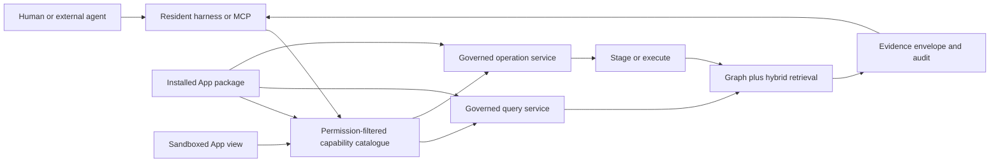

# Integral harness and runtime substrate — gap assessment and closure plan

**Prepared:** 2026-09-17
**Assessment base:** local checkout at `4c0168e`, including current uncommitted release-evidence updates
**Execution model:** coding agents working in bounded, dependency-ordered packages
**Decision owner:** Eldon Marks
**Status:** accepted baseline (QuerySpec v1 locked **C**, 2026-09-17); Wave 0–3 vertical slice + catalogue/merge/extension-host hardenings smoke-verified locally 2026-09-18 (API 11-cap catalogue, declared queries, Asset detail iframe). WP-11/12 release evidence still open.

## 1. Product thesis

Integral should be a harness-backed application environment: one resident mind operates over a governed graph, while independently packaged Apps add schemas, views, operations, skills, schedules, and business rules. Humans, the resident harness, external MCP clients, HTTP clients, and App views should encounter the same capabilities and policy decisions.

The next architectural step is **intrinsic agentive queryability**. A capability is incomplete until an authorized agent can discover it, understand its schema and effects, query its state, invoke its operations, and cite the objects that grounded its answer. This behavior must arise from the substrate and App contracts. Core should not need a new hand-written agent tool for every App concept.

The target rule is:

> Every active substrate or App capability publishes a permission-filtered descriptor into one runtime catalogue; every read uses one governed query service, and every mutation uses one governed operation service.

## 2. Assessment

### 2.1 What Integral is today

Integral already has the main parts of the intended architecture:

- A graph substrate with explicit structural invariants, workspace scope, a shared policy engine, and auditable writes.
- An always-on agentive ops layer with a pluggable harness binding, a singular resident model, facets, staging, routines, retrieval, skills, and MCP.
- A versioned App package contract with independently discovered packages, Operational Models, hooks, typed operations, schedules, extension views, package trust, and lifecycle controls.
- A meaningful external reference package. Asset Register owns its schema, declarative views, custom view, tools, skills, custody rules, warranty schedule, and concurrency behavior.
- A shared typed operation dispatcher used by HTTP, resident/MCP tooling, and the extension-view bridge.
- Strong contract checks. On this assessment, `make verify-contract verify-core-only` passed; three Postgres-only contract cases were skipped in the local lane.

This is a credible foundation preview. It is beyond a conventional chat wrapper and beyond a static plugin system.

### 2.2 Maturity by layer

| Layer | Current maturity | Evidence | Principal gap |
| --- | --- | --- | --- |
| Graph and access substrate | Strong | jvspatial model, invariants, policy engine, rooted graph rules | Public query semantics are not yet a stable substrate contract |
| App packaging | Strong preview | manifest v3, external paths, trust checks, Asset Register | Clean published artifacts and complete release identity remain open |
| App runtime lifecycle | Strong single-worker preview | install/upgrade/pause/resume/uninstall, restart rehydration, recovery tests | Runtime registrations are process-local and lifecycle registration failures can be logged and tolerated |
| Typed operations | Strong | one App operation dispatcher across HTTP, tool dispatch, and view bridge | Capability discovery is split across catalogues; generic CRUD can still bypass App state-machine intent unless guarded |
| Agent tool surface | Broad | 106 manifest entries: 103 existing and 3 deliberate gaps | The hand-curated manifest is an inventory, not yet a self-describing substrate protocol |
| Retrieval | Substantial | deterministic and hybrid retrieval with permission filtering | Retrieval, graph queries, profile introspection, and App operations return different shapes and provenance conventions |
| Content authoring | Strong | introspect → propose → diff → publish | The contract is specialized to Operational Models rather than generalized across substrate capabilities |
| Extension UI | Useful first slice | sandboxed iframe, signed handshake, contextual reads, typed operation invocation | Bridge reads are hard-coded host projections; no capability/query/subscription contract exists |
| Developer experience | Early preview | quickstart, reference Hello, Asset Register, SDK helpers | No scaffold/validator CLI; the independent trial used internal lifecycle functions and skipped the custom view |
| Release proof | Partial | contract/core-only/artifact lanes and AC matrix | AC-01 and AC-14 remain partial; local docs disagree about branch/status; exact digest and Postgres evidence are not attached |

### 2.3 The most important gaps

#### G1. Queryability is fragmented

Core has several good but separate discovery and read paths: Operational Model introspection, the central resident/MCP tool manifest, `ToolContext`, retrieval services, App operation listing, and extension-view contextual reads. An App author cannot declare one capability and have it become uniformly discoverable and queryable across every surface.

#### G2. `ToolContext` is both too low-level and domain-contaminated

`ToolContext.find_entries` accepts a raw jvspatial query dictionary and returns internal node objects. That exposes persistence vocabulary as the extension contract and leaves result, pagination, projection, and provenance behavior implicit. At the same time, `get_employee_compensation` interprets `base_salary` and `effective_date` in Core. This business logic belongs in the owning App.

#### G3. The runtime catalogue is not yet a durable control plane

Installed tools and hooks are cached in module-level dictionaries and rebuilt from persisted Apps at startup. This matches the current single-worker constraint, but it does not define consistency across workers, rolling restarts, or failed registration. Several lifecycle paths continue after registration errors. An App may therefore be marked active while part of its operational surface is unavailable.

#### G4. App state invariants do not have one mandatory write gate

Typed operations correctly centralize business behavior such as custody. Generic Entry/Profile write surfaces are also powerful. The platform needs a formal rule for protected fields and state machines so generic writes, imports, migrations, hooks, agents, and custom views cannot bypass App invariants.

#### G5. Agent answers lack a universal evidence envelope

Retrieval is permission-aware, but query and operation results do not share one standard envelope for object references, schema/version, policy scope, freshness, provenance, warnings, and cursor state. “Ask anything in my workspace” becomes dependable when every answer can point back to governed substrate objects.

#### G6. The developer proof is still partly repository-coupled

The quickstart trial copied an example and used internal Python lifecycle functions as an install proxy. It did not exercise the browser extension view. The release evidence still marks AC-01 and AC-14 partial, and the local contract lane skipped Postgres cases. A public developer needs a supported CLI/API path against built Core artifacts.

#### G7. Product and release state have documentation drift

The checkout is on `fix/duplicate-assistant-bubble`, while sprint and release documents name `main` and `feat/ac-gaps-post-sprint`. The tool-manifest prose and summary also disagree on existing-tool totals. These discrepancies weaken the claim that manifests and release records are authoritative.

## 3. Target architecture

### 3.1 One capability model

Introduce a versioned `CapabilityDescriptor` as common metadata for Core, Apps, connectors, and view bridges.

```text
CapabilityDescriptor
  identity: namespace, key, version, owner package
  kind: resource | query | operation | view | skill | schedule | event
  input_schema / output_schema
  effects: read | propose | execute
  resources and policy actions
  availability: active | paused | degraded | unavailable
  trust and execution class
  discoverability rules
  provenance and documentation references
```

Descriptors are compiled from Core declarations and active App manifests. They are filtered for the requesting principal and workspace before advertisement. The resident, MCP server, HTTP meta endpoints, extension host, and developer tooling consume the same catalogue snapshot.

### 3.2 One governed query service

Add a public `QuerySpec` and `QueryResult` contract above jvspatial.

**Locked (2026-09-17) — QuerySpec v1 = option C (hybrid, App-closed):**

1. **Declared App queries** — Apps expose `kind: query` capabilities with typed parameters for domain semantics and performance guarantees (e.g. Asset Register warranty/custody queries). Callers invoke by capability key + params; the App/engine owns the plan.
2. **Open bounded Core queries** — against Core primitives only (Entry/Track/App/workspace graph shapes Core owns), with strict depth, cardinality, projection, and policy limits.
3. **No generic querying of App domain records** in sprint 1 except through an explicit declared capability. Open `QuerySpec` must not target App-owned entry types / resources by ad-hoc filter.

That proves intrinsic queryability without a too-permissive first contract. Open App-record DSL stays a post-sprint revisit (§11).

```text
QuerySpec (v1)
  mode: declared_capability | core_open
  # declared_capability:
  capability key + typed params (from CapabilityDescriptor.input_schema)
  # core_open (Core primitives only):
  resource selector: Core-owned types only
  filter expression: typed, bounded operators
  traversal: named Core relations, bounded depth
  projection: declared fields
  sort, cursor, limit
  retrieval mode: deterministic | semantic | hybrid

QueryResult
  schema/version
  rows or passages
  canonical object references
  provenance and freshness
  applied scope and policy summary
  cursor, warnings, degraded-mode markers
```

The service compiles declared App queries and Core open queries to indexed single-hop work, Walkers for multi-hop computation, and the existing hybrid retrieval path — always behind the same result envelope. It enforces workspace scope, permissions, maximum depth, maximum cardinality, time budget, and stable pagination. Raw jvspatial query dictionaries and internal Nodes do not cross the public extension boundary.

### 3.3 One governed command service

Keep the App operation dispatcher and make it the canonical command path:

```text
UI / extension view / HTTP / resident / MCP
  → resolve capability descriptor
  → bind principal + workspace + app instance
  → validate input
  → policy decision
  → stage or execute according to effect class
  → App invariant guards
  → atomic substrate mutation
  → audit + typed result + object references
```

Generic writes that touch App-protected fields must pass declared validators or route to an operation. Apps declare protected fields, state transitions, idempotency requirements, and preconditions in their operation/resource metadata.

### 3.4 One runtime catalogue

Persist a compiled catalogue generation for each workspace and treat in-process maps as read-through caches. Installation or lifecycle change builds a new generation, validates every contribution, commits App state and catalogue activation atomically, then publishes invalidation. A failed capability registration leaves the App in `degraded` or `failed`, never silently `active`.

The first release may remain single-worker, but the contract must define generation identity, startup reconciliation, stale-cache rejection, and the later notification mechanism.

### 3.5 Agentive flow



## 4. Next sprint goal

An independently installed App can declare resources, queries, operations, views, skills, and schedules once; after activation, an authorized user or agent can discover and use them through UI, HTTP, resident chat, MCP, and the extension bridge with equivalent policy, validation, evidence, lifecycle, and audit behavior.

Asset Register remains the proof. The sprint should demonstrate:

- “Which laptops have warranties expiring in the next 45 days, who holds them, and what source records support that answer?”
- “Show available assets at Georgetown and prepare a checkout of LT-104 for Maya.”
- “Why can I see this asset but not invoke checkout?”
- “What capabilities did Asset Register add, and which are currently paused?”

## 5. Execution plan

### Wave 0 — freeze the contracts

#### WP-00: Architecture decision and terminology

**Ownership:** architecture/docs
**Files:** new ADR, `extension-contract-v1.md`, `RESIDENT_HARNESS.md`, `INVARIANTS.md`

- Define intrinsic agentive queryability and the capability/query/result contracts.
- Encode locked QuerySpec v1 (C): declared App queries + open bounded Core queries; no generic App-domain record queries.
- Decide descriptor identity, versioning, compatibility, and permission filtering.
- State that App operations are the command seam and protected App state cannot be changed around it.
- Define catalogue generation and activation states (prefer distinct App activation failure names vs retrieval/connector `degraded`).
- State Operational Model draft/publish remains specialized; catalogue advertises it, does not replace it this sprint.
- Reconcile App, package, Operational Model, skill, tool, operation, and capability terminology; `tool_manifest` becomes adapter/generated view of Core descriptors.

**Acceptance:** schemas and examples cover Core plus Asset Register; no unresolved field names or lifecycle states remain for implementation agents; QuerySpec v1 mode split is unambiguous in fixtures.

#### WP-01: Executable contract schemas and SDK types

**Ownership:** schemas/SDK
**Depends on:** WP-00

- Add Pydantic and SDK models for `CapabilityDescriptor`, `QuerySpec`, `QueryResult`, `ObjectRef`, `Evidence`, and typed errors.
- Publish JSON Schemas generated from one source.
- Add compatibility fixtures for additive minor changes and rejected breaking changes.
- Add a contract linter for App manifests.

**Acceptance:** Python SDK and server validate the same fixtures; malformed descriptors fail before package execution.

### Wave 1 — strengthen the substrate boundary

#### WP-02: Domain-neutral `ToolContext` v2

**Ownership:** extension facade
**Depends on:** WP-01

- Add `ctx.query(QuerySpec)`, `ctx.get(ObjectRef)`, `ctx.invoke(operation_key, payload)`, attachment, settings, and audit helpers.
- Return serialized SDK models rather than internal Nodes.
- Deprecate raw `find_entries(query)` for external Apps.
- Move `get_employee_compensation`, salary field names, and effective-date selection into the owning HR/payroll App.
- Keep compatibility adapters for one declared minor-release window.

**Acceptance:** Core contains no payroll vocabulary; Asset Register and Hello use only the v2 facade; private-import and domain-drift guards pass.

#### WP-03: Governed query engine

**Ownership:** query/substrate
**Depends on:** WP-01

- Implement two v1 modes: (a) declared App query dispatch by capability key + typed params; (b) open bounded Core-primitive queries.
- Reject open `QuerySpec` that targets App-owned entry types / resources (fail closed with typed error).
- For Core open mode: bounded filters, projections, named-relation traversal, cursor pagination, deterministic ordering, depth/cardinality/time budgets.
- Compile one-hop work to jvspatial queries and multi-hop work to Walkers; declared App queries may use either under App/engine ownership.
- Integrate hybrid semantic retrieval behind the same result envelope (Core open and declared paths as applicable).
- Enforce permission filtering before materialization and at result serialization.
- Add caller-safe explain metadata (no protected payload leakage).

**Acceptance:** Asset Register warranty/custody answers go through declared queries only; Core open queries cannot ad-hoc scan Asset Register entry types; deterministic/semantic/hybrid share object-ref + evidence shape; cross-workspace and unauthorized traversal fail closed.

#### WP-04: App invariant guards

**Ownership:** writes/policy
**Depends on:** WP-00, WP-01

- Add manifest declarations for protected fields, validators, transitions, and required operation routes.
- Run guards for UI CRUD, API CRUD, imports, migrations, hooks, resident calls, MCP, and extension views.
- Define bypass authority for migrations and repair jobs with explicit audit provenance.
- Convert Asset Register custody and lifecycle rules into the proof fixture.

**Acceptance:** attempts to set `checked_out`, current custodian, or active custody through generic Entry writes are rejected or routed through the custody operation on every surface.

### Wave 2 — make the App runtime authoritative

#### WP-05: Compiled capability catalogue

**Ownership:** package/runtime
**Depends on:** WP-01, WP-02

- Compile Core tools, App queries/operations/views/skills/schedules, and connector tools into one descriptor catalogue.
- Preserve existing tool names through adapter-generated descriptors.
- Filter descriptors by workspace, principal, lifecycle, trust, and scope.
- Generate resident and MCP tool definitions from descriptors.
- Remove manual count drift and make reconciliation a required gate.

**Acceptance:** installing Asset Register adds its capabilities without hand-editing `tool_manifest.yaml`; pausing it removes them from every caller's advertised catalogue.

#### WP-06: Durable catalogue generations and lifecycle activation

**Ownership:** lifecycle/runtime
**Depends on:** WP-05

- Persist catalogue generation, package digest, compile status, and diagnostics.
- Make package validation and capability compilation prerequisites for `active`.
- Atomically activate a generation with the App lifecycle state.
- Rehydrate exact generations after restart and reject stale cached invocations.
- Add a `degraded` state and repair/reconcile command.
- Specify a multi-worker invalidation adapter while retaining the current single-worker deployment gate.

**Acceptance:** injected compile/registration failure never yields an active but partially callable App; restart and repair converge to the recorded generation.

#### WP-07: Shared operation/evidence envelope

**Ownership:** operation dispatch/audit
**Depends on:** WP-01, WP-04, WP-05

- Standardize operation discovery and results across HTTP, resident, MCP, and view bridge.
- Include object refs, policy decision id, audit correlation id, idempotency key, package version, and warnings.
- Preserve propose/bless/execute semantics from the descriptor effect class.
- Make denied and paused behavior identical on every surface.

**Acceptance:** one contract test invokes Asset Register checkout through all four surfaces and compares normalized results, denials, staged state, and audit linkage.

### Wave 3 — deliver the agentive and application experience

#### WP-08: Resident query planner and grounded answers

**Ownership:** harness integration
**Depends on:** WP-03, WP-05, WP-07

- Add `integral_describe_capabilities` and `integral_query` as stable primitives.
- Teach the resident to introspect before planning and prefer App-declared queries/operations.
- Render object references as navigable citations in chat.
- Report unavailable/paused capabilities and explain permission denials without leaking hidden data.
- Invalidate jvagent tool-surface caches by catalogue generation.

**Acceptance:** warranty and availability questions are answered from Asset Register records with clickable evidence and no App-specific Core binding.

#### WP-09: Extension bridge v2

**Ownership:** frontend extension host
**Depends on:** WP-03, WP-05, WP-07

- Replace hard-coded `entries.count` and `context.primary_entry` reads with capability discovery and bounded query messages.
- Keep the sandboxed iframe and capability-limited bridge.
- Validate source, mount identity, handshake expiry, message size, rate, and request cancellation.
- Add lifecycle revocation and a host-driven refresh/event primitive.
- Publish a small TypeScript client for App views.

**Acceptance:** Asset Register's custom view discovers its allowed query and checkout capability, refreshes after the operation, and loses access immediately on pause.

#### WP-10: Developer CLI and independent artifact trial

**Ownership:** developer experience/release
**Depends on:** WP-01, WP-05, WP-06, WP-09

- Provide `integral app init`, `validate`, `build`, `install`, `inspect`, and `doctor` or equivalent supported commands.
- Run the trial against built Core artifacts without importing `app.*` internals.
- Exercise install, browser view, query, operation, pause, upgrade, restart, uninstall, and diagnostics.
- Produce a machine-readable report with Core digest, App digest, contract version, database, and results.

**Acceptance:** a clean-room coding agent modifies a scaffolded App and completes the trial using public docs and SDKs only.

### Wave 4 — prove operability and release

#### WP-11: Queryability evaluation and observability

**Ownership:** test/observability
**Depends on:** WP-03, WP-06, WP-08

- Add traces spanning harness turn → catalogue generation → query/operation → policy → graph → evidence/audit.
- Measure discovery accuracy, grounded-answer precision, permission leakage, query latency, operation parity, stale-catalogue rejection, and recovery time.
- Add golden Asset Register questions, adversarial workspace probes, high-cardinality limits, and lifecycle chaos tests.
- Define SLOs for catalogue activation, deterministic query latency, resident grounding, and pause revocation.

**Acceptance:** failures identify package, capability, generation, principal, query plan, and policy decision without exposing protected payloads.

#### WP-12: Release evidence and documentation reconciliation

**Ownership:** release/docs
**Depends on:** all prior packages

- Run full `make verify`, contract, Core-only, clean-artifact, Postgres concurrency/restore, frontend, and browser lanes against the exact candidate.
- Record commit and artifact digests; reconcile branch names, counts, roadmap state, AC status, and known limitations.
- Close AC-01 and AC-14 with evidence rather than document edits alone.
- Publish only after architect acceptance of the contract and release evidence.

**Acceptance:** one release record links every required check to the exact Core and Asset Register artifacts.

## 6. Dependency and ownership map

```text
WP-00 ──┬── WP-01 ──┬── WP-02 ──┐
        │           ├── WP-03 ──┼── WP-08 ──┐
        │           └── WP-04 ──┼── WP-07 ──┤
        │                       │           ├── WP-11 ── WP-12
        └────────────── WP-05 ──┼── WP-06 ──┤
                                └── WP-09 ── WP-10 ─────┘
```

Each coding agent owns one work package and its named files. Shared schema files belong to WP-01 until its handoff is accepted. Downstream agents consume tagged schema fixtures and do not edit them ad hoc. Every handoff includes:

1. changed contract and compatibility impact;
2. preserved invariants;
3. commands and results;
4. failure-path evidence;
5. migrations and rollback behavior;
6. known limits and next-owner notes.

## 7. Sprint acceptance criteria

| ID | Observable result |
| --- | --- |
| AQ-01 | Clean Core artifacts boot without commercial packages and expose a versioned Core capability catalogue |
| AQ-02 | Installing an independently built Asset Register artifact activates one validated catalogue generation without Core edits |
| AQ-03 | Authorized callers discover Asset Register resources, queries, operations, views, skills, and schedules; unauthorized callers cannot infer hidden capabilities |
| AQ-04 | A declared App query (or Core open query on Core primitives) returns equivalent governed data and evidence through HTTP, resident, MCP, and extension view |
| AQ-05 | A multi-hop warranty/custody question answered via Asset Register **declared** queries returns grounded object references with no cross-workspace leakage; open QuerySpec cannot ad-hoc query those App records |
| AQ-06 | Checkout uses one operation implementation and yields equivalent validation, staging, policy, idempotency, conflict, and audit behavior on every surface |
| AQ-07 | Generic writes cannot bypass Asset Register protected fields or state transitions |
| AQ-08 | Pause/uninstall/revocation removes App capabilities from discovery and invocation; stale catalogue calls fail closed |
| AQ-09 | Restart, interrupted activation, failed compilation, repair, upgrade, and rollback converge to an explicit catalogue generation and lifecycle state |
| AQ-10 | Core contains no Asset Register, HR, payroll, or other App-domain interpretation in public extension facades |
| AQ-11 | The custom view uses bridge v2 for discovery, query, operation, refresh, and lifecycle revocation while remaining sandboxed |
| AQ-12 | Query budgets stop unbounded traversal and high-cardinality reads with typed, non-leaking errors |
| AQ-13 | A clean-room agent completes scaffold → build → install → query → mutate → upgrade using only public artifacts and docs |
| AQ-14 | Release evidence records exact Core/App digests and passes full, Postgres, frontend, browser, recovery, and security lanes |

## 8. Required tests

- Contract: descriptor/schema compatibility, manifest compilation, SDK parity, no private imports.
- Authorization: row, relation, field, capability-discovery, and operation denial across workspaces and principals.
- Query: declared App capability dispatch; Core open plans with Walker traversal; rejection of open App-domain scans; semantic/hybrid degradation; cursor stability; depth/cardinality/time budgets.
- Command: validation, protected fields, staging, idempotency, concurrent conflict, and audit correlation.
- Lifecycle: failed compile, failed activation, crash between generation persistence and activation, restart, repair, pause, upgrade, rollback, uninstall.
- Distribution: built Core plus independently built App in a clean environment.
- Surface parity: HTTP, resident, MCP, extension bridge, and native UI.
- Browser: capability-driven custom view, grounded chat citations, pause/revoke behavior, and fallback UI.
- Postgres: concurrent custody, catalogue activation serialization, recovery, and backup/restore.

## 9. Explicit non-goals

- A public marketplace or automatic publisher approval.
- Sandboxing arbitrary trusted Python inside the Core process.
- Multi-agent/A2A orchestration.
- Arbitrary SQL, arbitrary graph query dictionaries, or unconstrained GraphQL for Apps or agents.
- Generic / open querying of App-owned domain records (entry types, resources) except through an explicit declared `kind: query` capability — locked for sprint 1.
- Multi-worker deployment in this sprint. The catalogue contract and invalidation port are required; the production adapter can follow.
- Replacing jvspatial, the policy engine, staging, MCP, Operational Models, or the App operation dispatcher.
- Rewriting Operational Model draft/publish into the generic Query/Command path this sprint.

## 10. Immediate sequence

1. ~~Accept or amend intrinsic agentive queryability~~ — **accepted**; QuerySpec v1 locked **C** (declared App + open Core; no generic App-domain reads).
2. Execute WP-00 and WP-01 before implementation agents create competing query or descriptor shapes.
3. After schema freeze, start WP-02, WP-03, WP-04, and WP-05 with exclusive file ownership.
4. Keep Asset Register as the continuous proof fixture; do not create a second reference domain this sprint.
5. Close the current foundation release record separately with exact-artifact and Postgres evidence. Do not describe the preview as published or fully released before that proof exists.

## 11. Decisions to revisit after adoption

- Whether catalogue invalidation uses Postgres notifications, a durable event log, or an external broker when multi-worker deployment becomes supported.
- Whether to admit **open bounded QuerySpec against App-owned resources** (post sprint-1 C lock) once declared-query coverage and policy are proven.
- Whether the query language remains JSON-only or gains a textual developer form generated from the same schema.
- Whether field-level policy is required beyond App-protected fields and existing resource ACLs.
- Whether declarative Apps can be admitted at a lower trust tier than executable Python Apps.
- Whether extension views need offline/cache capabilities after the online bridge v2 proves stable.
