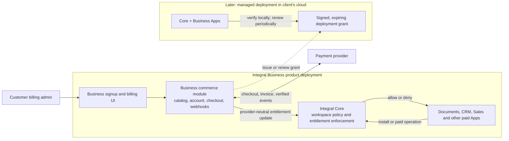

# Integral Business self-serve commerce build plan

**Status:** Proposed implementation plan  
**Date:** 2026-09-25  
**Scope:** Integral Business commercial control plane and the Integral Core changes needed to enforce its decisions

## Recommendation

Build self-serve commerce as a Business-owned control-plane module with a
versioned, provider-neutral contract to Core. Initially deploy it as part of
the Integral Business product stack; do not create a fleet of microservices or
require a separately operated control plane for hosted self-serve. Core remains
the authority that allows or denies paid behavior.

The boundary is logical from the beginning and may become a deployment
boundary later. Client-cloud managed deployments use the same entitlement
contract, delivered as a signed, time-limited deployment grant when direct
control-plane connectivity is unavailable or undesirable.

## Current baseline

- Core has a workspace-scoped `Entitlement` Object and manual grant, revoke,
  and list endpoints. Commercial App installation and resumption are gated;
  revocation pauses the App while retaining generic data access and export.
- The entitlement projection does not yet have Billing Accounts, Subscriptions,
  provider event processing, checkout, or a customer billing portal.
- Current grant authorization permits workspace admins/owners to grant their
  own entitlements. That is appropriate only for the current manual provisioning
  phase; it must be closed before payment-backed access is offered.
- Paid execution needs broader checks than install/resume. Paid tools,
  scheduled work, connectors, and other declared paid capabilities need
  runtime authorization.
- `integral-business` currently contains the Documents, CRM, and Sales App
  packages and a Docker stack that runs Core plus those packages. It has no
  commerce service or billing UI.
- Core's current finish-status document still lists release qualification
  evidence as open. Commerce work must not be presented as proof that Core is
  production-ready.

## Ownership contract

| Concern | Owner | Contract |
|---|---|---|
| Plans, paid product catalog, trial policy, checkout, invoices, customer portal | Integral Business | Commercial product configuration and customer billing experience |
| Payment-provider integration and event reconciliation | Integral Business commerce module | Provider events are verified, idempotent, durable, and reconciled |
| Billing Account and Subscription authority | Integral Business commerce module | Provider-neutral IDs and lifecycle state; provider IDs stay adapter metadata |
| Workspace entitlement projection and authorization | Integral Core | Core accepts only authenticated billing-service commands or explicit platform-admin overrides |
| Package/capability declarations and data behavior after entitlement loss | Business App packages | Declare entitlement keys, required capabilities, grace/loss behavior, export and retention metadata |
| Enforcement | Integral Core | Enforce at install/resume and paid operation boundaries, regardless of UI or caller |
| Client-cloud deployment license | Business issuer, Core verifier | Signed grant scoped to account/deployment, package rights, limits, and expiry |

Business must not import Core internals. Core must not import Business code or
contain Business plan/pricing rules.

## Build sequence

### Wave 0 — Lock the first commercial offer

**Repos:** Product decision; update this plan and the Business product docs.

Decide before checkout implementation:

1. First offer is organization/workspace subscription plus the initial paid
   Business Apps. Keep per-seat, storage, and usage metering out of the first
   charge unless a validated offer requires one.
2. One Billing Account may cover multiple workspaces; each workspace belongs
   to one Billing Account. Define who can create, transfer, and administer the
   account.
3. Set trial length, payment-failure grace, cancellation timing, downgrade
   behavior, data access/export, and deletion/retention policy.
4. Decide whether App entitlements are included in named plans or sold as
   add-ons. Define test/sandbox workspace treatment.
5. Define initial hosted region, support level, and the later client-cloud
   managed-service boundary. Avoid promising offline licensing in the first
   self-serve release.

**Exit:** A small versioned product catalog and lifecycle matrix covers signup,
trial, paid, past-due, grace, canceled, refunded, and manually overridden
states.

### Wave 1 — Harden Core's entitlement authority

**Repo:** `integral-core`.

1. Change customer-facing entitlement permissions. Workspace admins may view
   applicable entitlements but cannot mint or reactivate paid grants. Keep
   manual grants behind platform-admin/support authority, with actor, reason,
   expiry, and audit record. Make revoke authority explicit as well.
2. Add a trusted, authenticated billing-service command boundary for
   entitlement projection updates. Require idempotency and source references;
   never trust browser redirects or caller-supplied `status=active`.
3. Add the Billing Account association to workspace scope, including migration,
   uniqueness, reassignment rules, and auditability. Keep commercial objects
   record-shaped (`Object`) unless a graph relationship is required by actual
   traversal or policy behavior.
4. Evolve the entitlement contract to represent source, external subscription
   reference, effective dates, grace state, loss policy, and package/capability
   grants without leaking provider-specific state into authorization logic.
5. Add a single entitlement/capability decision service used by lifecycle and
   execution paths. Deny by default on missing, expired, revoked, or invalid
   state; support explicit grace behavior.
6. Enforce on install/resume and every paid operation boundary, including tool
   dispatch, scheduled/background execution, connector activation or execution,
   and relevant MCP/resident paths. Preserve policy, tenant consent, trust, and
   entitlement as separate gates.
7. Preserve generic, permission-checked read/export after loss. Make App pause,
   job stopping, retries, and dependent App behavior deterministic and
   observable.

**Exit:** Core contract tests prove self-grant is denied, trusted projection is
idempotent, each paid execution surface denies after loss, grace is explicit,
and generic record/export access remains available.

### Wave 2 — Implement the Business commerce control plane

**Repo:** `integral-business`.

1. Add a commerce module/service that owns the catalog, Billing Account,
   subscription lifecycle, provider customer references, and Core projection
   client. Keep provider-specific code behind a small adapter.
2. Integrate checkout and customer portal with the selected payment provider.
   Create checkout sessions server-side from the product catalog; never accept
   price, amount, customer, or entitlement decisions from the browser.
3. Add a durable webhook inbox. Verify signatures, deduplicate provider event
   IDs, persist before processing, retry safely, and periodically reconcile
   provider state. Handle out-of-order events and subscription changes.
4. Project normalized billing state to Core using the trusted command
   boundary. Persist correlation IDs and explainable state transitions.
5. Add account setup, plan selection, trial start, payment method, invoice and
   portal entry points, current plan/Apps, payment-failure status, and clear
   entitlement explanations.
6. Make provisioning recoverable: signup can be retried without duplicate
   accounts/workspaces, billing event replay cannot double grant, and failed
   Core projection is surfaced and reconciled.
7. Keep the first version plan-based. Add an immutable usage ledger before any
   metered billing; defer usage charges until measurement, retries, limits,
   refunds, and customer-visible explanation are specified.

**Deployment choice:** Co-deploy commerce and Core in the first hosted product
stack, with an explicit API/module boundary. The commerce runtime may be a
separate process/container for dependency isolation, but it is not a separate
customer-operated microservice or a requirement for a distributed control
plane.

**Exit:** A new organization can sign up, start a trial, purchase or cancel,
and see correct Core access after verified provider events and reconciliation.

### Wave 3 — Business App catalog and lifecycle experience

**Repos:** Core generic UI surfaces plus Business catalog metadata.

1. Expose catalog metadata for price/plan eligibility, entitlement key,
   compatibility, requested capabilities, and entitlement-loss behavior.
2. Connect App discovery/install to the billing experience: show included,
   trial, add-on, or unavailable state; route to checkout where appropriate;
   re-check with Core before install.
3. Show billing admins the Billing Account, plan, workspace coverage,
   subscription/grace state, entitlements, and last reconciliation result.
4. Keep the interface generic enough for future third-party paid Apps; Business
   owns initial product content and commercial configuration.

**Exit:** A customer can discover and activate a paid App without support
staff manually granting an entitlement, and an admin can explain why access is
allowed or denied.

### Wave 4 — Client-cloud managed deployment licensing

**Repos:** Integral Business issuer/control plane and Core verifier.

1. Define a signed deployment grant containing account/deployment identity,
   package and capability rights, limits, issued/expiry times, and grant
   revision. Keep customer data and provider payment secrets out of the grant.
2. Add Core signature verification, key rotation/revocation, clock tolerance,
   renewal, grace, and failure behavior. Persist the last valid grant and
   verification result for audit.
3. Bind grants to an installation identity with an administrator-approved
   enrollment/replacement process. Avoid a hard dependency on a live network
   call for each user operation.
4. Add deployment inventory, renewal and expiry visibility, and support
   diagnostics to Business operations.
5. Qualify backup/restore, upgrade, recovery, and license transfer for the
   client-cloud deployment model.

**Exit:** A customer-cloud deployment enforces its signed grant locally,
renews predictably, and enters the agreed grace/read-only/export state when it
cannot renew.

## Acceptance gates

1. **Security:** No customer API, browser flow, or App package can self-grant
   paid entitlements. Provider webhooks are verified and replay-safe.
2. **Authorization:** Entitlement enforcement is server-side on all declared
   paid entry points; UI state is advisory only.
3. **Correctness:** Duplicate and out-of-order provider events, lost responses,
   retries, cancellation, refunds, and reconciliation converge to one
   explainable entitlement state.
4. **Continuity:** Loss or lapse pauses paid behavior according to policy while
   preserving generic permission-checked reads, exports, audit history, and
   the declared retention period.
5. **Isolation:** Billing Account access follows explicit billing-admin roles
   and cannot grant access to unrelated workspaces.
6. **Operations:** Metrics and alerts cover webhook backlog/failures,
   projection lag, reconciliation drift, failed provisioning, and upcoming
   entitlement expiry.
7. **Release:** Core and Business are tested as separately versioned artifacts
   pinned to compatible releases. Qualify a fresh production-like deployment
   before selling hosted production access.

## Explicitly deferred

- Usage-based charges, token billing, connector-volume billing, overages, and
  complex seat proration.
- Marketplace publisher payouts or customer-published paid packages.
- Offline or air-gapped client-cloud licensing beyond the signed grant and
  agreed renewal window.
- Splitting the hosted control plane into independently scaled services before
  traffic, isolation, or operational needs demonstrate the benefit.
- Making all of Core paywalled. Core remains the general-purpose substrate;
  Business Apps, hosted service, support, and declared premium capabilities are
  commercial surfaces.

## Sequencing dependencies

Wave 0 precedes contract changes. Wave 1 can proceed independently of provider
selection once the normalized entitlement contract is settled. Wave 2 depends
on Wave 1's trusted projection boundary. Wave 3 depends on catalog and checkout
state. Wave 4 can begin its grant-format design alongside Wave 2, but should
not ship before signing, renewal, expiry, restore, and support behavior are
qualified.
