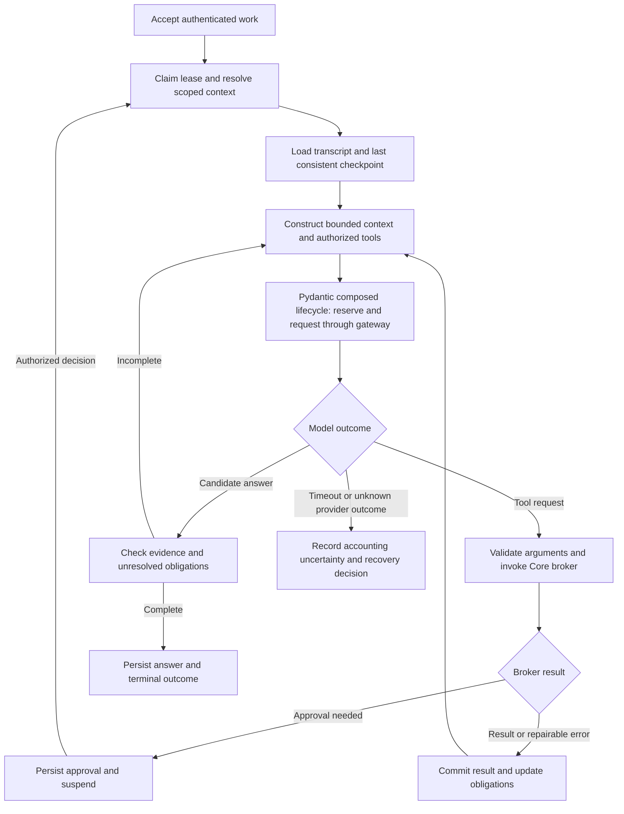

# Pydantic AI Harness Alternative — Implementation Plan

**Prepared:** 2026-10-04

**Decision owner:** Eldon Marks

**Status:** Active V1 execution baseline; implementation and independent qualification in progress

**Revision:** 3 — coding-agent execution, 2026-10-04. Retains revision 2’s broader capability composition and the subsequent Agent Skills standard-only decision. Supersedes human-team allocation, engineer-day estimates and deferred package briefs. This is an execution blueprint, not dependency approval or implementation evidence.

**Assessment:** working checkout at `b0934bd5`, including existing uncommitted work; findings are planning evidence, not release qualification.

**Companion:** [Harness and intelligence-plane specification](PYDANTIC_AI_HARNESS_INTELLIGENCE_PLANE_SPEC.md)

**Delivery model:** one coordinating coding agent, bounded implementer assignments, fresh-context review and sequential integration. File ownership, task dependencies, durable handoffs and evidence govern progress. Human input is reserved for product/architecture decisions and explicitly authorized release actions. These are development roles, not additional agents inside Integral’s resident runtime.

## 1. Outcome and release scope

Ship an alternative resident provider named `integral_native`, implemented by composing Pydantic AI and the broader `pydantic-ai-harness` capability library, and selectable alongside jvagent. Users must be able to carry out the same governed Integral work through either provider. The alternative must improve task completion, context handling, observability, and recovery while preserving tenant isolation and accounting accurately for requests and effects.

The first production release includes graph-backed conversations and sessions; a controlled model/tool loop; tenant-specific skill and capability overlays; staged writes and durable approvals; model gateway integration with LiteLLM; immutable usage accounting; quota admission hooks; operator diagnostics; migration/rollback; and continued external Claude/ChatGPT access through MCP.

Provider choice and model choice are distinct. `integral_native` selects the Integral harness. Its model policy selects models/providers through the gateway. A user's existing Claude/ChatGPT session connects externally through MCP and remains owned by that product. Connecting a consumer subscription is not equivalent to supplying API credentials or moving that assistant into Integral.

Integral AI via Pydantic AI is the default provider. jvagent remains explicitly selectable for compatibility; an unavailable selected provider must surface a clear error rather than silently routing the turn to another harness. Qualification evidence in §13 remains required for release readiness.

**Strategic rule:** adopt supported upstream behavior, adapt it to Integral's contracts, and build custom behavior only for a demonstrated gap. Pydantic drives the reasoning/tool lifecycle. Integral supplies authenticated context, governance, graph continuity, work authority and durable usage facts. Neither an upstream model plan nor a framework effect record can grant authority or prove a substrate mutation occurred.

Release scope has three tiers: mandatory composed capabilities in §2.3; optional, separately qualified accelerators; and deferred architectural expansions. Required capabilities may not be silently omitted to meet a schedule. If a pinned API cannot meet a mandatory behavior, record the gap, evaluate a bounded adapter/fallback and obtain an architecture decision before qualifying the release.

## 2. Corrections and decisions from the live code

### 2.1 Integration baseline

The earlier research emphasized the legacy HTTP connector. The primary current path is **embedded streaming jvagent**:

`ai_chat.py → chat_streaming.py → ChatBackendProvider → JvagentProvider → stream_jvagent_embed_turn`.

`JvagentProvider.stream_turn` prefers the embedded transport and falls back to legacy HTTP. The migration should add a provider to this existing registry and normalized event contract; it should not start by replacing the old standalone connector.

There is also an existing durable work kernel: `WorkItem`, `WorkApproval`, `WorkOutboxEntry`, leases/fences, recovery, and public jvspatial transaction/CAS requirements. Reuse this kernel for the native runtime. Adding Temporal, DBOS, or a second queue is deferred unless WP-00 demonstrates that the existing kernel cannot satisfy a specific required behavior.

`JvagentProvider` currently disables process-wide skill/tool caches whose keys lack tenant components. The native implementation must have complete cache identities from its first pilot. This is a concrete isolation issue with an existing mitigation, not a reason to assume the live code is currently leaking tenants.

### 2.2 Implementation defaults

| Decision | Implementation baseline | Evidence or reason |
|---|---|---|
| Harness identity | `integral_native` provider with one resident and principal facets | Existing provider registry; ADR-003 |
| Harness behavior | Pydantic AI Harness capabilities and public lifecycle hooks behind an adapter | Reuse planning/context/persistence/control behavior; keep dependency-specific state out of public Core contracts |
| Durable execution | Existing PostgreSQL WorkItem kernel and outbox | I-WORK-01..06 already define authority and transactions |
| Conversations | Existing ChatThread/ChatMessage graph | Preserve UI and ownership semantics |
| Sessions | New rooted HarnessSession graph node under the thread | Integral-owned continuation, multiple historical binding sessions |
| Checkpoints | Harness StepPersistence with a tenant-scoped custom StepStore over encrypted Object records | Framework snapshots/events are subordinate to Core sessions, fencing and effect receipts; no edges to Objects |
| Model transport | LiteLLM SDK adapter first, optional Proxy adapter second | SDK already pinned; do not assume a Proxy is deployed |
| Metering | Core-owned append-only quantities/estimated cost, reconciliation, generic admission contracts | Business owns tariff, paywall, payer resolution and invoices |
| Observability | OpenTelemetry-compatible metadata plus durable Core run/step/event records | Logfire/export backends are deployment options |
| Tenant deployment | Shared PostgreSQL with authorization on every boundary; dedicated deployments remain possible | Logical isolation is a release requirement; physical isolation is deployment policy |
| Execution sandbox | No ambient shell/filesystem; permitted code tools require a tenant-scoped sandbox | Library tool support alone is not an isolation mechanism |

The initial release can retain the deployment-wide single-worker guard while the native implementation is qualified across workers. That guard may be removed only after all shared application services—not just native turn locks—are proven safe. A selectable legacy provider with process-local state can still require one worker.

### 2.3 Capability adoption matrix

Names below describe current documented surfaces, not verified APIs in an installed release. WP-00 must record exact exports, versions, optional extras, provider compatibility and the selected fallback for each required behavior. A Pydantic capability is a unit of agent behavior; an Integral capability is an authorized substrate operation. Their identifiers and registries remain distinct.

| Surface | Release treatment | Integral adaptation / accountable package |
|---|---|---|
| Typed agent loop, hooks, structured outputs and streaming | Mandatory: adopt | Pydantic adapter and normalized provider events; WP-06 |
| Planning | Mandatory for complex tasks: adopt | Mirror bounded plan revisions and obligations to Core work; receipts determine completion; WP-06/07/09 |
| Tool Search / on-demand capabilities | Mandatory: adopt | Search only an authorized catalogue; live authorization on invocation; WP-07/08 |
| Provider-native or model-agnostic compaction | Mandatory context strategy: select per route | Preserve protected work state outside lossy summaries; meter auxiliary calls; WP-07/09 |
| Tool Output Limits and cache diagnostics | Mandatory output bounds; diagnostics enabled for qualification | Spill to tenant-owned artifacts with authorized reads and expiry; WP-07/11 |
| Skills | Mandatory progressive instruction loading: adopt | Translate approved Integral skills into capabilities or a validated library; graph/profile scope controls discovery; script execution stays brokered; WP-07 |
| StepPersistence | Mandatory: adopt through custom StepStore | Encrypted, fenced jvspatial persistence; map physical run/conversation identities; WP-02/06/09 |
| Memory and Conversation Search | Mandatory scoped behavior: adapt | Existing scratch/promotion and permission-filtered transcript services; no default shared notebook/search index; WP-07/09 |
| Ask User / deferred tool calls | Mandatory: adopt interaction lifecycle | Prompt Sheet and WorkApproval adapters; durable suspend/resume rather than an open coroutine waiting for approval; WP-08/09/10 |
| Instrumentation and Pydantic Evals | Mandatory: adopt | Redacted OTel export, durable Core IDs, frozen domain postconditions and evaluation cases; WP-00/11/16 |
| SpendLimits / UsageLimits | Mandatory runtime guards: adapt | Shared scoped counters where useful; Core reservations and ledger remain authoritative; WP-05/12 |
| Guardrails / argument repair | Mandatory policy hooks and bounded validation; model-based defenders optional | Deterministic broker checks cannot be overridden by a judge; repair never retries a denied or uncertain effect; WP-06/08 |
| Code Mode (Monty) | Optional measured pilot after read-only parity | Explicit selected brokered tools, no host mounts, no eager/speculative execution initially; WP-13/16 |
| FileSystem / Shell / sandbox backends | Required only where WP-00 marks tool parity mandatory | Tenant-scoped isolated jobs and artifact access; never ambient host execution; WP-13 |
| Web/browser/SaaS/MCP connectors | Optional or parity-driven, individually qualified | Existing connector contracts, scoped credentials, outbound policy and usage units; no automatic connector catalogue exposure; WP-13/14 |
| Advisor / model selection | Optional measured quality improvement | Same resident and scope, child request lineage, admission and metering; WP-04/07/16 |
| UseThreadExecutor | Optional server resource control | Bounds synchronous callbacks, not chat concurrency; context propagation and shutdown proof; WP-06/16 |
| BackgroundTools / DynamicWorkflow / Pydantic Graph | Deferred unless a bounded need survives WP-00 | A workflow graph is computation, not jvspatial knowledge storage; background work must use WorkItem leases/outbox; separate design before enabling |
| SubAgents / handoffs / runtime capability creation | Deferred | ADR-003 and App trust contracts require explicit review; no peer-agent fabric or runtime elevation through generated code |

Start from an explicit composition, not a wholesale `Coder()`/`Researcher()` default. Their constituent capabilities are reusable, but their tool/environment/delegation assumptions need qualification. A deployment profile lists capabilities, settings, supported models, data stores and extras; the hash is recorded on each run.

### 2.4 Commercial distribution and dependency policy

The published Pydantic AI and Harness licenses are MIT. Integral Core can retain its Apache license and Integral Business can remain proprietary; preserve upstream copyright/license notices in distributed artifacts. Optional dependencies and hosted services require their own review. Logfire, a Pydantic-hosted gateway and enterprise support are optional deployment choices, not Core boot requirements.

WP-00 produces an exact dependency/extra manifest and license report; WP-15 includes applicable third-party notices and verifies the native-only wheel/container. Harness uses 0.x API versioning: pin exact compatible versions, retain the tested restore path and evaluate upgrades as controlled migrations. Use the active Pydantic AI repository/package metadata; the former standalone Harness repository is historical. A commercial license assessment does not establish operational production readiness.

### 2.5 Standard skill interoperability

Integral Core skills follow the full [Agent Skills standard](https://agentskills.io/specification), without JV Agent extensions. This user-directed decision supersedes the earlier plan to preserve `spec`, `extends`, `requires-actions` or non-standard disk naming through adapters.

Skill names and directories use lowercase hyphenated names; allowed-tools is a standard optional space-separated string. Tool IDs and opaque App operation/graph keys remain separate. Required fields are name and description; optional fields are license, compatibility, string-valued metadata and allowed-tools. Markdown bodies have no mandatory headings. Do not relocate vendor behavior into metadata.

Core's parser, scaffold, normalizer and format checks enforce this boundary. Runtime adapters consume portable descriptors and instructions. Authorization, App bindings and shared host instructions live in runtime policy and manifests, not skill inheritance. Resources and scripts use explicit authorized facilities. Existing App libraries migrate their disk names/references and remove vendor fields; WP-00/07 verify real-library discovery, resource and execution parity. No native adapter restores retired Action dependencies or base-SOP inheritance.

External Claude/ChatGPT clients reach Integral operations through MCP. Native skill compatibility does not automatically install App instructions in a client's catalogue; client loading is a separate supported mechanism.

## 3. Repository ownership and target layout

### 3.1 Core and Business

Core owns runtime execution, identities/scopes, graph conversation/session management, capability enforcement, operational events, usage facts, cost confidence, immutable export watermarks, and generic limit/reservation contracts. Core must work independently as an Apache-licensed substrate.

Integral Business owns customer accounts, payer mapping, subscriptions, payment/checkout, plans, tariffs, credits, discounts, invoice close, customer-facing paywall and spend UI, and hosted gateway operations. Core may store an opaque attribution handle returned by a trusted extension; it must not import Business modules or encode plan names/markups/payment-provider logic.

The Business work package below defines a handoff to that repository. Execution of this plan starts in Core; implementation in Business needs its own checkout, instructions and scope review.

### 3.2 Proposed modules

Names below are proposed ownership boundaries. WP-01 validates them against live code before creating files.

```text
backend/app/
  agentive/runtime/
    contracts.py               # internal immutable execution contracts
    controller.py              # thin work/lifecycle coordination; no duplicate model/tool loop
    pydantic_adapter.py        # isolated Pydantic AI/Harness public APIs
    composition.py             # versioned explicit capability profiles / per-run factory
    governance.py              # trusted Core lifecycle hooks; broker is final tool gate
    step_store.py              # custom StepStore, encrypted records and identity mapping
    memory_adapter.py          # scoped scratch/transcript facade for Harness behavior
    context.py                 # tenant-safe context/skill/capability assembly
    tool_adapter.py            # capability broker-backed toolset
    transcript.py              # canonical model history conversion
    sessions.py                # graph session lifecycle
    checkpoints.py             # encrypted, versioned checkpoint records
    events.py                  # durable event identity/replay/projectors
  services/chat_providers/integral_native_provider.py
  services/intelligence/
    gateway.py                 # transport-neutral ModelGateway
    litellm_adapter.py          # initial SDK route; separate Proxy variant if needed
    credentials.py             # facade over current credential service
    usage_ledger.py             # append-only usage and correction records
    reconciliation.py          # join capture, gateway and provider evidence
    admission.py               # generic reservation/limit extension boundary
    observability.py           # redacted spans and summaries
  schemas/intelligence/        # public request/response/event schemas
  schemas/agentive/            # additive runtime/work contracts where appropriate
```

HTTP handlers stay in existing API modules or dedicated `api/intelligence.py`, using `@endpoint`, canonical exceptions and schemas outside handlers. All persistence uses jvspatial public APIs. Atomic work/CAS uses the public transaction interface already required by the work kernel. A missing public primitive is an upstream jvspatial change with contract evidence; direct asyncpg/SQLAlchemy imports in Core are not an alternative.

Frontend adds a provider adapter using the current normalized events and existing staging/Prompt Sheet UI. It may need a shared backend transport extracted from `JvAgentProvider.ts`; provider selection, model selection, and external MCP connection must have distinct labels.

## 4. Contracts to freeze before feature work

### 4.1 Execution context

Create a frozen `ExecutionContext` containing deployment identity, authenticated principal/kind/facet, workspace, thread, native session, WorkItem, run/attempt/segment, binding version, profile/capability snapshot fingerprints, deadline and limits, credential mode/reference, admission reference and trace ID.

Populate it from trusted server data. Never merge browser `extra_data`, provider metadata or model arguments over principal, workspace, run, credential or billing attribution fields. Caller extras are a validated, allowlisted payload. Existing provider behavior need not be silently changed until its compatibility tests cover the new boundary.

Every ID read is checked against current principal and workspace. Thread access requires both workspace access and thread-level ownership/access. Organization membership does not automatically expose coworkers' private chats. New native threads are bound to their workspace; accessing another workspace requires another authorized thread or an explicit export/import flow.

### 4.2 Authority and continuity records

| Record | Primitive and role | Minimum constraints |
|---|---|---|
| ChatThread/ChatMessage | Existing graph Nodes; user-visible transcript | Rooted catalogue, ownership, named message containment; tenant-scoped reads |
| HarnessSession | Node under ChatThread via `HAS_HARNESS_SESSION` | One active session per thread/binding, owner/workspace checks, generation CAS |
| RuntimeCheckpoint | Object; private recoverable state | Immutable version/fingerprint, encrypted body, tenant/thread/session/run IDs, fence/sequence |
| WorkItem/WorkApproval/WorkOutboxEntry | Existing Objects; scheduling and approval authority | Preserve lease/fence, definition binding, atomic approval/outbox transitions |
| AgentRun/RunStep | Existing Objects; execution and capability receipts | Explicit attempt/segment and terminal reason; tenant checks; cached aggregates only |
| RuntimeEvent | Object; durable progress/replay metadata | Unique `(run, event_sequence)`; redacted payload; authorizing scope; fence |
| UsageObservation | Object; immutable source measurement | Request/attempt identity, source event identity, completeness, raw normalized units |
| UsageAdjustment | Object; correction/settlement | References original request/observation; no history rewrite |
| UsageReservation | Object; authoritative temporary admission hold | Atomic limit check+hold, expiry, settle/release, idempotent owner |

Objects are linked by validated scalar references, not graph edges. Sessions get graph edges; accounting/checkpoint/run records do not become Nodes simply to make the picture connected. Multi-hop session/tenant deletion is a Walker by default; operational-record cleanup uses bounded, tenant-scoped Object queries.

### 4.3 Run state model

Separate scheduling from execution state:

- WorkItem retains its existing legal transitions and determines queue/lease/approval authority.
- AgentRun records execution status; add explicit suspended/waiting state or a documented continuation segment model. Do not fake a successful terminal run when work remains pending.
- HarnessSession reflects continuity (`active`, `suspended`, `closed`, `expired`, `revoked`) and points to the last consistent checkpoint.
- ModelRequest records dispatch outcome (`reserved`, `dispatched`, `responded`, `failed`, `cancelled`, `outcome_unknown`) independently of accounting completeness.

Existing deterministic WorkItem attempt run IDs remain compatible. Use `logical_work_id`/`work_item_id` for continuity across attempts and `run_segment_id` for continuation within an attempt. Effect keys remain stable across recovery; physical model requests always receive a new request-attempt ID if actually redispatched.

### 4.3.1 Framework identity and state ownership

| Framework concept | Mapping and authority |
|---|---|
| `conversation_id` | Opaque continuation namespace mapped to one authorized HarnessSession; not a client-supplied ownership claim |
| Framework `run_id` | Unique for each physical `Agent.run` invocation; Core run/attempt/segment mapping persisted before dispatch; never reuse it across separate invocations |
| Tool call ID | Physical invocation identity mapped to a stable logical obligation/effect key; not an idempotency key across recovery |
| Step event / snapshot | Framework observation stored through StepStore and projected to existing Core records; not a second user-visible run state machine |
| Model-owned plan / notebook | Untrusted working state, validated and persisted separately as needed; completion and promotion require Core evidence/policy |
| Capability mutable state | Per invocation by default; checkpoint manifest declares restore/reset/rebuild semantics for every enabled capability |

The checkpoint manifest includes message format/version, compaction version, plan revision, pending obligations and approval references, effect receipts, capability profile/hash, external artifact references and their retention, and framework/Core identity mapping. StepPersistence snapshots principally preserve messages; capability state, sandbox files and unfinished tool work are separate concerns. Declaring a capability enabled without a recovery policy is a WP-09 blocker.

### 4.4 Events and transport

Preserve existing text/tool/source/status/error/message-finish envelopes. Add versioned `run_id`, `event_id`, `sequence` and timestamps without breaking existing clients. New state fields cover waiting for approval, checkpoint restoration, cost pending and terminal reason.

Commit durable semantic events before publishing. Token deltas may remain transient; recovery reads committed assistant message segments and an encrypted runtime checkpoint. A reconnect cursor never triggers a new model request. Define an explicit resynchronization response when old events expire.

An SSE disconnect is transport loss; explicit cancellation is an execution command. Existing disconnect behavior is cancellation, so changing it needs a feature flag and UI evidence. Pilot defaults: foreground chat cancels on disconnect unless continuation is explicitly enabled; scheduled WorkItems continue independently of browser connection. Browsers changing tabs must preserve existing I-CHAT-PAR behavior.

## 5. Native loop design

Compose the native runtime using Pydantic AI Harness capabilities and public hooks. Let upstream drive model/tool iteration, planning support, progressive discovery, context strategies and settled-step persistence. The Integral controller coordinates work admission, authority, suspend/resume and truthful outcomes. It must not duplicate upstream message parsing or loop machinery. Any custom loop component needs a gap record naming the failed behavior, evidence, alternatives, maintenance owner and exit/rollback condition.

### 5.1 Composition and enforcement order

Construct a fresh per-run composition from an immutable, versioned profile and trusted ExecutionContext. Use explicit factories for stateful capabilities, clients and stores; reuse only immutable definitions or independently scoped backends. Do not assume a capability instance is stateless because an Agent accepts it. Cache identities include deployment, workspace, principal/facet, permission generation, focus and profile/binding versions. Bound synchronous callbacks and demonstrate ContextVar propagation/cleanup where thread executors are used.

Required boundary sequence (semantic order, not an assumed ordering of upstream constructors):

1. Authenticate, authorize thread/workspace, claim work lease and resolve scoped profile/stores.
2. Restore only safe checkpoint state; revalidate current authority and revisions.
3. Build bounded instructions/history from approved skills, retrieval and working memory. Compaction runs before request-only memory injection where required by the selected API.
4. Before **each** model dispatch, check fence/cancellation/deadline and atomically reserve through the gateway; record durable intent. This includes compaction/advisor/guardrail calls.
5. Before **each** tool invocation, including nested Code Mode, connector and background calls, invoke Core broker validation with current scope, capability revision, approval and stable effect identity.
6. Persist effects/usage and settled snapshots with idempotent, fenced writes. Redact before telemetry/UI export.
7. Publish committed semantic outcomes; completion uses receipts and unresolved obligations, not a model plan status alone.

WP-00/01 record the actual hook ordering and nested-call coverage of the selected package. A before/after hook alone is insufficient where calls can bypass it: gateway dispatch and broker invocation are final enforceable boundaries. Capability events need schema/version mapping and duplicate suppression before UI projection.

### 5.2 Recovery, memory and spend constraints

- StepStore authorization is enforced on every read/write/list/fork/delete, using trusted tenant identity. Stores use jvspatial public persistence, not bundled File/SQLite/Mongo stores in production. Resolve partial framework event/snapshot/Core writes by deterministic keys and recovery; document the true transaction boundary.
- Only settled, consistent snapshots are automatically resumed. Interrupted snapshots are quarantined until pending effects have been reconciled. A fork creates new Core work/session authority and does not inherit an outstanding approval or replay completed effects as fresh actions.
- Framework tool-effect records are observations. Core's stable effect keys and broker receipts determine whether an operation may execute or return a prior result. Unknown effects suspend, including framework-started calls lacking terminal results.
- Skills loading consumes only approved standard-format profile material; filesystem discovery and inclusion filters are not authorization. Harness Skills loads instruction bodies, not bundled scripts/resources; preserve those through explicit artifact/script tools. Use custom/deferred capabilities when filesystem materialization would distort Integral's skill contract.
- Memory writes use existing personal scratch/promotion rules and provenance; organization/system notebook scope needs an explicit approved contract if not already supported. Conversation search filters by owner/access before matching, and removes revoked/deleted material from indexes, summaries and recoverable content. Namespaces derive from the server, never model arguments.
- Protected obligations, receipts and approvals live outside lossy summaries and are reattached after compaction. Permission/definition changes trigger rebuilding context before further use; old summaries cannot preserve revoked access.
- SpendLimits can provide scoped counters and runtime feedback, including shared stores, but documented admission checks do not reserve in-flight spend. Reuse Core atomic reservations to avoid concurrent over-admission. Unknown/unpriced usage is explicit; never translate an upstream zero-price fallback into a free or settled Core request. Configure fail-closed monetary guards or an approved pricing function, with token/request limits as additional brakes.
- Eager/speculative Code Mode is disabled initially. Even read-only speculative requests can incur cost and access data; any later activation needs nested-call admission/authorization, cancellation proof and a measured benefit including unused-call cost. Deferred approval tools remain outside initial Code Mode selection; qualify continuation semantics before adding them.



Loop policies:

- Simple answers use one model request when sufficient. Complex tasks get a compact typed plan and completion criteria; the controller avoids an extra planning call on every message.
- Load core skills plus permitted workspace/App overlays. Discover large tool catalogues progressively; tool relevance filtering does not broaden authorization.
- Keep unresolved obligations, approvals, effect receipts, pending tool calls and provenance when compacting. Meter compaction, classifiers, verification calls and title generation through the same gateway.
- Structured errors classify repairable arguments, transient provider/tool failures, permission denial, stale capability/definition, unknown effect outcome, and required human information. Denials and unknown effects do not get blind retries.
- Use bounded retries, request/tool limits, wall-clock deadline, context budget, output ceiling and spend reservation. Repeated identical failing calls trigger stop/repair rather than a longer loop.
- Validate final claims against receipt-backed evidence and task criteria. Do not promise completed work when only a proposal exists. Avoid requiring a model judge for every trivial answer; deterministic receipt checks are preferred where possible.
- One resident is retained. Pydantic AI agent handoffs/subagent features are not enabled in the baseline; specialized brokered tools and deterministic work steps supply capabilities. Optional Advisor calls are bounded model requests within that resident, not separately authorized peers.
- Every capability call checks scope, policy, current lease/fence, cancellation, deadline, active App definition and approval. Context construction is not authorization enforcement.

## 6. Work packages and dependencies

### 6.1 Execution roles and authority

| Role | Coding-agent responsibility | Boundary |
|---|---|---|
| Coordinator / integrator | Read the baseline, maintain task ledger and ownership map, dispatch ready tasks, integrate compatible changes sequentially, reproduce acceptance evidence | Sole editor of shared integration files in a wave; cannot waive gates or authorize releases |
| Package implementer | Execute one assigned task slice, preserve existing changes, add meaningful tests for its contracts, document evidence and rollback | Write only assigned files; request a coordinator reassignment before touching another task’s files |
| Review pass | Read the candidate diff and requirements from fresh context; inspect invariants, integration and evidence; report defects with paths and reproduction | Read-only review assignment; does not approve its own implementation or weaken requirements |
| Qualification pass | Reproduce accepted package checks on the integrated artifact; assemble G0–G11 evidence | Evidence must identify the actual revision/configuration; missing services or credentials remain explicit gaps |
| Eldon Marks | Resolve material architecture/product tradeoffs, approve consequential scope changes and authorized release/default decisions | Routine implementation, bounded repair and integration proceed under the authorized scope |

Roles may run sequentially in one coding session if separate agents are unavailable. A fresh-context review can use another session reading the persisted artifacts. Parallel coding sessions are useful only after disjoint ownership and frozen interfaces are established; they do not change ADR-003 or enable runtime SubAgents/A2A.

### 6.2 Dispatch contract and entry gate

The package definitions below, task slices in §6.5, dependency graph in §7 and acceptance gates form the assignment baseline for every WP. The coordinator materializes exact paths and commands at dispatch after checking the checkout; this is a mechanical specialization of the defined task, not a new planning phase.

Before assigning a task:

1. Record `git rev-parse HEAD`, `git status --short`, current dependency/configuration identities and the existing patch manifest. Fingerprint configuration without publishing secrets or credential-bearing environment/patch content. Preserve pre-existing work. Never reset, stash, overwrite or commit unrelated changes to obtain a clean baseline. If overlapping edits cannot be attributed safely, select an authorized isolated checkout or pause that task for a concrete coordination decision.
2. Read root `AGENTS.md`, applicable nested instructions, `docs/INVARIANTS.md`, this plan and the companion specification. Read only the producer/consumer code needed for the task. Proposed paths in §3 are targets, not claims that files already exist.
3. Verify that every package dependency has an **accepted** receipt against the integrated artifact. A producer’s summary or unmerged branch is insufficient. Initial WP-10 work may begin after WP-06; its continuation acceptance waits for WP-08/09.
4. Resolve the exact file allowlist, shared-file patch requests, selected pins/profile, fixture strategy, executable checks and expected postconditions. Record applicable invariant IDs with the preservation/amendment required by §10. An unresolved mandatory upstream API or persistence primitive blocks its dependent implementation rather than inviting a guessed API.
5. Record the task’s out-of-scope behavior and rollback. Required external credentials, sandbox services and paid probe budgets are explicit inputs; lack of those inputs does not make a simulated probe pass real integration acceptance.

Dispatch template (copy into `docs/product/harness-execution/wp-XX/task-YY.md` when execution begins):

```yaml
package: WP-XX
task: WP-XX.YY
objective: <one observable deliverable from section 6.5>
baseline: <commit plus reviewed patch/config/dependency fingerprints>
dependency_receipts: [<accepted producer receipt paths>]
read_first: [<plan/spec sections, instructions, producer and consumer files>]
owned_files: [<exact existing or proposed paths; no implicit whole-repo ownership>]
shared_file_requests: [<coordinator-owned path and required additive patch>]
contracts: [<schema/API/profile versions consumed and produced>]
invariants: [<actual IDs and required preservation or approved amendment>]
steps: [<ordered implementation and verification steps>]
checks: [<exact commands, environment, expected exit and postconditions>]
evidence_dir: docs/product/harness-evidence/wp-XX/task-YY/
stop_conditions: [<bounded failures that require a contract/architecture decision>]
rollback: <reversible behavior and treatment of durable/unknown work>
```

Every prompt ends with: **“You are not alone in this checkout. Preserve others’ changes. Own only the listed files. Stop before changing a frozen contract, crossing the Core/Business boundary or bypassing a gate. Return the handoff defined in §6.4. Do not push, create/update a PR or change production/default settings without explicit authorization.”**

### 6.3 Shared-file ownership and integration

The coordinator owns `backend/app/main.py`, `backend/app/config.py`, `backend/app/models/nodes.py`, `backend/app/models/edges.py`, `backend/app/services/chat_providers/base.py`, `backend/app/services/chat_providers/registry.py`, `backend/app/services/chat_streaming.py`, `backend/pyproject.toml`, `backend/uv.lock`, shared frontend provider/event contracts, `docs/INVARIANTS.md` and generated capability maps. An implementer sends a concrete patch proposal plus consumer tests for these files. The coordinator applies it after dependency receipts are accepted. Ownership can be reassigned explicitly for one task, never concurrently.

`runtime/step_store.py` is owned by WP-02 initially and WP-09 only after WP-02 acceptance; the WP-06 implementer consumes its frozen interface. `runtime/events.py` follows WP-03 → WP-10 integration. The minimum frontend native adapter belongs to WP-06, then WP-10 extends it. Gateway transport belongs to WP-04; WP-05 capture and WP-12 admission integrate through frozen callbacks. Any changed producer interface invalidates affected downstream receipts until their conformance checks are reproduced.

Independent implementers may use isolated worktrees where authorized and useful. Merge changes one at a time and rerun producer/consumer checks against the resulting combined artifact. A private worktree’s green result does not qualify a different integrated revision. Do not cherry-pick another agent’s unrelated changes or resolve a conflict by deleting its work.

Keep each implementation slice reviewable: one primary contract or behavior, bounded owned files, explicit consumer adaptation and targeted failure fixtures. Split large tasks before dispatch. A split changes task IDs and ownership, never relaxes package acceptance or leaves an enabled producer/consumer pair incompatible. Incomplete behavior stays behind the existing provider/profile enablement boundary.

### 6.4 Execution ledger, handoff and resume

Create execution state only when implementation starts, under `docs/product/harness-execution/`. `ledger.yaml` tracks task ID, dependencies, owner/session, baseline, owned paths, status, evidence and next action; the coordinator is its sole writer. Task statuses are `pending`, `ready`, `running`, `review`, `repair`, `accepted` or `blocked`. A task enters `accepted` only after review and integrated evidence. Packages close after every mandatory slice and package acceptance passes; optional unqualified capabilities remain explicitly disabled.

Each handoff contains:

- Objective/task ID, base revision and resulting patch/commit fingerprint, configuration/profile/dependency identities and exact files changed.
- Contracts produced/consumed, invariant preservation, migration implications and tests for actual postconditions.
- Commands with exit codes, environment/service identities and redacted evidence paths; distinguish fixtures, real providers, PostgreSQL, browser journeys and packaged artifacts.
- Unresolved defects, missing inputs, known baseline failures, remaining risks, rollback and the exact next task. Never report an unrun command as passed.

On interruption or context reset, read the ledger, task brief and last handoff; compare live status/diff to their baseline before continuing. Reuse completed evidence only if its code/config/input identity still matches. Pending approvals, unknown effects/usage and diagnostic artifacts survive cancellation or rollback. A blocked task names the failed behavior, evidence, available alternatives and the minimum input/decision needed; continue other eligible tasks when ownership permits.

Review and repair use the same requirements. Do not remove a failing test, weaken an assertion, increase a timeout or disable a mandatory capability solely to obtain green evidence. Reproduce suspected baseline failures independently and mark them separately; they are not a release waiver. Follow repository lint/test requirements before any implementation commit. Planning alone does not authorize pushes, PRs or deployments.

### 6.5 Bounded task slices and evidence routing

Execute slices in order within a package unless their brief explicitly freezes an interface and establishes disjoint paths. The **last slice of every package includes fresh-context review, bounded repair, integrated reproduction and an accepted handoff**. WP-00 review resolves technical decisions before WP-01; WP-17 release approval remains human-owned.

The table below supplies the initial dispatch sequence and proposed test namespaces. Test paths are future deliverables, not claims of existing tests. The coordinator makes each command concrete from the selected interpreter/services before dispatch. Existing relevant regression tests remain required in addition to the proposed namespace.

| Package | Ordered task slices and deliverables | Proposed evidence test namespace |
|---|---|---|
| WP-00 | **00.1** baseline/call/skill/parity inventory and isolated dependency resolution; **00.2** read-only composition, hook ordering and scoped StepStore/deferred suspension probes; **00.3** real budgeted route/usage/cancellation proof plus frozen evaluation corpus; **00.4** adoption/pin/gap decision report and calibrated execution graph | Isolated spike `tests/contracts/test_native_harness_{composition,step_store,meter_capture}.py` |
| WP-01 | **01.1** frozen context/identity/state and JSON schemas; **01.2** provider event/cancel compatibility adapters and extension/composition contracts; **01.3** golden producer/consumer fixtures and invariant review | `backend/tests/native_harness/wp_01/` |
| WP-02 | **02.1** rooted session schema, typed edges, active-generation migration and CAS; **02.2** canonical multimodal/tool transcript conversion and encrypted StepStore; **02.3** scope/lifecycle/export/delete/round-trip/ID-collision proof on PostgreSQL | `backend/tests/native_harness/wp_02/` |
| WP-03 | **03.1** submission idempotency and work/outbox transaction or recoverable intent; **03.2** shared thread/principal admission reservations and exact terminal release; **03.3** native API/worker integration, lease heartbeat, cancellation/fencing, two-process contention, stale-write and worker-death recovery proof | `backend/tests/native_harness/wp_03/` |
| WP-04 | **04.1** gateway/credential factories and modality profiles; **04.2** LiteLLM routes, explicit physical retries/fallback and capture/admission callbacks; **04.3** route, credential overlap and cancellation fixtures/probes | `backend/tests/native_harness/wp_04/` |
| WP-05 | **05.1** immutable usage Objects/indexes/source normalization; **05.2** durable intent/capture/outbox projection, adjustments and reconciliation; **05.3** Decimal/token-category/duplicate/retry/lost-response evidence | `backend/tests/native_harness/wp_05/` |
| WP-06 | **06.1** fresh composition/governance factory and native provider/controller over accepted gateway/session/work contracts; **06.2** coordinator registration and minimum frontend read-only adapter/selector; **06.3** real UI read-only continuity/cancel/isolation/metering proof | `backend/tests/native_harness/wp_06/`; native-provider frontend tests and browser evidence |
| WP-07 | **07.1** scoped standard-skill descriptors/discovery/authorized resources and immutable cache keys; **07.2** compaction/output spill/protected obligations and Core memory/search adapters; **07.3** revocation/private-skill/context-fidelity/auxiliary-metering proof | `backend/tests/native_harness/wp_07/` |
| WP-08 | **08.1** typed broker tools, stable effect mapping and argument/error handling; **08.2** durable Ask User/Prompt Sheet/WorkApproval suspend/resume adapter; **08.3** exact-payload/revocation/duplicate approval and existing staging regression proof | `backend/tests/native_harness/wp_08/`; Prompt Sheet/staging browser evidence |
| WP-09 | **09.1** capability recovery manifests and fenced safe checkpoint pointer; **09.2** fresh-invocation restore/fork/unknown-effect reconciliation; **09.3** kill-at-boundary, two-store divergence, corrupt codec and key-rotation proof | `backend/tests/native_harness/wp_09/` |
| WP-10 | **10.1** extend WP-06 transport/events/cursor replay and sticky binding; **10.2** paused/recovering/cancel/approval continuation projections after WP-08/09; **10.3** browser refresh/reconnect/thread-switch/fork and duplicate-event evidence | Native-provider/chat frontend suites; `backend/tests/native_harness/wp_10/` |
| WP-11 | **11.1** redacted OTel/capability projection with durable lineage; **11.2** authorized generic usage/run endpoints and operator inspector; **11.3** secrets/export outage/retention/access-control and browser inspection evidence | `backend/tests/native_harness/wp_11/`; inspector frontend/browser evidence |
| WP-12 | **12.1** generic admission schemas, local default and atomic reserve/settle/release/reconcile; **12.2** gateway integration and downstream consumer contract example; **12.3** near-limit races, unresolved holds, duplicate settlement and Business-free Core proof; separate Business implementation requires its own authorized assignment | `backend/tests/native_harness/wp_12/` |
| WP-13 | **13.1** close auxiliary usage/tool parity inventory; **13.2** mandatory brokered sandbox tools and isolated artifact lifecycle; **13.3** optional Code Mode/Advisor profiles only where qualified; **13.4** nested admission/metering, sandbox separation and accelerated/standard comparison | `backend/tests/native_harness/wp_13/` |
| WP-14 | **14.1** native/MCP capability-policy/receipt conformance and external usage classification; **14.2** supported client configuration/connection and revocation probes; **14.3** cross-client operation parity evidence and instructions | `backend/tests/native_harness/wp_14/`; real supported MCP-client receipts |
| WP-15 | **15.1** restart-safe session migration, fork/switch and rollback tools; **15.2** native-only packaging/bootstrap/optional extras through coordinator; **15.3** retention/purge, representative duplicates, clean wheel/container and rollback proof | `backend/tests/native_harness/wp_15/`; clean artifact installation evidence |
| WP-16 | **16.1** reproduce all package checks on a frozen candidate and close traceability gaps; **16.2** paired efficacy/ablation/chaos/concurrency/soak and browser journeys; **16.3** G0–G3, G5–G9, G11 dossier with blockers/remediation and pilot-entry decision | `backend/tests/native_harness/wp_16/`; frozen Pydantic Evals corpus and release evidence |
| WP-17 | **17.1** prepare reversible pilot configuration, alarms and rollback runbook for authorized deployment; **17.2** observe actual traffic and collect G4/G10 over the required period; **17.3** reconcile pilot failures/charges, rehearse rollback and deliver explicit release/default decision dossier | Pilot receipts/monitoring exports and rollback evidence; no simulated pilot replacement |

For WP-01..16 backend tasks, the dispatch command is `cd backend && .venv/bin/python -m pytest tests/native_harness/wp_XX/ -o addopts='' --strict-markers -v` once those owned tests exist in the synchronized environment; include applicable existing regression files. The explicit override prevents repository default marker exclusions from silently omitting mandatory fault/slow cases. Record collected/passed/skipped/deselected counts and justify every nonexecuted required case. Record missing namespaces as unfinished work, never a passing empty selection. Use real PostgreSQL for transaction/index/fence checks. Frontend tasks use the current `npm run lint:types` and targeted `npm run test:run -- <owned test files>`, plus browser smoke evidence for the stated journeys. Package integration follows §13 and root AGENTS, including generated capability-map updates where applicable. WP-00 uses its isolated interpreter; WP-17 uses actual authorized pilot evidence.

### 6.6 Starting prompt and completion rule

Use this prompt in a coding session with the Core checkout attached:

> Read `AGENTS.md`, applicable nested instructions, `docs/INVARIANTS.md`, `docs/product/PYDANTIC_AI_HARNESS_IMPLEMENTATION_PLAN.md` revision 3 and its companion intelligence-plane specification. Act as the coordinating coding agent. Inspect the live checkout and preserve existing changes. Start with WP-00.1: create the execution ledger and its concrete task brief, inventory the current integration/call/skill/parity surfaces, and record a reproducible baseline. Proceed through ready slices using accepted dependency receipts, explicit file ownership and the handoff/review rules in §6. Do not assume the proposed native files or APIs already exist. Use an isolated environment for WP-00 and stop dependent implementation when a mandatory capability/authority primitive is unproven. Keep Core generic, preserve one resident per binding and use only standard skill frontmatter. Report completed evidence, concrete blockers and the next ready task. Do not push, open/update PRs, deploy or switch the default without explicit authorization.

This prompt is for a later authorized implementation run; this document update does not launch it. A final implementation report distinguishes completed Core packages, pending Business consumer work, controlled pilot entry and final production/default qualification. The harness is complete only when the applicable mandatory package and G0–G11 receipts exist; writing code or closing the agent’s task list is insufficient.

### WP-00 — Runtime and provider compatibility proof

**Coding-agent assignment:** compatibility implementer. **Dependencies:** none. **Dispatch:** WP-00 slices in §6.5; package closure requires its acceptance evidence.

**Work:** Inventory embedded versus HTTP paths, existing work kernel, gateway calls, all LLM side calls, credential ownership, skill scripts and frontend events. Freeze a baseline with commit, reviewed patch manifest and reproducible artifact before implementing; do not commit unrelated existing changes to manufacture a baseline. Evaluate released Pydantic AI versions against Core's Python >=3.10, LiteLLM 1.101 range, OpenAI SDK, async cancellation and optional-extra constraints. Test LiteLLM SDK route and optional Proxy route with configured OpenAI/Anthropic models using explicitly budgeted credentials; no assumption that a consumer account provides API entitlement.

**Composition proof:** exercise Planning, Tool Search/on-demand skills, selected compaction/output bounds, StepPersistence with a minimal custom scoped store, instrumentation and spend guards in one small read-only harness. Exercise Ask User/deferred approval against a stubbed durable suspension boundary. Establish hook ordering, per-run mutable state, capability-state recovery and every auxiliary model route. Verify required behavior through LiteLLM; for provider-native features lost in translation, choose a portable strategy or propose a metered provider adapter through ModelGateway rather than a silent direct SDK bypass. No production dependency pin is chosen from latest documentation alone.

**Deliverables:** capability-by-route adoption matrix (exact API/export, required extra, state, hooks, store protocol, metering path, license and fallback); provider compatibility matrix; exact proposed pins/lock diff and dependency notices inventory; documented public API examples; request usage/cancellation/retry capture matrix; encrypted checkpoint round-trip proof; jvagent parity inventory; frozen evaluation manifest. Review required Python floors and optional-extra conflicts independently of package names.

**Stop conditions:** a required scope check can be bypassed; deferred resume cannot preserve original work authority; checkpoint state cannot be safely restored; or any paid request escapes capture/admission. Name the affected capability and bounded alternative before proceeding.

**Acceptance:** one streamed typed tool run per supported route; preserved cache/multimodal/request ID fields; explicit unknown usage on cancellation; Pydantic public API can pause at a persisted boundary or reconstruct from canonical history. Any Python floor increase or dependency incompatibility is an architecture decision before proceeding.

**Handoff:** accepted API/pin/adoption report and minimum parity list referenced by each dependent task receipt. Spike code stays isolated until promoted deliberately.

#### WP-00 assignment brief

- **Objective:** prove the mandatory composed lifecycle can fit Integral authority, state, model transport and accounting before production dependency selection.
- **Inputs:** this revision and companion spec; `backend/pyproject.toml`/`uv.lock`; provider base/registry/jvagent implementation; chat streaming/thread services; agentive broker, profile/skill registry, work models/execution/outbox/recovery; root and agentive AGENTS; `docs/INVARIANTS.md`; ADR-003 and current chat concurrency contract.
- **Owned outputs:** isolated spike environment/code and redacted `docs/product/harness-evidence/wp-00/` reports; proposed dependency diff only. Do not modify provider default, production config or the existing dirty feature changes. Evidence directory is created during execution, not implied to exist now.
- **Artifacts:** baseline manifest (commit, patch hashes, Python/package versions, reproducible build identity); adoption/provider matrix; hook/state/store coverage report; normalization/cancellation capture fixtures; selected-extra license report; proposed pins; evaluation manifest; remaining gap/decision register and calibrated task graph.
- **Sequence:** inventory baseline; resolve minimal extras in the isolated environment; exercise scoped read-tool composition; demonstrate settled snapshot/new-invocation restore and deferred suspension; collect model/auxiliary request observations; verify parallel tenant contexts and denied scope; freeze parity/evaluation cases; write the decision report. Real provider calls require available, explicitly budgeted credentials. Fixtures alone are not provider compatibility evidence.
- **Invariants:** I-GRAPH-01/02, I-WORK-01..06, I-SKILL-SCOPE-01, I-RET-01..05, I-SCRATCH-01..05, I-APP-DEF-01, I-HOOK-01/02, I-SUBSTRATE-01 and I-EXT-01/02; spike tools use broker-shaped fixtures and cannot mutate live tenant data.
- **Verification recipe:** record `git rev-parse HEAD`, `git status --short`, `uv --version` and the selected isolated interpreter's `--version`. Put contract probes in proposed `tests/contracts/test_native_harness_composition.py`, `test_native_harness_step_store.py` and `test_native_harness_meter_capture.py` inside the spike. Run the isolated interpreter with `-m pytest <each proposed file> -v`; record actual commands, versions and exit status. Run the explicitly budgeted provider driver separately and record request IDs/normalized usage with secrets removed. These files/commands describe future evidence, not tests already present or executed.
- **Exit:** every mandatory behavior has a compatible pinned route/adapter or a reviewed bounded gap; stop conditions above are resolved; no paid call or nested tool escapes authority/capture; state/recovery policies are complete enough to freeze WP-01; task boundaries, dependency gates and acceptance commands are reviewed before feature implementation.
- **Rollback:** discard or retain the isolated spike as evidence; production remains on its existing dependencies/binding. No live schema or provider change is part of the spike. Promote only reviewed code/fixtures in subsequent bounded packages.


### WP-01 — Versioned runtime, event and commercial extension contracts

**Coding-agent assignment:** contract implementer. **Dependencies:** WP-00. **Dispatch:** WP-01 slices in §6.5; package closure requires its acceptance evidence.

**Ownership:** proposed `runtime/contracts.py`, schemas and contract documentation; coordinator owns additive `chat_providers/base.py` and caller adaptations.

**Work:** Freeze ExecutionContext, ModelRequest/Response, RuntimeEvent, checkpoint/capability-state schema, usage observation/adjustment, admission reservation interface, composition profile and provider cancel/resume lifecycle. Define StepStore identity/fencing, memory/store scope, skill translation and capability-event mappings. Produce public JSON schemas and a sample Core-only extension adapter usable by downstream distributions without internal imports. Freeze semantic hook ordering and mandatory enforcement coverage from WP-00. Classify trusted versus untrusted fields. Make the existing unconditional jvagent cancellation hook in `chat_streaming.py` dispatch to the selected provider. Preserve jvagent compatibility via an adapter.

**Acceptance:** old provider events parse unchanged; provider-specific cancellation reaches only the right run; reserved fields cannot be overwritten through `extra_data`; Core builds without Business installed. Publish JSON schemas and golden compatibility fixtures.

### WP-02 — Graph sessions and transcript fidelity

**Coding-agent assignment:** session/storage implementer. **Dependencies:** WP-01. **Dispatch:** WP-02 slices in §6.5; package closure requires its acceptance evidence.

**Ownership:** Nodes/edges through coordinator, `runtime/sessions.py`, `runtime/transcript.py`, `runtime/step_store.py`, `chat_threads.py` additions, migration script.

**Work:** Add rooted HarnessSession with typed thread relationship, binding generation and active-session uniqueness. Reuse existing chat catalogue/ownership rather than a second User graph. Build versioned conversion preserving tool arguments/results, source references, attachments and safe provider metadata. Place detailed model exchanges in encrypted checkpoint records when UI parts do not represent them. Implement session reset, close, export and deletion with scope checks. Implement the custom StepStore over encrypted Object records, including framework-to-Core identity mapping, idempotent event writes and fenced snapshot pointers; expose no tenant selector to the model.

**Acceptance:** graph traversal reaches every new session; create and edge wire are atomic; graph/owner/cache mismatch is denied; two callers cannot create two active generations; tools and multimodal history round-trip; model reconstruction works without jvagent history. Ordinary organization members cannot read each other's private threads. StepStore list/fork/delete and ID-collision probes cannot expose another tenant; separate physical invocations have separate framework run IDs; key/codec version is recorded and round-trips.

### WP-03 — Shared turn admission and work-kernel integration

**Coding-agent assignment:** work-kernel implementer. **Dependencies:** WP-01, WP-02. **Dispatch:** WP-03 slices in §6.5; package closure requires its acceptance evidence.

**Ownership:** `chat_turn_registry.py`, work kernel adaptations, `runtime/events.py`; integrate API enqueue and worker dispatch centrally.

**Work:** Use public PostgreSQL transactions and CAS to enforce shared thread and principal concurrency; admission reservations are terminally released only for the exact WorkItem. Submission gets a client request id; atomically persist accepted-message reference, admission reservations, enqueue and outbox fact where public graph/Object UoW supports it. If graph+queue cannot share a transaction, implement recoverable submission-intent reconciliation instead of claiming atomicity. Route native work through WorkItem, with cancellation, heartbeat, lease expiry and stale worker fencing. The coding-agent slices split the shared reservation primitive (03.2) from its live API/worker lifecycle integration and adversarial multi-process proof (03.3).

**Acceptance:** two-process same-thread race admits one run; duplicate send yields the same accepted work/message; stale workers cannot write checkpoints/events/effects; per-user/tenant limit is shared; worker death recovers work. JSON/SQLite remain explicitly single-worker dev only; PostgreSQL production probes fail closed.

### WP-04 — Model gateway and credential isolation

**Coding-agent assignment:** gateway implementer. **Dependencies:** WP-00, WP-01. **Dispatch:** WP-04 slices in §6.5; package closure requires its acceptance evidence.

**Ownership:** `services/intelligence/gateway.py`, LiteLLM adapters and credential facade, additive config; current credential storage API remains authoritative.

**Work:** Build a request-scoped gateway with model capability profiles, supported modalities, allowlisted routes, bounded timeout/output, credential resolution and provider request identifiers. Start with SDK integration if sufficient; optional Proxy implementation uses trusted metadata and scoped credentials. Explicitly record every actual retry/fallback attempt. Remove or intercept invisible retry layers that would prevent attempt-level accounting. Supported workspace/key owner resolution must match current policy, not assume caller key versus workspace owner key.

**Acceptance:** overlapping tenants cannot share mutable credential/model clients; secrets do not enter prompts/logs; gate/capture contract fixtures pass here, and actual paid admission conformance completes with WP-12 before WP-06; OpenAI/Anthropic routes preserve required behavior; fallback records model served and each attempt; unknown cost remains unknown. SDK/proxy compatibility is verified on the chosen pins.

### WP-05 — Immutable usage ledger, pricing observations and reconciliation

**Coding-agent assignment:** usage-ledger implementer. **Dependencies:** WP-01, WP-04. **Dispatch:** WP-05 slices in §6.5; package closure requires its acceptance evidence.

**Ownership:** ledger/reconciliation modules, Object models, indexes, durable ingestion worker, usage schemas.

**Work:** Implement append-only source observations keyed by request-attempt and source event identity. Separate physical provider requests from logical run/step identity; source observations for the same request reconcile into one projection rather than being double summed. Store tokens by category with explicit inclusion rules, rate-card source/version, Decimal cost estimate, credential mode, trusted opaque payer attribution, and completeness. Integrate gateway/model events and callbacks with durable capture intent/outbox; add missing-capture and unknown-outcome records.

**Acceptance:** replayed callback/outbox events create no additional charge; two independent observations do not double-count the same request; retries incur distinct recorded provider costs; cache/reasoning/audio parent/child token buckets are not summed twice; money is exact to declared precision; cancellation can settle later; reconciled adjustments preserve originals; unavailable ledger prevents new paid dispatch. Provider invoice data may be coarse—report matching granularity and uncertainty honestly.

### WP-06 — Composed native Harness provider and read-only slice

**Coding-agent assignment:** native-runtime implementer with coordinator-owned UI/registry integration. **Dependencies:** WP-02, WP-03, WP-04, WP-05, WP-12 Core admission. **Dispatch:** WP-06 slices in §6.5; package closure requires its acceptance evidence.

**Ownership:** native provider adapter, `composition.py`, governance capability, thin lifecycle controller and Pydantic adapter; minimum frontend provider/selector through the coordinator; backend registry integration via coordinator.

**Work:** Register `integral_native` as optional provider. Compose upstream typed loop, Planning for complex work, instrumentation, StepPersistence and runtime guards with Core governance hooks. Use an explicit per-run factory, history converter, gateway adapter and existing broker for read tools. Persist bounded plan revisions/obligations alongside settled snapshots; emit canonical capability events and truthful terminal outcomes. Preserve user message versus trusted host instruction distinction. Provide a minimal approved skill/context profile here; WP-07 broadens discovery/memory/compaction. Clarifications can use the existing interface, with durable question/approval integration completed in WP-08. Add the minimum frontend native adapter/selection path and basic text/source/error rendering here so the read-only UI gate is achievable; WP-10 extends that path with full reconnect, continuation and staging UX. That minimum UI effort is allocated within WP-06 rather than repeated in WP-10. Do not expose writes yet.

**Custom-code limit:** upstream drives model/tool iteration. Keep only work coordination, authority checks and result projection in the controller; any additional loop needs the §5 gap record.

**Acceptance:** read-only task through real chat UI; multi-turn continuity; two users/workspaces concurrently with no context/credential/tool bleed; cancellations use the right adapter; model and all auxiliary calls appear in usage ledger; errors after stream start become normalized terminal events rather than raised iterator exceptions. Nested and auxiliary calls pass the required enforcement boundaries; capability hooks run in the documented order. StepPersistence records a settled boundary, and fresh invocation reconstruction retains planning obligations without sharing mutable capability state.

### WP-07 — Skills, discovery, context budget and private memory

**Coding-agent assignment:** context/skills implementer. **Dependencies:** WP-01, WP-02, WP-06. **Dispatch:** WP-07 slices in §6.5; package closure requires its acceptance evidence.

**Ownership:** `runtime/context.py`, `runtime/memory_adapter.py`, immutable profile adapters, shared skill parser facade where necessary, composition profiles and context strategies.

**Work:** Adopt Harness progressive capability discovery, Tool Search, Skills-compatible loading, route-selected compaction, Tool Output Limits and cache diagnostics. Adapt existing core and workspace/App skills without a jvagent SkillDoc dependency; use validated deferred capabilities where native library discovery would change skill semantics. Catalogue authorized descriptors separately from lazily loaded bodies; scripts/resources use explicit brokered tools. Cache only immutable artifacts keyed by deployment, tenant, principal/facet, focus, permission/catalogue generation, skill versions and binding version; invalidate on lifecycle/role change. Preserve protected obligations/approvals/evidence outside compaction summaries. Artifact spill paths are scoped, authorized and expiring.

**Memory/search:** expose Harness Memory/Conversation Search behavior through Core scratch/promotion and owner-filtered transcript services, using public custom stores/tool adapters proven in WP-00. Do not deploy a second unmanaged notebook or BM25 index. Store memory provenance and revision conflicts; scope namespaces in trusted code; rebuild contaminated summaries after revocation. Organization/system memory expansion is deferred until a contract exists.

**Acceptance:** App-private skill remains private; install/pause/uninstall/permission change refreshes correct turn; large history/tasks do not resend all prior observations unboundedly; compaction retains unresolved work and charges its model request; concurrent profile construction is deterministic. No shared mutable Agent or capability state across tenant turns. Skills include/exclude never substitutes for authorization; resources/scripts remain functional where required. Deleted/revoked content disappears from memory/search/compacted context before subsequent use. Tool Search cannot discover unauthorized names or descriptors. Compare compaction fidelity and cache behavior against the frozen baseline.

### WP-08 — Governed tools, staged writes and Prompt Sheet continuation

**Coding-agent assignment:** governed-tool/approval implementer. **Dependencies:** WP-03, WP-06, WP-07. **Dispatch:** WP-08 slices in §6.5; package closure requires its acceptance evidence.

**Ownership:** tool adapter, broker integration, additive staging/approval/Prompt Sheet callbacks through the coordinator.

**Work:** Adopt Ask User and deferred-tool lifecycle through Core adapters. Build typed tools from catalogue schemas with capability/version identity. Dispatch through `capability_broker`, preserving App definition binding, Core receipts, current policy, effect keys and work authority. Reuse WorkApproval to suspend/requeue after human decisions. Generic submission of questions produces Prompt Sheet items. Bless/deny/edit/expire/revoke events resume or terminate authorized work, with no fabricated user utterance. Persist the framework deferred call identity and exact approved payload; stop the invocation at a consistent boundary and release its worker lease while retaining durable work/approval state. Resume in a fresh fenced invocation; never retain an idle coroutine as approval authority. Guardrails and argument repair add bounded validation; they cannot downgrade broker denials.

**Acceptance:** proposal is not reported as executed; approval payload change invalidates authority; role/key/App revocation blocks resume; duplicate bless/effect delivery does not duplicate internal effect; host follow-through reaches the original work/session; direct writes occur only where current policy explicitly permits. Existing jvagent staging remains functional.

### WP-09 — Checkpoint recovery and uncertain outcomes

**Coding-agent assignment:** recovery implementer. **Dependencies:** WP-03, WP-05, WP-08. **Dispatch:** WP-09 slices in §6.5; package closure requires its acceptance evidence.

**Ownership:** StepStore recovery integration, encrypted checkpoint/capability manifests, thin work recovery state machine.

**Work:** Use StepPersistence for settled message snapshots and step observations. Persist Core checkpoint manifests at required model/tool/approval boundaries, including unresolved tool calls, receipts, compact context, plan revision and each capability's restore policy. Store unfinished observations separately when they do not form a safe resumable snapshot. Couple snapshot/event writes with Core state atomically where supported; otherwise reconcile deterministically and do not advance the safe pointer prematurely. CAS the session checkpoint pointer under the current fence. Reconstruct a fresh Pydantic run from committed state using public APIs; do not serialize live coroutine objects. Distinguish resumable completed requests from uncertain in-flight provider requests. Internal operations may replay known receipt results; external non-idempotent effects require status/reconciliation or stop.

**Acceptance:** kill process at each boundary: before dispatch, after provider response before checkpoint, after effect before result publish, during approval wait, during stream; recover with documented outcome. A lost model response may cause another paid request and must record uncertainty; no exactly-once provider billing promise. Key rotation can decrypt retained checkpoints; corrupt/incompatible checkpoint yields safe transcript reconstruction or explicit blocked state. Kill between framework/Core writes and recover without false success or duplicate events. Interrupted snapshots cannot automatically replay unknown effects; forks get fresh work authority and cannot inherit pending approvals. Memory/plan state and expired sandbox/media artifacts restore or fail explicitly.

### WP-10 — Streaming UI, events, reconnect and provider selector

**Coding-agent assignment:** frontend/transport implementer. **Dependencies:** WP-01, WP-03, WP-06; final continuation tests require WP-08/09. **Dispatch:** WP-10 slices in §6.5; package closure requires its acceptance evidence.

**Ownership:** native frontend provider, shared transport extraction, normalized event contracts, chat runtime/state projection, provider selector; no redesign of staging cards.

**Work:** Extend the minimum native UI adapter delivered in WP-06; render full native provider streams through existing chat UI; retain attachments, sources, questions, staged cards and backgrounds. Subscribe/replay semantic events by cursor; restore committed transcript on missed events. Add truthful paused/cancelled/recovering statuses. Persist sticky thread binding; expose native provider for new threads and an explicit fork/migrate operation for existing conversations. Continue to hide unsupported voice features.

**Acceptance:** browser evidence for select provider, send, switch threads, refresh/reconnect, cancel, answer Prompt Sheet, approve/revoke, restore; no duplicate bubbles/cards. Lost SSE subscription does not start a duplicate run or leak another thread's events. Frontend capability flags accurately reflect pinned provider support.

### WP-11 — Observability and operator analytics

**Coding-agent assignment:** observability/inspector implementer. **Dependencies:** WP-01, WP-05, WP-06. **Dispatch:** WP-11 slices in §6.5; package closure requires its acceptance evidence.

**Ownership:** telemetry module, authorized run/usage read schemas/endpoints, generic operator inspector.

**Work:** Adopt Pydantic instrumentation and capability events, correlating OpenTelemetry run/model/tool/approval/recovery spans with durable IDs. Record composition/profile version, discovery, compaction and cache diagnostics, guard outcomes and plan revision changes without hidden chain-of-thought. Redact before exporter callbacks; payload capture off by default. Build an inspector for timelines, receipts, failures, token/cache usage and confidence, retry lineage, cost status and evidence references. Expose exportable metrics; avoid high-cardinality tenant/principal metric labels. Tenant admins see only allowed workspace usage; private conversation content remains owner-protected.

**Acceptance:** from a failure/charge, operator can trace the owning request/attempt/receipt; tracing backend outage does not erase durable usage or break execution; bounded telemetry queue/retention; no secret fixtures in traces/logs/analytics exports. Sampled spans never determine usage totals.

### WP-12 — Generic admission, reservation and Business handoff

**Coding-agent assignment:** Core admission implementer; separate downstream Business assignment. **Dependencies:** WP-01, WP-03, WP-05. **Dispatch:** WP-12 slices in §6.5; package closure requires its acceptance evidence.

**Core work:** adapt Harness SpendLimits/UsageLimits to runtime feedback and scoped shared projections where useful. Use a jvspatial-backed custom store if its public protocol is sufficient; counters must be idempotent projections of recorded request observations, not a second financial ledger. Do not claim framework threshold checks reserve in-flight spend. Configure unknown-price handling explicitly; unknown cannot settle as zero. Register a neutral UsageAdmission extension with `authorize_and_reserve`, `settle`, `release`, `reconcile` and typed opaque attribution. Local Core default grants configured deployment limits; Business supplies subscription/payer decisions. Reserve estimated maximum request cost/units before dispatch, with atomic account/workspace limits and concurrent holds. Unknown final cost keeps the hold conservative pending reconciliation. Unavailability of paid-service admission denies paid work cleanly while read/export of existing data remains available.

**Business handoff:** quantities/source certainty, stable ledger cursors, reservation callback schemas, model/provider facts and rate versions. Business implements payer/plan mapping, credits, pricing, settlement/invoices and customer paywall. No commercial surcharge or invoice line is embedded in Core's provider-cost record.

**Acceptance:** concurrent requests near limit cannot over-admit by racing; duplicate settlement/release is idempotent; reservation expiry cannot drop an unresolved dispatched hold; blocked request incurs no model charge; BYOK behavior follows contract; quota denial leaves conversation/history accessible. An independent Core install passes with no commercial extension.

### WP-13 — Auxiliary usage coverage and permitted execution tools

**Coding-agent assignment:** auxiliary-tool/sandbox implementer. **Dependencies:** WP-05, WP-07, WP-08. **Dispatch:** WP-13 slices in §6.5; package closure requires its acceptance evidence.

**Work:** Route classifier/title/compaction/verification, embedding, speech and model-backed tooling through metered adapters or explicitly registered meter sources. Register separate units for search/connector/storage/compute where measurable. Inventory jvagent script/file tools; either provide needed replacements as brokered, tenant-isolated sandbox jobs or mark them unavailable in native capability advertisement. Select upstream sandbox/backend capabilities where they satisfy the execution contract, and qualify browser/research/connector surfaces independently. No default ambient Python/shell capability is inherited. Do not confuse a filesystem root or SSH workspace with process/network isolation.

**Optional Code Mode slice:** select explicit brokered read tools with typed return schemas, request-scoped Monty and no host mounts; disable eager/speculative execution. Meter every nested call and computation unit defined by the deployment. Leave deferred approval tools outside the initial selection. Compare the same tasks with Code Mode on/off for completion, physical request count, latency, total cost and recovery. Admit mutation support or speculation only after a separate boundary/continuation review and passing evidence.

**Acceptance:** deployment-wide model-call inventory has a meter or a declared external/unobservable status for every operation; tenant sandbox paths/cleanup, mounts, network and credentials are isolated; repeated sandbox jobs carry separate work and usage identity. Full parity claims require all required tools, not only CRUD. Code Mode cannot bypass nested broker checks, leak mounts/artifacts or hide cost; killing a nested call cannot silently repeat effects. Optional Advisor/connector routes preserve lineage and admission. Accelerator failure leaves the qualified standard tool path available.

### WP-14 — External Claude/ChatGPT interoperability and governance parity

**Coding-agent assignment:** MCP interoperability implementer. **Dependencies:** WP-01, WP-05, WP-08, WP-12. **Dispatch:** WP-14 slices in §6.5; package closure requires its acceptance evidence.

**Work:** Verify native resident and external MCP clients discover/invoke the same authorized capabilities. External MCP invocation creates Core operation/usage context and receipts with client identity, without executing a second resident model loop. External chat transcript/model spend remains client-owned and unobservable unless a trusted supported usage API explicitly reports it. Provide connection instructions for supported client capabilities; OAuth/MCP client support and subscriptions must be verified at integration time.

**Acceptance:** same read/proposal through native and external client yields compatible policy/evidence; revocation isolates sessions; MCP proposals appear under the correct tenant/actor; external model usage is marked unobserved, never zero or inferred. Integral can meter its own operations regardless of which client requested them.

### WP-15 — Migration, rollback, retention and native-only boot

**Coding-agent assignment:** migration/packaging implementer with coordinator-owned metadata changes. **Dependencies:** WP-02, WP-08, WP-09, WP-10, WP-11. **Dispatch:** WP-15 slices in §6.5; package closure requires its acceptance evidence.

**Work:** Add schema migration/backfill with dry-run and restart-safe batches. Preserve existing threads/provider handles; start native sessions from sanitized Core history, displaying limitations if old records omit recoverable model details. Add an explicit authorized conversation fork/switch flow; a rollback pauses native work and starts a new jvagent binding from supported transcript history rather than pretending a native checkpoint can be restored into jvagent.

**Native-only deployment:** choose a plain jvspatial Server when jvagent is disabled, remove unconditional bootstrap/shutdown/cancel imports from the native path, adapt remaining jvagent skill parsers/credentials assumptions through neutral facades. Keep agentive ops layer always on. Package only the selected extras and include applicable MIT/third-party notices and a dependency inventory. Demonstrate that hosted Pydantic services are optional and that independent Core distributions can select composition profiles using supported configuration, without Business imports. New configuration selects enabled providers; it must not reintroduce fictitious `AGENTIVE_ENABLED` behavior.

**Packaging ownership:** coordinator owns `backend/pyproject.toml`, lock and build configuration. Separate optional legacy/native dependencies through reviewed extras or a supported distribution profile. Native-only qualification requires package metadata that does not force installation of jvagent, not merely avoiding its imports. Preserve documented dual-provider installation/default behavior for existing deployments; unavailable configured providers fail with an actionable configuration error rather than silently selecting another harness. WP-00/01 freeze that compatibility decision before metadata changes.

**Acceptance:** migration on representative duplicate/legacy records is idempotent; rollback preserves existing data and completed receipts; native-only wheel boots/serves UI and tasks with no jvagent import required on that path; retention/deletion purges content-bearing checkpoint/event history while preserving minimal accounting obligations; graph sessions remain rooted.

### WP-16 — Evaluation, chaos, isolation and release qualification

**Coding-agent assignment:** qualification pass using accepted package receipts. **Dependencies:** all functional Core packages WP-00..15. **Dispatch:** WP-16 slices in §6.5; package closure requires its acceptance evidence.

**Work:** Use Pydantic Evals with Integral postcondition/receipt evaluators and redacted datasets. Run the frozen efficacy corpus, capability composition/ordering conformance, state-recovery and selected-extra dependency checks, meaningful contract/unit/PostgreSQL tests, cross-tenant adversarial scenarios, multi-process contention, callback duplication, recovery fault injection, budget races, native-only clean artifact install, jvagent regression, browser journeys and soak tests. Compare using the same model/settings/capability snapshots where possible; report unmatched routes separately. Do not select framework based on cherry-picked prompts or vendor performance claims.

**Acceptance (controlled pilot entry):** G0–G3, G5–G9 and G11 pass for the proposed pilot profile with exact commit/build identity and redacted artifacts. G4 and G10 require actual pilot traffic and close in WP-17; they are not prerequisites for collecting that traffic. Production default remains unchanged. Failures create bounded remediation work; no default switch to compensate for missing evidence.

### WP-17 — Opt-in rollout and default-provider decision

**Coding-agent assignment:** pilot evidence implementer; Eldon Marks owns release/default decisions. **Dependencies:** WP-16 and applicable Business qualification. **Dispatch:** WP-17 slices in §6.5; package closure requires its acceptance evidence.

**Work:** enable for internal workspaces, then opt-in pilot tenants, then a controlled fraction of new conversations. Set per-tenant limits and gateway spend alarms. Monitor unknown usage, cross-tenant/cancel incidents, efficacy, latency, cost and recoveries. Keep kill switch for new native admissions and a documented active-work drain/stop procedure.

**Acceptance (final rollout/default qualification):** G4 accounting completeness and G10 pilot volume/period close here; reconfirm all pre-pilot gates against the released pilot artifact and applicable Business admission consumer. Minimum pilot volume and observation period in §13; one rehearsed rollback; no unresolved safety/accounting hard failure. Changing production/default settings requires the user's explicit release authorization in that session.

## 7. Waves and integration order

| Wave | Packages | Deliverable / exit |
|---|---|---|
| 0 | WP-00 | Pinned compatibility proof and frozen baseline |
| 1 | WP-01 | Runtime/usage/extension contracts and invariant review |
| 2 | WP-02, WP-04 | Rooted sessions/transcripts; gateway route with attempt capture |
| 3 | WP-03, WP-05, then WP-12 Core admission | Durable fencing; ledger/outbox; atomic reservation and extension contract |
| 4 | WP-06 | First read-only native vertical slice |
| 5 | WP-07; initial WP-10, WP-11 | Context fidelity and user/operator surfaces |
| 6 | WP-08 then WP-09 | Staged work, approval and recoverable continuation |
| 7 | finish WP-10/11; WP-12 handoff conformance; WP-13/14/15 | Full parity, external MCP, migration and native-only deployment |
| 8 | WP-16 | Qualified profile for controlled pilot entry; final pilot gates pending |
| 9 | WP-17 | Opt-in pilot, final G4/G10 evidence and authorized release/default decision |

The coordinator dispatches independent coding tasks only after their contracts and disjoint ownership are frozen. With one coding session, use the same waves sequentially. They do not independently edit shared storage/protocol files. The two feeder paths WP-00 → 01 → 02 → 03 and WP-00 → 01 → 04 → 05 join at WP-12 Core admission, then WP-06 → 07 → 08 → 09 → 15 → 16 → 17. The minimum UI adapter is in WP-06; later continuation UI work joins WP-15 before pilot entry. WP-12 does not depend on the native provider: exercise admission through a gateway contract fixture, then integrate in WP-06. Business implementation is a separate consumer milestone, not a prerequisite for independent Core admission.

## 8. Migration and transaction design details

### 8.1 Additive migration

Keep current provider/session fields readable. Add binding/session references separately; backfill only after validating thread workspace/ownership. Unresolvable tenant history is quarantined for explicit review, not assigned to the currently logged-in user. New thread creation validates required workspace before persisting, preventing detached records on validation failure.

Schema/index changes run through existing bootstrap/migration conventions. Unique indexes for active sessions, request IDs, source events, event sequences and reservations must be tested on actual PostgreSQL data, including duplicates. Deduplicate legacy records before enabling uniqueness where needed.

### 8.2 Accounting sequence

1. Atomically persist admission reservation and request intent before outbound model dispatch.
2. Send with stable correlation metadata; record that dispatch may have occurred even when the local network call times out.
3. Persist provider/gateway usage observation and durable outbox fact in one transaction when supported.
4. Project one request's settled state from all trusted observations, using source precedence and completeness rules.
5. Settle/release reservation idempotently, retaining unresolved holds according to explicit policy.
6. Export quantities/cost confidence to Business with monotonic sequence/cutoff; amendments after invoice close arrive as new adjustment events.

Failure between provider response and ledger persistence creates a pending reconciliation case. Retain evidence through an encrypted recovery journal or independent gateway capture; an asynchronous callback alone cannot guarantee zero loss. If no independent evidence exists, keep usage unknown rather than claim complete accuracy. Hard financial correctness means honest states, no duplicate billing, and reconciliation—not invented token counts.

### 8.3 Effects and replay

Checkpoint replay returns persisted results for completed logical effect keys. Unknown external effects are reconciled before retry. External APIs that provide neither idempotency nor status lookup are classified non-replayable and suspended for review after uncertain outcome. Changing model plan/arguments cannot reuse an old approval/effect key.

The existing work kernel uses `logical_step_key` and stable `effect_key`. The governance/StepStore adapters map persisted obligations and physical framework calls to these identities; it must not derive keys solely from volatile model tool call IDs or restart counters.

## 9. Proposed public services

Prefer additive existing endpoints; finalize exact names in WP-01.

| Service | Authorization and behavior |
|---|---|
| Existing `/chat/providers`, threads, messages, cancel | Provider-neutral availability, sticky binding, idempotent send/cancel |
| `/chat/threads/{id}/runs` and run detail | Owner-authorized outcomes and receipt summaries; no raw payload leakage |
| `/chat/threads/{id}/events?after=...` | Authorized cursor replay/resync; does not execute work |
| Session fork/reset endpoint | Authorized, explicit handling of pending approvals/work; audited |
| `/intelligence/usage` and aggregates | Tenant/principal/admin role scopes; immutable cutoff, confidence and cursor |
| Operator run inspector endpoint | Separate scoped access; prompt payload off by default; audit support access |
| UsageAdmission plugin interface | Trusted server extension; no browser-controlled payer/limit bypass |
| MCP capability invocation | Same broker/policy/effects; externally owned model spend remains unobserved |

All user-visible pricing/upgrade/paywall behavior comes from Business's UI/API layer. Core errors expose useful neutral codes such as `usage.limit_exceeded`, `usage.accounting_unavailable`, `runtime.lease_lost`, `runtime.approval_required` and `runtime.outcome_unknown`.

## 10. Invariants and architecture review checklist

The plan reviewer must enumerate preservation/amendment for the actual invariant IDs in the checkout; do not invent IDs and imply they already exist.

| Existing invariant/contract | Required preservation / amendment | Packages |
|---|---|---|
| I-GRAPH-01 | Session nodes attach to rooted threads in same UoW; migrations verify reachability | 02, 15 |
| I-GRAPH-02 | Runs, usage, checkpoints and queue records remain Objects unless graph participant justification exists | 01, 03, 05, 09 |
| I-CONV-01..03 | `@endpoint`, canonical exceptions, schemas outside handlers | All API packages |
| I-SUBSTRATE-01; I-EXT-01/02 | No domain/Business imports or customer-plan branches in Core | 01, 07, 12–15 |
| I-HOOK-01/02 | Reuse published extension boundaries; amendment before new frozen hook points | 08, 12 |
| I-SKILL-SCOPE-01; I-BUNDLE-05 | Overlays limited to accessible Apps and namespaced correctly | 07 |
| I-SKILL-01..04 | Agent Skills standard only; no vendor frontmatter, naming exception or required body sections; preserve App manifest bindings | 00, 07 |
| I-APP-DEF-01; I-APPROVAL-01..03 | Active definition and exact approval payload remain authority; no framework plan/judge can override them | 01, 06, 08, 09 |
| I-RET-01..05 | Current permission-filtered retrieval/index rules preserved | 06–08 |
| I-SCRATCH-01..05 | Scratch and promotion policy/provenance remain canonical | 07 |
| I-WORK-01..06 | Leases/fences, effect keys, atomic work/approval/outbox, deterministic enqueue, production store probes | 03, 08, 09, 15 |
| I-CHAT-01 | Human-visible chat and staging don't expose raw graph IDs | 06, 10 |
| I-CHAT-PAR-01..05 in ai-chat docs | Shared admission strengthens 01/02; preserve background tab behavior; native session mapping requires explicit amendment to 05 | 01–03, 10 |
| ADR-003 and resident contract | One resident per binding/facets, MCP-only external surface, always-on ops layer | All |

There is no efficiency exception for auth, rooted nodes, route conventions or the Core/App boundary. Any measured procedural/denormalized exception includes the required inline measurement and rationale.

## 11. Requirement-to-package traceability

| Requirement | Primary package(s) | Evidence |
|---|---|---|
| R01 native alternative without changing default | 06, 10, 17 | Provider selection and regression evidence |
| R02 tenant/principal/facet isolation | 01, 02, 04, 07, 16 | Adversarial concurrent multi-tenant suite |
| R03 graph conversation/session continuity | 02, 09, 15 | Graph/round-trip/migration evidence |
| R04 no mutable shared framework state | 04, 06, 07 | Overlapping-run cache/credential tests |
| R05 multi-worker turn authority | 03, 16 | Two-process contention/fencing tests |
| R06 broker/catalogue parity | 07, 08, 14 | Descriptor and operation conformance |
| R07 staging/approval safety | 08, 09 | Revocation/edit/duplicate approval tests |
| R08 exact internal effect replay semantics | 03, 08, 09 | Receipt replay and crash matrix |
| R09 uncertain external effects stop/reconcile | 09, 13 | Non-replayable outcome tests |
| R10 all model calls metered | 04–06, 07, 13 | Source-call inventory and capture report |
| R11 immutable/deduplicated usage | 05, 16 | Source replay and correction fixtures |
| R12 token category correctness | 00, 05, 13 | Known provider usage normalization |
| R13 cost/version/confidence correctness | 05, 12 | Decimal/rate/cancellation reconciliation |
| R14 shared reservations/quota enforcement | 03, 12 | Budget race and replay tests |
| R15 Business paywall/price ownership | 01, 12 | Independent Core + extension contract proof |
| R16 redacted operational tracing | 11, 16 | Correlation and redaction scans |
| R17 authorized operator/analytics views | 10, 11 | Browser and access-control evidence |
| R18 safe cancel/disconnect/reconnect | 01, 09, 10 | Browser + interrupted-stream tests |
| R19 durable routines/event work | 03, 09, 13 | Existing scheduled/event origin conformance |
| R20 model/provider flexibility | 00, 04 | OpenAI/Anthropic and feature profiles |
| R21 context budget/skill fidelity | 07, 16 | Long-context and overlay evaluation |
| R22 useful sandbox tools walled by tenant | 00, 13 | Sandbox isolation and parity matrix |
| R23 external Claude/ChatGPT coexistence | 14 | Supported MCP client integration evidence |
| R24 native-only boot and clean artifact | 15, 16 | Wheel/container without jvagent-path dependencies |
| R25 safe retention/delete/export | 02, 09, 11, 15 | Tenant purge and audit-retention evidence |
| R26 measurable efficacy improvement | 00, 16, 17 | Frozen paired evaluation and pilot report |
| R27 broad upstream adoption with bounded custom gaps | 00, 01, 06, 07 | Resolved §2.3 matrix and composition profile; custom-gap register |
| R28 every enabled capability has a recovery policy | 00, 02, 09 | State manifest, interrupted snapshot/fork and two-store crash evidence |
| R29 nested/auxiliary calls remain governed and metered | 04, 08, 12, 13, 16 | Hook-order matrix, nested broker/admission and physical request fixtures |
| R30 commercial distribution and independent derivations | 00, 01, 12, 15 | Dependency notices, Core-only install, published extension/profile example |
| R31 optional accelerators are evidence-gated | 13, 16 | Standard/accelerated paired comparison, safe disabled profile and fallback |
| R32 existing App/Claude-style skill compatibility | 00, 07, 16 | Standard-format inventory, migrated disk references, behavior/resource conformance and required-skill G6 gate |

## 12. Evaluation design

WP-00 freezes at least **120 cases** across simple conversation (15), governed retrieval/aggregates (20), schema/App work (20), task planning/repair (15), approval/clarification continuation (15), long-context/overlay/multimodal (15), and routine/recovery tasks (20). Cross-tenant/security/billing faults are an additional deterministic suite, not averaged into quality scores.

Use Pydantic Evals for repeatable cases, custom deterministic receipt/postcondition evaluators, and optional redacted trace-based checks. Evaluation instruments must not expose private tenant datasets to external judges without the approved data policy. Include observed bad runs and realistic user tasks. Store expected substrate postconditions and required provenance where possible. Run each stochastic case at least three times per binding/model configuration. Report paired results, confidence intervals and failures by category; a global mean cannot hide regressions on schema authoring or approvals.

Add capability ablations (planning/discovery/context strategy and optional Code Mode/Advisor) on the same authorized task/model configuration to identify which composition changes actually help. Count all physical and auxiliary requests, unclaimed speculative work if later enabled, and provider cost per successful task. A faster but incomplete task is not a latency improvement.

The baseline uses current jvagent on the same artifact, supported model settings, authorized tools and dataset. If baseline already passes a case, qualify equivalent behavior; if baseline fails, target the documented failure. Judge clear state changes with deterministic substrate reads/receipts; model judges supplement human review for answer quality. Redacted evidence references carry successful `substrate_query_executed` receipts for data claims.

## 13. Acceptance gates and rollout thresholds

Targets below are **proposed release gates**, not measured results. Freeze them in WP-00/01 before evaluating; revise with a recorded reason, never after seeing scores simply to declare success.

| Gate | Required evidence |
|---|---|
| G0 architectural fit | Mandatory adoption matrix resolved; exact pins/public APIs/hooks/state proof; invariants reviewed; custom gaps bounded; no second authority ledger/queue; selected-extra licenses/notices inventoried |
| G1 isolation | Zero unauthorized reads, effects, profile/key leakage or foreign trace/usage access in adversarial and concurrent suite |
| G2 lifecycle | All deterministic cancellation/approval/restart/fence scenarios pass; unknown outcomes explicitly suspended/reconciled |
| G3 accounting | 100% dispatched requests in fixtures have durable intent and exactly one projected physical request or explicit unresolved state; replay never inflates spend; Decimal/provider normalization matches fixtures |
| G4 operational completeness | Real pilot model-request accounting completeness ≥99.5% within 24 hours; any missing cases explicitly listed and held from final charge; provider reconciliation residual explained at available granularity |
| G5 paywall correctness | Atomic near-limit concurrency and idempotent settlement pass; bypass traffic classified; no paid call admitted without required reservation |
| G6 capability/product parity | Every mandatory §2.3 behavior and WP-00 required tool/skill/modality passes; optional features explicitly disabled if unqualified; equivalent broker/MCP semantics; browser journeys pass |
| G7 efficacy | Target ≥90% task completion on corpus and ≥10 percentage-point improvement over baseline when baseline ≤80%; when baseline >80%, demonstrate a statistically supported improvement or concrete reduction in its diagnosed failures without regression |
| G8 latency/cost | Matched-model p95 completion time ≤1.2× baseline and median provider cost per successful task ≤1.2× baseline; improvements/tradeoffs beyond that need architect review |
| G9 release | Required repo gates, clean install, PostgreSQL, Docker/native-only/jvagent lanes, capability map where affected, exact redacted artifact identity |
| G10 pilot/default | At least 500 completed representative pilot runs over at least 7 days; no unresolved hard isolation/effect/accounting failure; one rollback drill; explicit default-switch approval |
| G11 composition/recovery | All mandatory capabilities have declared state/store/hook/meter semantics; nested/auxiliary checks and interrupted snapshot/fork cases pass; optional accelerators remain disabled unless their profile is qualified |

**Gate ownership:** WP-16 closes controlled pilot entry gates G0–G3, G5–G9, G11. WP-17 collects and closes real-traffic G4/G10 and rechecks the rest for broader release/default. Core-only readiness can be qualified independently; a commercial deployment also requires its Business consumer to pass admission, usage export and paywall conformance.

A 99.5% completeness target does not permit billing the missing 0.5% as though known. Those requests remain flagged, conservatively reserved and subject to reconciliation/Business charging policy. No claim of perfect provider invoice matching where invoices lack request-level evidence.

### Implementation verification commands

Use meaningful unit/contract tests for touched behavior, real PostgreSQL for CAS/index/atomicity, and browser smoke for user flows. At each implementation commit follow root AGENTS.md: clean lint/format/type/hooks and appropriate tests; full suite for substrate changes. At release run `make verify` and the current release/artifact targets documented by `make help`, plus CI checks if a PR is explicitly authorized. Run `make capability-map` when manifest/binding/core skill changes require generated outputs.

This planning task does not run implementation tests. Coding work must attach commands, exit status, commit/build identity and redacted evidence in each package handoff.

## 14. Coding-agent capacity and progress measurement

The unit of delivery is an **accepted task slice on an identified integrated artifact**, not an engineer-day, agent turn or amount of generated code. The previous human staffing/calendar estimates are withdrawn for this execution model. They are not converted into speculative agent-speed forecasts.

Start with one coordinator and one active implementation assignment. After WP-00 proves the interfaces, the coordinator may dispatch disjoint ready tasks in the same wave, subject to the available execution environment and authorization. Review and qualification can be sequential passes; additional coding sessions are an execution option, not a staffing prerequisite. Concurrent tasks cannot share writable files, an unisolated PostgreSQL fixture schema, a browser login/session, tenant sandbox paths or migration state. Give probes separate identities and clean them up without touching other runs.

Calibrate after WP-00 and the first integrated packages. Track accepted slices, first-pass contract failures, repair cycles, context/restart overhead, integration queue, test/service wait time, external probe cost and the unresolved dependency path. Record resource budgets per task and split before a task becomes too large to review or resume. Agent token/runtime limits are operational budgets; reaching one creates a persisted handoff, not package completion. Spend caps for development probes are separate from the product’s tenant accounting policy.

WP-00 publishes the revised task DAG, feasible parallel assignments and service/credential blockers. Any forecast must state its measured sample, serial dependency assumptions and external wait time. Fast code generation does not eliminate review, PostgreSQL/migration proof, clean artifact checks, browser evidence or the ≥7-day/≥500-run pilot gate. Business work remains separately scoped and qualified.

The first demonstrable read-only vertical slice ends at WP-06 after Core admission. Commercial and native-default readiness remain downstream acceptance decisions. Progress reports name the last accepted slice, current ready/running/blocked assignments, missing evidence and next concrete action; they do not infer completion from task count alone.

## 15. Risks, mitigations and decisions

| Risk | Mitigation / responsible package |
|---|---|
| Pydantic AI feature/API drift or Python incompatibility | Exact stable pin/public APIs; compatibility fixtures; dependency report in WP-00 |
| Legacy model history lacks tool/raw usage details | Explicit conversion provenance and safe restart; no fabricated migration data; WP-02/15 |
| Tenant authority overwritten by caller extras | Frozen server context and allowlist; WP-01 |
| Cache/context/client credential contamination | Immutable full-key caches; request-scoped clients; WP-04/07 |
| Hidden provider retry charges | Instrument each physical request or require independently durable gateway capture; WP-04/05 |
| Provider response lost before checkpoint/ledger | Pending/unknown state, durable capture evidence and reconciliation; WP-05/09 |
| Native crash repeats external effect | Stable logical keys, receipts, status lookup; non-replayable stop; WP-08/09 |
| Multi-worker claim exceeds existing App/MCP guarantees | Retain global worker guard until broader services qualified; WP-03/16 |
| Unneeded orchestration complexity | Reuse existing work kernel and Pydantic public APIs; no second workflow engine in v1 |
| Billing logic pollutes Core | Generic extension/facts only; separate Business handoff; WP-12 |
| Framework upgrade breaks checkpoint restore | Versioned encrypted snapshots; public transcript rebuild; WP-09/15 |
| New library alone does not improve reasoning | Composed planning/context policies plus paired evaluation; WP-07/16 |
| Capability hooks run in an unexpected order / nested calls bypass hooks | Proven semantic ordering plus enforcement at gateway/broker; WP-00/01/06/13 |
| Framework persistence diverges from Core authority | Scoped StepStore, stable identity mapping, fenced safe-pointer CAS and crash reconciliation; WP-02/09 |
| Skills/notebook/search becomes a second access path | Approved profile discovery, scoped scratch/transcript adapters, revocation rebuilding; WP-07 |
| Spend guard permits concurrent overshoot or unknown pricing becomes free | Core atomic holds, explicit pricing policy, idempotent usage projection; WP-05/12 |
| Broad extras introduce license/dependency/hosted-service coupling | Minimal selected extras, artifact dependency/notice inventory and independent Core boot; WP-00/15 |

Outstanding decisions are bounded inside WP-00/01: exact versions/Python floor; model route modality support; SDK versus Proxy for deployments; definition of billable auxiliary units; retention/key rotation; revised chat-session mapping; and which sandbox tools are required for parity. Defaults are already given in §2; a blocker must name the failed acceptance behavior and alternatives.

## 16. Evidence sources and next executable step

The source inspection for this plan used `services/chat_providers/base.py`, `registry.py`, `jvagent_provider.py`, `chat_streaming.py`, `chat_turn_registry.py`, `chat_threads.py`, `services/app_graph.py`, model credentials, `agentive/services/capability_broker.py`, `execution_runs.py`, work models/execution/outbox/recovery/lifecycle and `docs/INVARIANTS.md`. Existing worktree changes were left intact.

Current primary documentation informed the contracts, with exact API/version checks deliberately assigned to WP-00:

- [Pydantic AI Harness and capability catalogue](https://pydantic.dev/docs/ai/harness/)
- [Capability composition and lifecycle](https://pydantic.dev/docs/ai/capabilities/overview/)
- [Harness Step Persistence and recovery limits](https://pydantic.dev/docs/ai/harness/step-persistence/)
- [Skills discovery and security boundary](https://pydantic.dev/docs/ai/harness/skills/)
- [Memory namespaces, concurrency and provenance](https://pydantic.dev/docs/ai/harness/memory/)
- [Spend limits and non-reserving admission](https://pydantic.dev/docs/ai/harness/spend/)
- [Code Mode, nested calls and speculation](https://pydantic.dev/docs/ai/harness/code-mode/)
- [Thread executor for synchronous callbacks](https://pydantic.dev/docs/ai/capabilities/thread-executor/)
- [Pydantic AI MIT license](https://github.com/pydantic/pydantic-ai/blob/main/LICENSE)
- [Historical standalone Harness MIT license and migration notice](https://github.com/pydantic/pydantic-ai-harness)
- [Pydantic AI agents and execution control](https://pydantic.dev/docs/ai/core-concepts/agent/)
- [Pydantic AI persistence](https://pydantic.dev/docs/ai/core-concepts/persistence/)
- [Pydantic AI usage semantics and limits](https://pydantic.dev/docs/ai/api/pydantic-ai/usage/)
- [Pydantic AI observability](https://pydantic.dev/docs/ai/integrations/logfire/)
- [LiteLLM request usage and cost](https://docs.litellm.ai/docs/completion/token_usage)
- [LiteLLM custom callbacks](https://docs.litellm.ai/docs/observability/custom_callback)

**Next executable step:** materialize task WP-00.1 and the execution ledger using §6.2–6.4, then run the compatibility proof. WP-01 follows accepted WP-00 evidence and resolution of material architecture decisions. Updating this plan does not start those implementation tasks. No production dependency, default provider, billing policy or tenant setting changes as part of creating this plan.


## 17. Blueprint review and controlled plan changes

Revision 3 retains broader upstream adoption and Core authority while making delivery executable by coding agents. The [revision review record](PYDANTIC_AI_HARNESS_BLUEPRINT_REVIEW.md) records the technical once-over and the coding-agent execution review. Passing a document review means the blueprint is coherent enough to begin WP-00; it does not satisfy runtime or release gates.

Before each wave, refresh code/pins and compare the package assumptions to the actual contracts. A change record states the reason, affected requirements/invariants, dependency and task-boundary changes, migration/rollback impact and new evidence gate. New hook points, graph primitives, tenant scope, commercial ownership, peer-agent behavior or workflow authorities require an architecture review before execution. A capability may be disabled immediately for containment, but removing a mandatory requirement requires a recorded scope decision. Keep companion documents synchronized; add corrective packages rather than weakening gates after observing a failure.

Package handoff rollback rules: additions stay behind the provider/profile flag; schema/index changes are additive until migration evidence permits removal; checkpoint codec changes keep a compatible reader or explicit transcript reconstruction; capability failure falls back only to a previously qualified profile; unknown effects/usage and pending approvals are retained on rollback. For a narrower profile, first suspend work depending on removed capabilities and revalidate remaining obligations. Do not resume revoked work merely because another provider is available.
