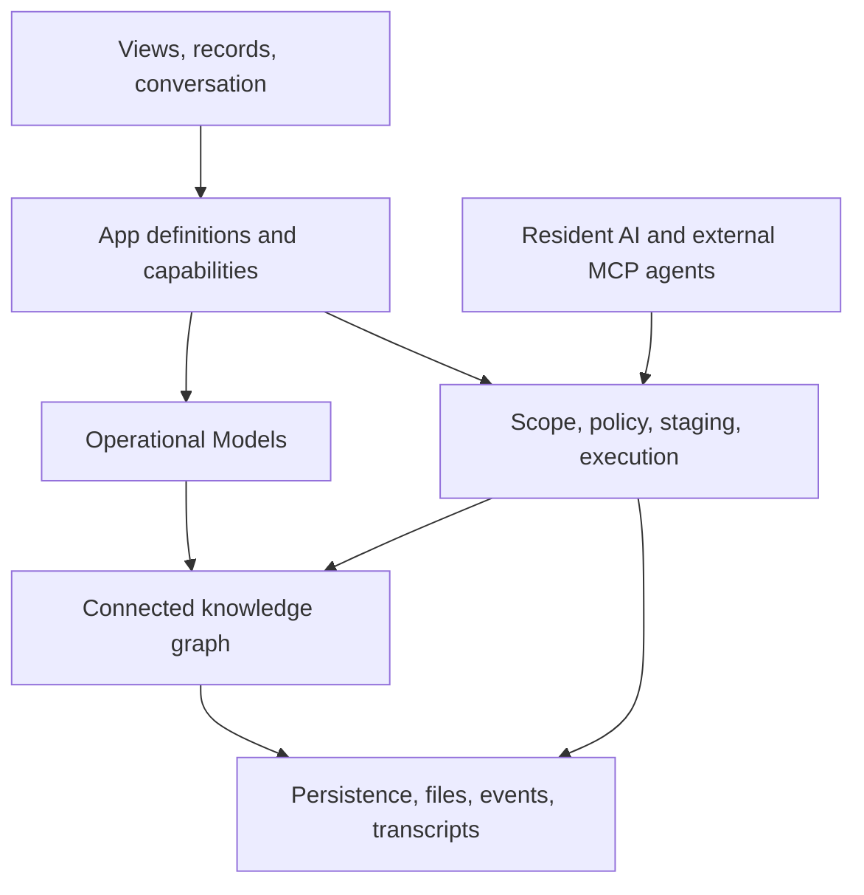

# Integral: knowledge that can become software

## The premise

A team begins with a purpose. It needs to receive work, make decisions, coordinate people, preserve evidence, and know what has happened. Software should give that purpose a useful operating form.

Today, the form often arrives first. A team buys several applications, fits its work into their structures, and bridges the gaps with messages, exports, spreadsheets, and memory. The people doing the work become the integration layer. When AI enters that environment, it inherits the same fragmentation.

Integral starts with a different premise: **operational knowledge, application structure, and intelligent action can share a common foundation.**

That foundation gives a fact a place, a relationship a meaning, a change an authority, and an application a definition. People work directly with the environment. AI helps interpret it, shape it, and act within it. Knowledge remains useful as applications change because the substrate's responsibilities persist across domains.

This paper is an extended guide for people evaluating Integral, designers imagining Apps, builders implementing them, and operators responsible for their behavior. The architecture is pre-1.0. Where a mechanism is gated or unfinished, that distinction is part of the explanation.

## 1. A shared operational world

Consider a service team. A request arrives by email. Someone asks a question in chat. A spreadsheet lists its state. A document contains the decision. A project application records the next task. A directory holds the final evidence.

Each tool can work well. The difficulty lies between them. Which decision is current? Which request does a file support? Who can see sensitive supporting information? Does a status change authorize another action, or only describe progress? Can an assistant distinguish an approved decision from an exploratory conversation?

A model can reason over supplied text. An operational system must establish identity, scope, structure, permission, and the difference between a suggestion and a committed result. Those responsibilities become more important when an assistant moves from explaining work to changing it.

Integral brings relevant knowledge into a common operating model. A request is an Entry with a defined type. Supporting material is attached. A decision can be another Entry connected through a relation. Delivery belongs to an appropriate Track. Their audiences can be governed independently while relationships preserve the story.

The objective is continuity. A person opening a view and an AI invoking a query should refer to compatible facts under compatible authority. A later conversation should revisit the result without depending on the memory of one process or one provider session.

## 2. The substrate

A substrate is the common material from which many operational environments can be built. Integral's substrate includes the knowledge graph, schema and composition mechanisms, workspace and resource access model, service contracts, and execution controls.

It knows what a record, relationship, workspace, permission, operation, and receipt are. A domain App supplies the meaning of the work: what a request requires, what a review evaluates, what a delivery contains, and which actions are useful.

This separation is a commitment. Core must not accumulate branches for particular App slugs, record-type names, or commercial workflows. Apps reach Core through published contracts and scoped context facades. The foundation can be tested without domain packages; an App can evolve without teaching Core a new business vocabulary.

It also preserves product choice. A hosted service can add commercial metering policies, subscriptions, or checkout. A private App can carry organization-specific rules. Core supplies generic controls and immutable usage facts where implemented; the commercial meaning belongs to the appropriate host or App.

A common substrate does not imply one universal application. Its value is the ability to support different applications without rebuilding access, knowledge integrity, and execution controls for each one.

## 3. The layers

These layers describe responsibilities rather than separate products or a rigid deployment stack.

| Layer | Purpose | Representative artifacts |
|---|---|---|
| Experience | Help people see, understand, and act | Records, views, App Home, dashboards, conversation, review cards |
| Application | Give a purpose an operating shape | Package, active ApplicationDefinition, queries, operations |
| Operational modeling | Describe information and composition | EntryTypes, fields, Tags, Views, track profiles, migrations |
| Knowledge | Preserve connected facts | Workspaces, Apps, Tracks, Entries, relationships, provenance |
| Intelligence | Interpret intent and use capabilities | Resident harness, skills, discovery, routing, MCP |
| Authority and execution | Decide whether and how actions occur | Identity, scope, policy, staging, approvals, leases, receipts |
| Persistence and operations | Keep records and services available | Graph stores, files, encrypted session records, events, usage facts |

Authority spans the layers. A view cannot make an unauthorized record readable. A skill cannot broaden scope. A provider session ID cannot become tenancy. A generated package cannot bypass trust checks by calling itself an application.

## 4. Connected knowledge

Integral uses jvspatial's object-spatial model. Operational entities participating in relationships are Nodes. Edges describe their relationships and can carry typed metadata: a collaboration role, relation field key, or the provenance of a connection.

Work is relational. A decision concerns a request. A person belongs to a workspace. A file supports a record. Keeping these connections explicit makes them available to permission resolution, graph traversal, deletion rules, export, and future computation.

Persisted graph participants must be reachable through named structural edges from the Integral root. A scalar ID can accelerate lookup, but cannot replace the relationship that makes an entity part of the graph. Subsystem participants extend from their owning App or another valid rooted ancestor according to their contract.

The model is selective. An append-only observation or scalar-keyed execution record may be an Object rather than a Node. Turning every log into a graph participant adds little value; leaving an operational participant detached removes it from the behavior the graph provides.

For users, the main containers are simple. A Workspace establishes a working boundary. An App groups a purposeful environment. A Track holds a collection. An Entry contains an individual typed record. Registries and subsystem branches organize these entities internally; the simplified hierarchy explains the experience while the architecture reference records actual graph structure.

## 5. Operational Models

An Operational Model gives part of the environment a shape. It defines available EntryTypes, fields, tags, views, and composition. Models attach to Apps and Tracks; an App-level model can define track templates.

A type might declare descriptive text, states, dates, member references, files, and relations. These declarations support validation and presentation. Relations link actual operational entities. A member field binds to an authorized graph User rather than treating a person as an arbitrary string.

Views provide different ways to work with the same records. A table emphasizes comparison, a board emphasizes state, and a calendar emphasizes time. Changing the view does not require copying the records into a new tool.

Integral distinguishes two versions in the authoring pipeline. Package YAML uses `integral_operational_model_version: 3`. Compiled runtime manifests use `operational_model_schema_version: 2`. They name different interfaces, not competing revisions of one field.

Models have a change lifecycle. A draft gives a proposed structure a reviewable place. Publishing validates it and checks effects on existing records. Breaking changes need supported migrations or an explicitly authorized destructive escape. Migration work reports progress and failures; publishing a structure cannot justify silently abandoning data that no longer fits.

Adaptability becomes an accountable process. Teams can revise their operating model while retaining a way to understand what changed and what happened to the records.

## 6. From models to Apps

An App is more than a schema. Its package can carry models, declared queries and operations, skills, tools, hooks, extension views, assets, and metadata. This is the reusable unit through which application behavior is installed and governed.

An installed App has an active ApplicationDefinition revision. It preserves the compiled manifest, requirement ledger, and provenance. Compilation makes that revision immutable; a changed contract creates another revision. The App's active pointer caches the authoritative relationship rather than becoming another source of truth.

A schema describes records. The complete application definition also describes the capability contract giving operations and presentation their meaning. Resolving the active definition establishes which application behavior is authoritative at the time of execution.

Lifecycle services cover installation, required settings, activation, pause, upgrade, and uninstallation. A paused App should not continue exposing active capabilities merely because files remain on disk. Dependencies are checked before delivery, and package registrations are scoped rather than accidental global state.

Different distributions can install different Apps on the same Core. Reuse therefore extends beyond a template: it can include structure, behavior, presentation, and instructions within a common perimeter.

## 7. Composition and boundaries

Operational work has more depth than one list. A review can refer to several requests. A delivery can have a related evidence collection. A shared record can point toward information with a narrower audience.

Sibling Tracks suit collections with independent lives. Anchored Tracks give an Entry a navigable relationship to a related collection provisioned from a template in the same workspace. The anchor does not turn the Entry into a containment parent.

Entries do not contain other Entries or Tracks. Operational entities should not disappear inside growing JSON arrays. Their identities, audiences, lifecycle, and relationships belong in explicit records and edges. JSON remains appropriate for data whose meaning is actually a value, rather than a concealed collection of operational entities.

Privacy follows the same principle. Access is resolved per resource. There is no general field-level privacy primitive. If two portions of information have different audiences, put the restricted portion behind its own Track or Entry boundary. Shared records can point toward it without making the contents readable to everyone who sees the link.

Composition and access can then remain aligned. A connection expresses a relationship; authority determines whether the destination can be inspected.

## 8. Resident intelligence

The resident AI interprets intent and uses the environment. Its default binding is Integral AI through Pydantic AI. jvagent remains a compatibility harness; Echo supports development and smoke checks.

The design is one resident mind per active binding, faceted by principal and scope. Personal, organization-facing, and system facets describe context and authority. They are not a fleet of peer agents exchanging delegated work through another fabric.

The harness supplies model interaction and agent-loop behavior. Core supplies authenticated execution scope, available capabilities, policy, review and effect boundaries, transcripts, session persistence, and observations. The model can reason while Core remains responsible for whether an effect may occur.

An ordinary request can lead the resident to discover capabilities, gather authorized context, answer, ask for missing information, prepare a change, or invoke an allowed action. Descriptions help it select a path. They cannot create capabilities the platform has not implemented.

Skills provide reusable instructions using the Agent Skills format. Their descriptions support discovery; instructions load when needed. App skills are exposed from active, accessible Apps in the current workspace. A skill explains a workflow, while authority comes from capability and policy checks.

Good assistance therefore combines reasoning with grounding. An eloquent response is useful when it remains faithful to accessible facts and accurately reports the status of proposed actions.

## 9. External agents and connectors

External agents enter through Integral's MCP surface. They discover and invoke exposed capabilities under an authenticated principal and the required scope. The retired peer-agent delegation fabric is not part of this architecture.

MCP also appears on the integration side: an external MCP server can be mounted as a connector. These are two directions. Inbound MCP exposes Integral; outbound MCP makes a declared external surface available to the resident. Each direction has its own authentication and trust boundary.

Native connectors can bring external records into Tracks, preserve source identity and provenance, and apply configured conflict behavior. Synchronizing again should update the corresponding record rather than create another copy. A conflict is an operational condition to resolve, not a reason to silently overwrite uncertainty.

A supported integration abstraction does not prove every external service has been qualified. Operators must test the actual connectors, credentials, scopes, and failure modes they intend to enable.

## 10. Shared authority

The backend determines scope and access. Explicit scope uses `X-Integral-Scope: ws:<workspace_id>`; malformed and inaccessible scopes are rejected. The interface coordinates workspace selection but is not the security boundary.

Resource roles form a five-tier ladder: owner, admin, editor, commenter, and viewer. Workspace membership roles are separate. Direct grants differ from inherited access. Inherited owner or admin authority is capped at editor on a child resource, preserving intentional delegation of its structure and governance.

Exclusions remove inherited access paths. They do not erase direct ownership or collaboration. Public reading and redeemed sharing use explicit limited paths; they do not grant general write authority or private workspace enumeration.

AI actions add policy to resource access. Core may deny an action, allow it, or require review. An identifier in a prompt is never a replacement for current permission. Conversation continuation, work recovery, and approval application must respect changes in authority, including revocation after a proposal was prepared.

This is the value of a shared perimeter: different participants can use different interfaces without inventing a second access model for each one.

## 11. Proposals and effects

Generative software needs a clear boundary between describing a change and making it.

Staging gives proposed changes a place for inspection. Review surfaces should show human names, intended scope, the change, and its status. Machine identifiers remain available for execution, but ordinary prose should not require users to interpret opaque graph IDs.

Approval enters the relevant execution path. It can still fail because permission changed, a record was revised, a dependency is unavailable, or a provider outcome is uncertain. The system must report the result rather than equating approval with success.

Receipts connect actions to evidence. They preserve actor, resource, effect identity, and outcome where the capability supports them. Attribution should preserve the original actor and record human review separately. A connector update remains a connector update. These distinctions let people understand who changed something and why.

Durable work adds leases, fencing, idempotency, and transactional transitions. Only the current lease holder may cross an effect boundary. Deterministic effect identity helps identify the same logical action during retries. An uncertain external write must be reconciled before a replay could duplicate it.

These mechanisms support reliability, but do not establish unlimited autonomous execution. The bounded WorkMandate contract exists; its public admission and execution path remains incomplete and non-runnable. The architecture's direction is wider than today's qualified product surface.

## 12. Continuity and memory

Different records preserve different kinds of continuity.

A product transcript is the conversation a person revisits. A harness session binds execution to scope. Checkpoints support execution continuity. Tool-effect receipts record effects. Operational records hold the user's facts. Usage observations describe physical model requests and reported consumption.

Combining these into one undifferentiated chat history obscures their duties. A provider handle is opaque and cannot define tenancy. A trace aids diagnosis but does not replace a product transcript or invoice fact. A completed transcript surviving restart does not prove interrupted work resumes safely.

A native HarnessSession attaches to its owning ChatThread and is bound to principal, workspace, thread, binding, and generation. Detailed session history uses encrypted scoped persistence. Durable native chat is disabled by default and needs explicit configuration and qualification of worker dispatch, replay, and recovery.

Continuity requires boundaries. Each kind of memory should preserve what its purpose requires under appropriate access, encryption, and retention rules.

## 13. Providers and usage facts

Routing and credentials are resolved on the server. An installation can use platform credentials, user-provided credentials, or an allowed combination according to policy. Provider keys should not reach the browser or be embedded in package manifests.

Provider-reported usage, calculated estimates, and missing information are different facts. A zero estimate or unavailable price cannot establish that a request was free. Source and uncertainty must remain available for downstream reconciliation.

Approved durable work adds physical-dispatch admission. A trusted host must attest valid bounds and applicable pricing; a shared budget hold and fenced dispatch intent precede the SDK call. Uncertain or calculated cost cannot settle a hold requiring definitive provider cost. This mechanism remains separate from the unfinished public mandate admission path.

An assistant must not turn an observation into a billing conclusion simply because the interface prefers a number.

## 14. Human experience

Architecture matters when it improves a person's day.

Integral offers records people can open, views they can change, relationships they can follow, and a resident they can consult. Named relations should lead to authorized destinations. Files should provide authenticated preview or download. Failed data sources should show an unavailable state rather than an empty collection that appears authoritative.

App Home gives a package a focused entry point using declared summaries, records, and actions from the active contract. Dashboards are separately configured instance projections. Both preserve underlying query and permission boundaries.

An action can prepare an editable conversation draft. Preparing a message and sending it are separate acts; opening an App should not initiate an invisible model interaction merely because an action control is displayed.

The experience should make important boundaries legible without teaching every person the machinery. People should understand where they are working, what they can see, what is proposed, and what completed.

## 15. How software emerges

A team describes a review process: submissions, reviewers, evidence, decisions, and follow-up. The resident can help turn that purpose into a draft structure using available authoring capabilities.

The team reviews record types, relationships, views, and permissions. It can separate sensitive notes into a narrower resource and inspect the proposed package. Required operations must have declared implementations. Installation gives the accepted definition a place in the workspace.

The first version need not anticipate everything. Experience may reveal a missing state, an awkward view, or a relationship deserving its own record. Those discoveries become another reviewable evolution of the model and definition, with migration checks where records are affected.

Purpose becomes structure; structure becomes usable software; experience informs the next structure. Current capabilities constrain each step. A design request can remain a design until implementation is intended.

The possibility is cumulative coherence. Generation can extend an environment that already understands knowledge, identity, relationships, and authority, instead of producing another isolated application.

## 16. Current implementation and open work

The codebase includes workspace and resource access, typed records, Operational Models, package lifecycle services, views, attachments, resident chat, staging, approvals, capability discovery, declared operations, extension views, App Home, dashboards, connectors, and durable work mechanisms.

Presence in source does not qualify every configuration or journey. Features depend on storage adapter, provider, trust tier, package, and settings. Native durable chat needs explicit enablement. Semantic retrieval depends on the indexing and vector backend. Attachment malware screening needs a real scanner; the default no-op adapter provides no screening assurance.

Production qualification requires evidence from the actual deployment: artifact checks, CI, database contracts, browser journeys, provider and connector flows, isolation, interruption, revocation, and recovery. The [qualification guide](../ops/QUALIFICATION.md) explains these separate gates.

Public bounded-work admission, broad multi-worker and connector qualification, and exhaustive cross-client recovery acceptance remain development or qualification work. They are directions rather than promises attached to every installation.

## 17. The distinctive idea

Integral's contribution lies in the relationship between its parts.

The graph gives knowledge continuity. Operational Models make it adaptable. App packages give purpose a reusable definition. The resident helps people interpret and shape the environment. Shared authority and execution connect intelligence to accountable effects.

Together, they create a place where software can be generated around work while preserving the structure and control that make it dependable.

The ambition is expansive. The first step is concrete: give people and AI a shared operational world, then make it understandable, conformable, and trustworthy enough to grow.

## Further reading

- [User guide](../user-guide/README.md): work in Integral step by step.
- [Architecture](ARCHITECTURE.md): implementation responsibilities and boundaries.
- [App quickstart](../developer/quickstart.md): build using the current contract.
- [Operational Models](../operational-models/README.md): schema and change lifecycle.
- [Qualification](../ops/QUALIFICATION.md): evidence and remaining checks.
