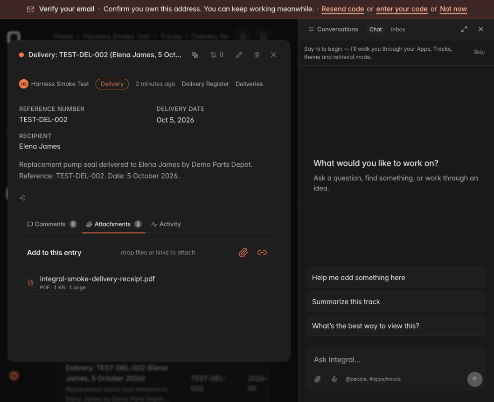
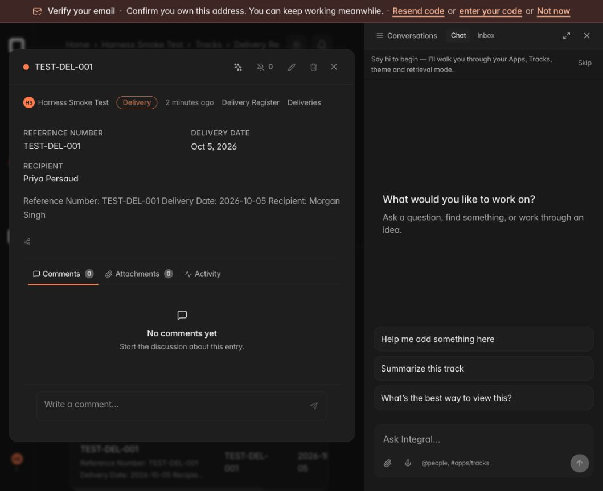
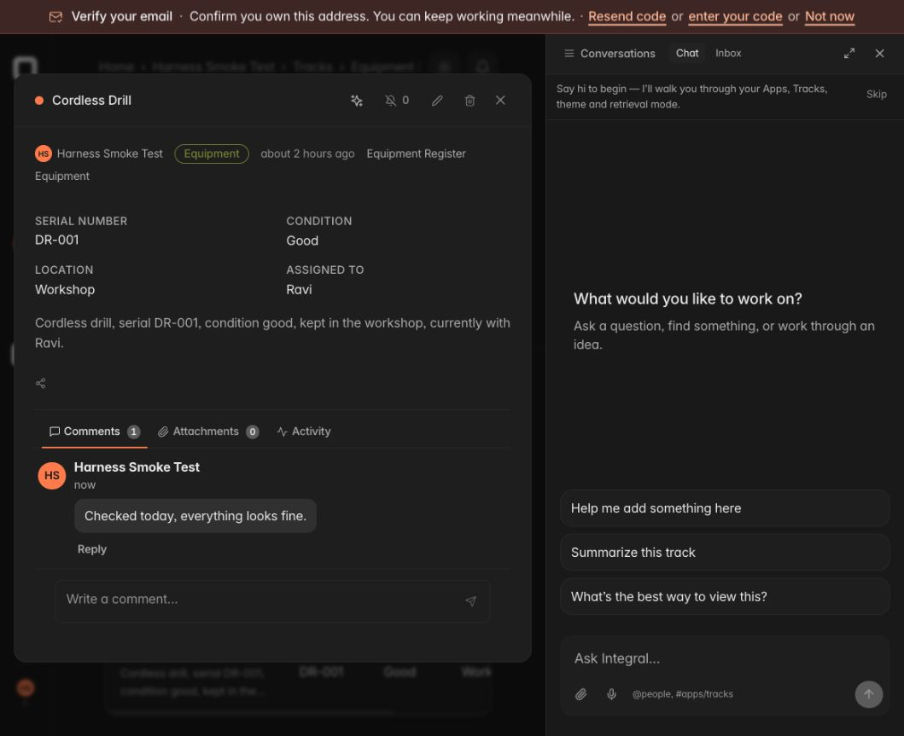
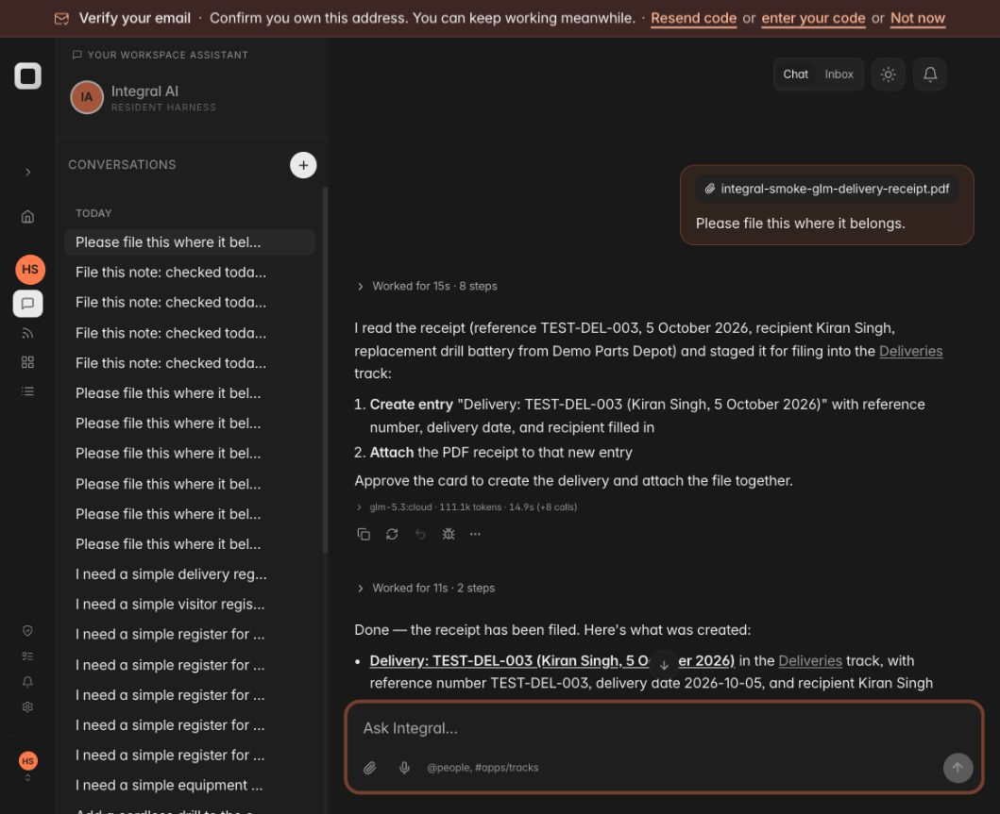
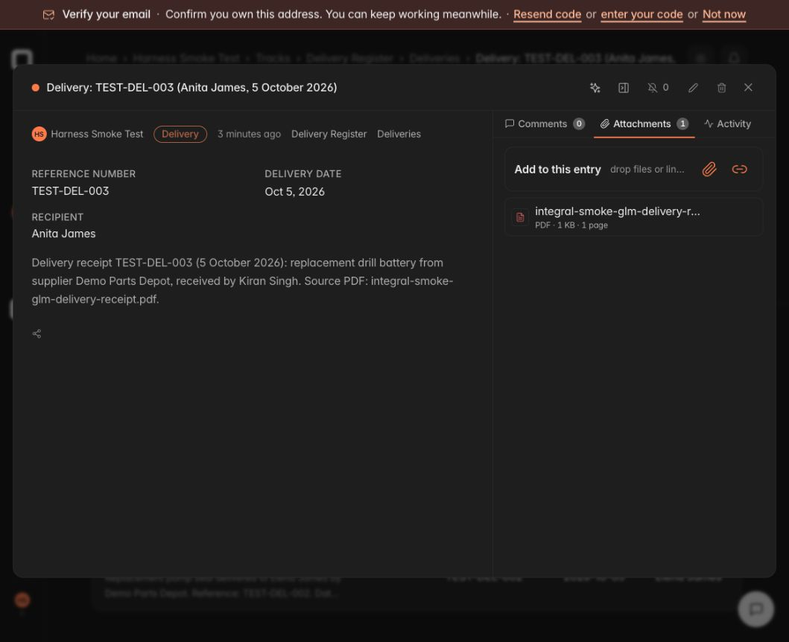
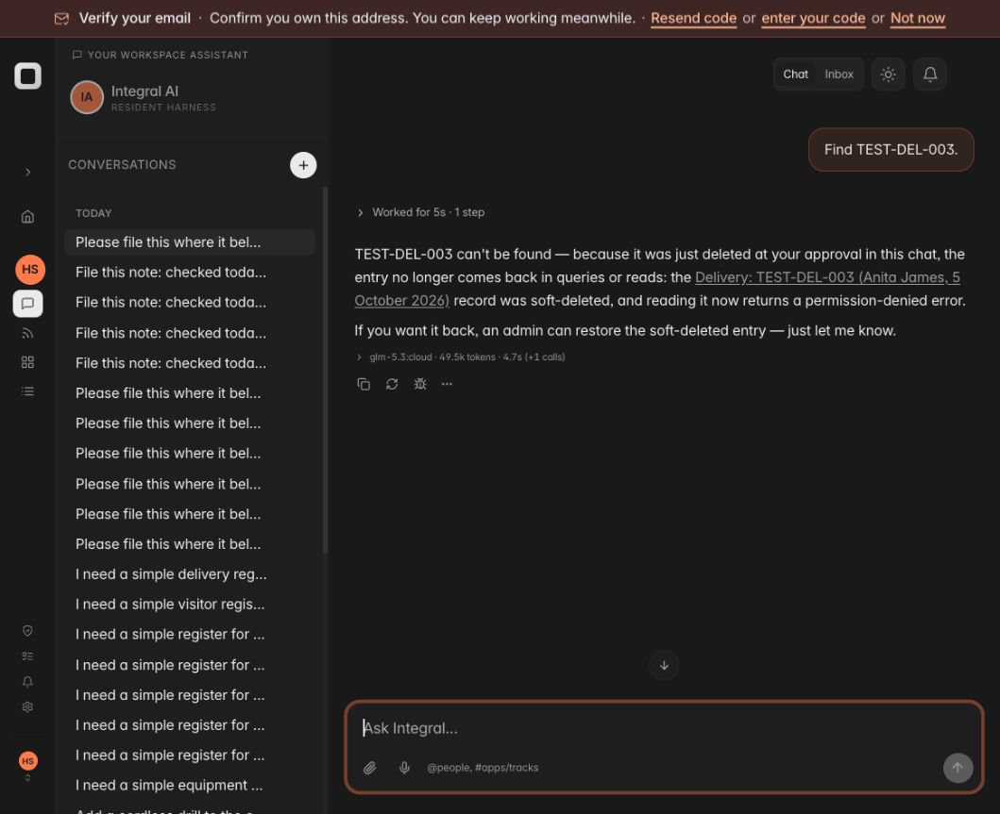
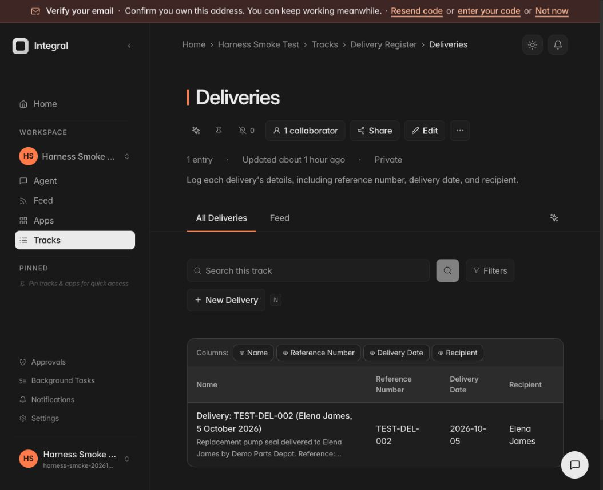

# Post-build CRUD and document filing — 2026-10-05 local / 2026-10-06 UTC

Integration evidence on `feat/pydantic-ai-harness-v1`, authenticated **Harness
Smoke Test** workspace, browser `http://127.0.0.1:9012`, checkout backend 4011,
PostgreSQL branch database. Only synthetic records and a generated synthetic
PDF were used. This is not V1 acceptance or production qualification.

## Ordinary browser inputs and outcomes

| Journey | Actual input / observation | Status |
| --- | --- | --- |
| Post-build create | `Add a delivery to the register: reference TEST-DEL-001, delivered on 5 October 2026 to Morgan Singh.` One card approved; saved in the agent-created Delivery Register. | Passed persisted create |
| Search/read | `Find delivery TEST-DEL-001 and show me its saved details.` Correct three fields and working entry link. | Passed |
| Update | `Change the recipient on TEST-DEL-001 to Priya Persaud.` One card approved; follow-up search and actual table show Priya Persaud. | Passed typed field; body still repeats the previous recipient, an unresolved content consistency issue |
| Receipt attempt 1 | Uploaded generated PDF then `Please file this where it belongs.` Cleared tool results caused repeated extraction/schema reads and the 10-request limit. | Failed; working-set compaction changed through public Harness API |
| Receipt attempt 2 | Same ordinary input. Proposed attaching TEST-DEL-002 receipt to TEST-DEL-001 due loose search similarity, without loading a skill. Rejected. | Failed; no wrong write applied |
| Receipt attempt 3 | Same input. Loaded filing skill but inspected multiple track schemas before reading the document and exhausted 10 requests. | Failed; source-first SOP and configurable 20-request ceiling |
| Receipt attempt 4 | Same input. Correctly distinguished transactions, but asked whether to do requested work. After `Yes, file it in the Delivery Register.`, proposed create+attach without structured fields. Rejected. | Failed; no incomplete record applied |
| Receipt attempt 5 | Same input. Selected correct track and mapped three typed fields, but concurrently staged attachment before create; commit rejected unresolved reference. | Failed; Pydantic public sequential barriers applied to stateful tools |
| Receipt attempt 6 | Same input. Read PDF, selected Deliveries, mapped Reference Number / Delivery Date / Recipient, staged create+attach in order. One card approved. | Passed filing and attachment |
| Receipt readback | `Find TEST-DEL-002 and show its saved details and attached receipt.` Correct fields, downloadable PDF card and working entry link. Actual Entry panel shows Attachments 1 and the receipt PDF. | Passed |
| Workflow switch to delete, before correction | In receipt conversation, `Delete delivery TEST-DEL-001.` then `Yes, delete it.` Agent asked to load a capability instead of doing discovery. | Failed |
| Workflow switch to delete, candidate | Repeated same delete request after per-turn discovery correction; loaded workflow and staged exact recoverable delete. | Passed recoverable delete and active-list readback |
| Approval follow-through | Automatic replies after create, update, reject and receipt approval incorrectly described resolved proposals as awaiting approval. Scoped snapshot inspection confirms refreshed consumed state reached the model. Explicit runtime outcome instructions subsequently produced correct delete readback. | Delete and clarified-comment follow-through passed; other outcome variants remain unqualified |
| Natural record approval | Prompt Sheet currently disables chat input while pending, so an ordinary typed approval cannot be entered. | Unqualified / UI gap |
| App/Track ambiguity | `File this note: checked today, everything looks fine.` Initially incorrectly proposed a new track on the first App. Removed automatic no-fit routing from ranking. Repeated input now asks one clarification naming the four current tracks. Answer named drill DR-001; correct comment proposal staged. | Passed one clarification, exact existing drill, one approved comment and actual Entry Comments 1 readback |
| GLM receipt control | Same `Please file this where it belongs.` with TEST-DEL-003 PDF. Correct three fields, combined create+attach, one approved card, automatic readback with source PDF. | Passed filing and readback |
| GLM update / delete | Same receipt conversation, recipient change to Anita James followed by deletion. | Passed applied typed update with PDF retained, recoverable delete, automatic readback and subsequent read denied for deleted record; actual table retains only TEST-DEL-002 |

Receipt success: gpt-4.1, 105.8k tokens, $0.0883, 14.4s, 9 tool steps.
Readback: 53.5k tokens, $0.0590, 5.0s, 3 tools.
GLM filing: 111.1k tokens, 14.9s, 9 tools; automatic approved readback
50.9k tokens, 10.5s, 2 tools. GLM update: 79.8k tokens, 7.5s, 3 tools;
approved readback: 47.2k, 5.0s, 1 tool. Delete: 49.0k, 30.5s, 1 tool;
approved readback: 50.3k, 6.5s, 1 tool; subsequent read: 49.5k, 4.7s, 1 tool. Unpriced cost remains undisplayed, not false zero. These figures describe the
observed runs; they are not latency or cost targets.

## Persisted test objects

- Delivery Register: `n.WorkspaceApp.956d28ccdb65406591c783ab`.
- Deliveries: `n.Track.4b82c29d743746f9bcf1b8ed`.
- TEST-DEL-001: `n.Entry.e66899f682ad49aa965dfefb` (recoverable delete test).
- Receipt TEST-DEL-002: `n.Entry.0b72ab2aa801456f9f335c7c`.
- GLM receipt TEST-DEL-003: `n.Entry.e0f791beeb734474a02e6d70`.
- Clarified note: one comment on `n.Entry.3fff265b0f8144a09a56a937`.

## Engineering boundaries

- Library owns tool execution order through public `Tool.from_schema(sequential=...)`:
  non-read operations are barriers; independent reads remain parallel eligible.
- Public `ClearToolResults` uses the model context window, retains eight recent
  tool pairs and loaded skill text. This preserves the receipt/destination/schema
  working set without a second conversation memory engine.
- Current-turn discovery uses public message boundaries, not user-word matching.
  Returned workflow candidates require a skill to be loaded through the public
  library tool choice; the model selects it, and already-loaded candidates are
  reused. Rank does not choose the procedure or confer authority.
- Destination ranking is now an advisory, side-effect-free read. Removed the
  legacy score-to-new-App/Track/type route and automatic preservation artifact
  from this surface. A low similarity score cannot prove missing structure or
  justify selecting the first App. Setup remains a deliberate skill workflow.
- Standard skill `allowed-tools` connects protected writes to an owning procedure.
  Loading it never grants permission; Core broker authorizes every call.
- Source interpretation precedes destination/schema selection. Candidate hits are
  not duplicate proof; record identity must match the source.
- Core staging refresh is read-only and requires exact principal/workspace/session
  match. Unknown or foreign outcomes are withheld; no write replay occurs.
- Build verification exposes canonical links only for permission-checked matching
  resources and rejects a different bound workspace before reading a design.

## Limits of this evidence

Image/photo receipts and OCR are not qualified by the text-PDF tests. Tenant
isolation and credential ownership require their independent contract evidence.
The deletion search proves absence from active results, not erasure from every
status; the OpenAI prose overstated that coverage and remains a claim-quality
gap. Typed chat approval while a record card is pending is still blocked by the
Prompt Sheet UI.

## Source gates

Initial full `make verify` exposed one old compaction-policy assertion. Updated
that assertion to the candidate public policy. Final full `make verify` passed
on the frozen source candidate, including guards, formatter/type checks,
CI reproduction, clean reproducible wheel, full backend suite and frontend
**1,306 tests across 220 files**. Wheel SHA-256:
`1a386da81bdc3423f15970f1e69d2429a976b99686b3de7f464530c75766ec30`.
Local gate log: `/tmp/integral-crud-qualified-verify.log`.
PostgreSQL-only skips are not qualification evidence; the browser journeys
used the live PostgreSQL branch runtime.

