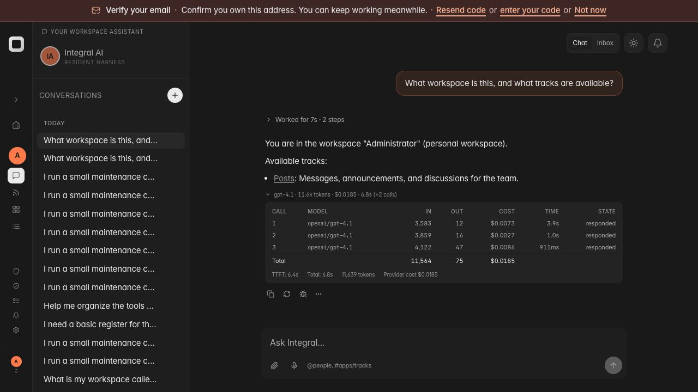
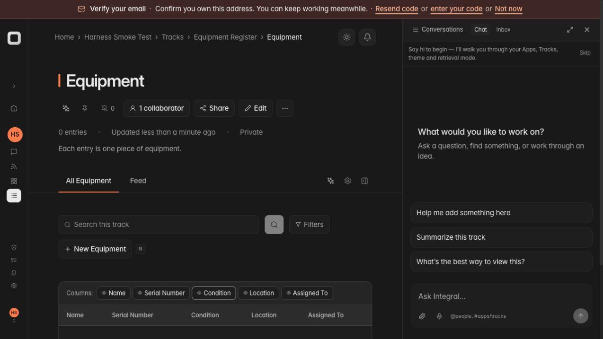
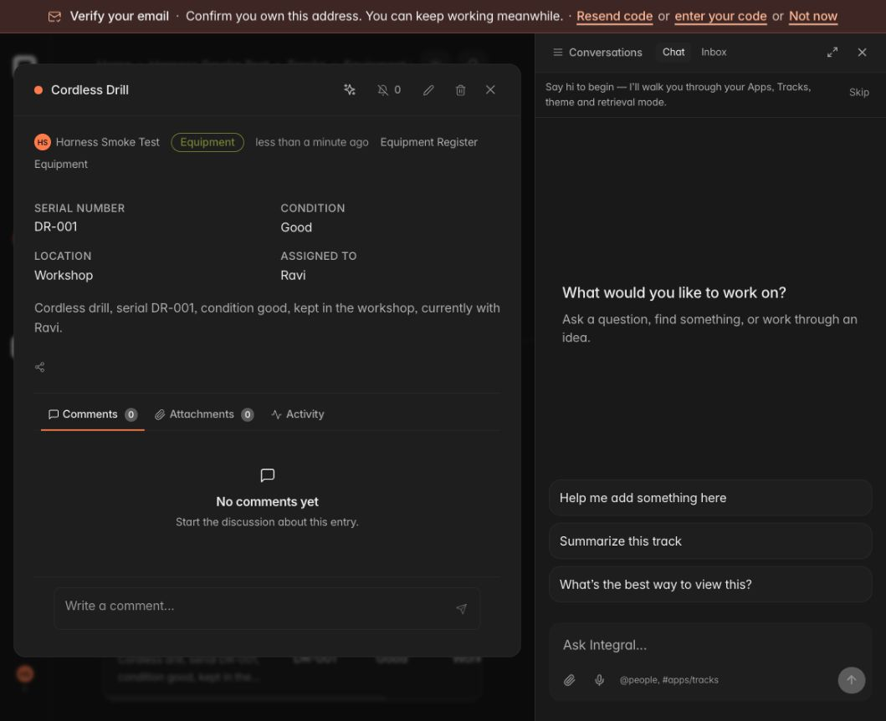
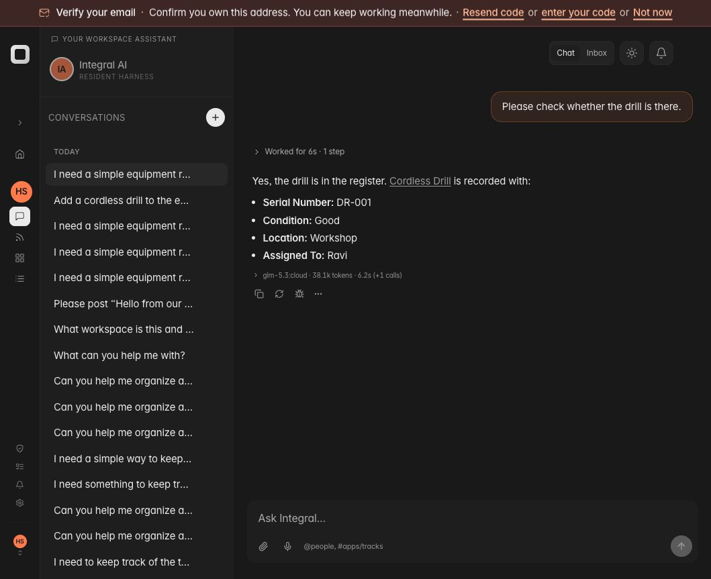
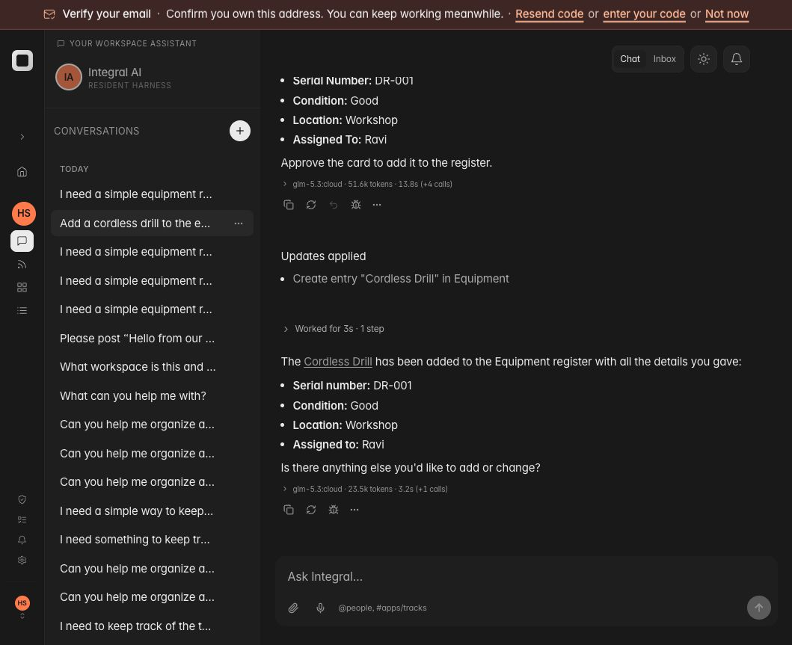
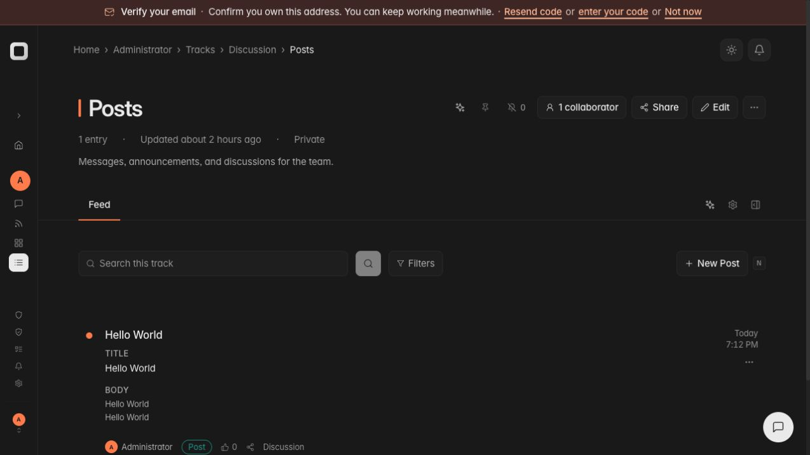
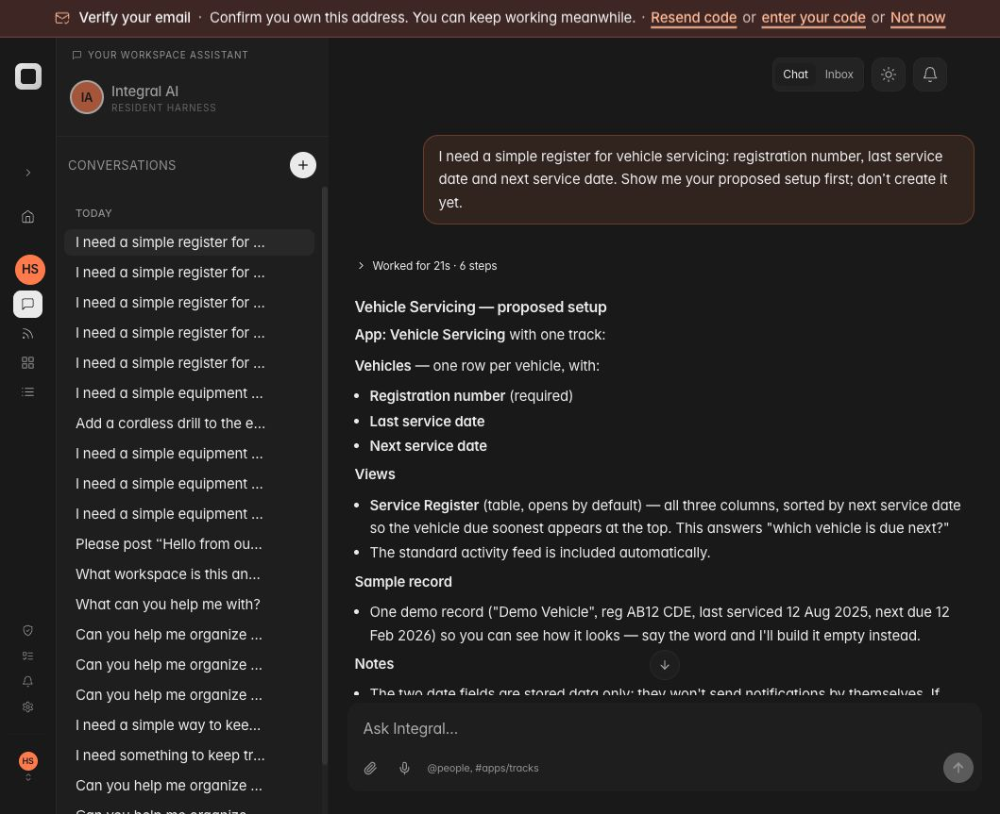
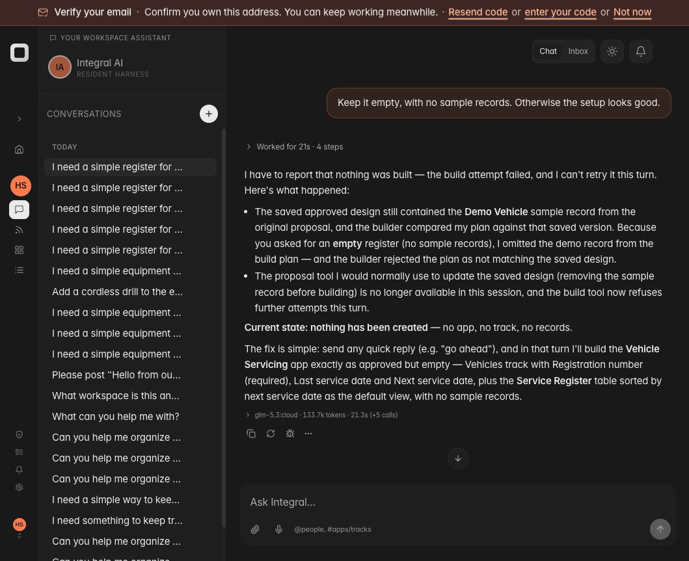

# Resident harness recalibration — 2026-10-05

This is integration evidence, not V1 acceptance. Tested branch:
`feat/pydantic-ai-harness-v1`. Browser: authenticated `Harness Smoke Test`
workspace on `http://127.0.0.1:9012`, proxying the checkout backend on 4011.
Installed Pydantic AI 2.54.0, Pydantic AI Harness 0.36.0, LiteLLM 1.101.4.
The user-visible 9011 conversation observed earlier was a legacy JV thread;
its transcript was not counted as native-harness evidence.

## Browser evidence

All prompts below used ordinary wording without skill names or tool coaching.

| Workflow | Observation | Result |
| --- | --- | --- |
| Workspace and track lookup | Named the smoke workspace and correctly reported its initially empty state; three Core reads, two model calls | Passed |
| New equipment register | Requested serial number, condition, location and holder. Native skill load, coverage and saved proposal; four model calls, 69.2k tokens, 13.0s | Passed proposal |
| Natural approval | `That sounds good. Go ahead.` then build and verify, without separate staging approval cards; five metered calls including approval judgment, 88.8k tokens, 10.7s | Passed |
| Structure readback | Apps showed one Equipment Register; its Equipment track showed Serial Number, Condition, Location and Assigned To in All Equipment; initially no entries | Passed |
| Add existing record, first attempt | Repeated discovery and hit a library usage limit. Search with limit=1 returned a skill but no tool; skill loading did not disclose its declared tools | Failed; corrected and retested independently |
| Add existing record, corrected attempt | Requested cordless drill DR-001, Good, Workshop, Ravi; correct tool staged one exact record in four model calls, 51.6k tokens, 13.8s | Passed staging |
| Record confirmation | One Approve click applied the record; native follow-through read it and linked the local record; one metered call, 23.5k tokens, 3.2s | Passed card approval |
| Record readback | Table contained exactly the drill with the requested values, and the entry panel opened | Passed |
| Cost display on unpriced GLM route | Corrected runs show token usage without falsely displaying $0.0000. Raw LiteLLM zero remains retained separately in the physical request usage record | Browser display passed; raw retention covered by source tests |
| Native OpenAI workspace lookup | Administrator account, native Integral AI binding, configured platform OpenAI key; gpt-4.1 returned the correct workspace and Posts track; three physical calls, 11,639 tokens, $0.0185, 6.8s | Model/tool execution and cost display passed; generated navigation link failed |
| OpenAI generated track link | The model omitted the `n.Track.` prefix from the returned ID; clicking its Posts link showed Track not found | Failed; remains a routing/output acceptance gap |

The OpenAI control temporarily changed the backend's default model, not tenant
credentials. The usage details showed all three calls and provider-response
cost attribution. This is not qualification of all OpenAI workflows or BYOK.

Created objects:

- App `n.WorkspaceApp.73012a30316445d789dfa8cf`.
- Track `n.Track.f6555a4d645e465b9a54e677`.
- Entry `n.Entry.3fff265b0f8144a09a56a937`.

## Corrections and source evidence

- Unified discovery uses native `ToolReturn.tools` disclosure and replays
  availability from framework history. Search retains a workflow and a tool
  even when the caller requests one result.
- Standard `allowed-tools` metadata is retained in projected skills. The
  supported tool preparation hook exposes those schemas while the skill is
  active. Integral's broker still authorizes every invocation.
- Removed default duplicate tool search and default extra Planning surface.
  Low-level app setup primitives remain behind Core's composed proposal/build
  contract on the resident model surface.
- Native approval uses the same metered model adapter, binds consent to the
  saved design/message, and checks the active session/run transactionally.
  The initial graph-ID lookup bug was reproduced in the browser and fixed.
- PostgreSQL regression tests passed for actual graph versus logical session
  identity, committed marker readback/cache invalidation, and a newer run
  taking ownership during judgment (two cases).
- Public `Tool.from_schema` replaced the private FunctionSchema import.
- Reported provider zero remains valid; an unpriced LiteLLM placeholder zero
  is retained as raw SDK accounting and is not treated as provider cost.
- Verification success now requires the result status `verified`; partial,
  blocked and failed readback cannot become a readiness claim.
- Native harness plus proposal service suite: 241 passed, 28 skipped before
  the final verification-status assertion was added. PostgreSQL cases above
  were run separately; skips are not PostgreSQL acceptance evidence.
- Full `make verify` completed successfully on this slice: staged guards,
  pre-commit checks, format/lint/types, reproducible wheel/import, CI-faithful
  smoke, frontend (1,305 tests across 220 files), and the full backend suite.
  PostgreSQL-only skips in that suite are not database qualification evidence.

## Outstanding acceptance work

- The failed discovery conversation now continues through settled library
  history as documented below. Stopped runs, pending write approvals and
  uncertain mutations still need their own browser qualification.
- Record approvals still require the existing card and disable the composer.
  Natural approval is qualified for the exact saved scaffold design only.
- The successful scaffold response initially invented `app.integral.ai` as
  its deployment host. Relative-link instructions were added; the subsequent
  drill response linked the correct local record.
- Saved proposal wording is not consistently explicit that it is unbuilt.
- The host-generated `[PROMPT_SHEET]` marker is now removed from the displayed
  approval receipt, with source and browser evidence below.
- Repeat OpenAI navigation, design-only, amendment/refusal, cancellation and
  recovery workflows against the final revision. Most build workflows in this
  round used GLM cloud; OpenAI lookup/cost details are recorded above.
- No commit or push is asserted by this report.

## Second round: terminal continuation and receipt presentation

The first integration slice was committed and pushed as `47b258e0` after its
full repository gate passed. Changes in this section are a subsequent slice;
its complete `make verify` gate passed: all staged guards, pre-commit checks,
format/lint/types, reproducible wheel/import, CI-faithful smoke, frontend
(1,306 tests across 220 files), and the full backend suite. PostgreSQL-only
skips are not database qualification evidence. Reproducible wheel SHA-256:
`5b7b4e4cd935f81f5bfa7b105454d3ca079acc89f7b8effc6a3ed6b955c56bb2`.

- Reopened the actual failed discovery conversation
  `n.ChatThread.6d6323a11aa947bbaa5aa8ab`, rather than starting another one.
  Initial recovery attempts exposed an unfinished library read effect and
  Core streaming progress rows being mistaken for authority receipts.
- The provider now uses the library's complete snapshots after validating
  terminal run scope, settled physical requests, pending approvals, and Core
  broker receipts. Declared reads can be abandoned with a durable failed
  effect transition; uncertain mutations remain blocked. Generic streaming
  progress rows do not grant execution authority.
- Ordinary browser follow-up: `Please check whether the drill is there.`
  The conversation completed with one `integral_query_entries` step and
  returned the existing DR-001 record with Good / Workshop / Ravi and its
  correct local link. Two model calls, 38.1k tokens, 6.2s. No create action ran.
- Recovery guards, failure boundaries and provider contracts passed together
  (41 tests). Coverage includes foreign/running runs, completed and failed
  mutations, missing mutation results, settled paid model attempts, and a
  durable abandonment transition for an unfinished read.
- Canonical URLs are supplied on resource tool results, retaining full opaque
  graph identifiers and original receipts. OpenAI retest of the same workspace
  question returned the full Posts link. Clicking it opened the actual Posts
  track and its one Hello World entry. Three calls, 11.7k tokens, $0.0155, 6.8s.
  This addition does not claim all generated links are validated.
- Approval receipts use the existing Prompt Sheet display parser across both
  transcript roles. The browser now shows `Updates applied` and the affected
  drill record without the internal marker or model regenerate controls.
  Focused frontend presentation tests passed (12 tests).

### Additional routing gap found

On the isolated smoke workspace under the temporary shared OpenAI control:
`I need a simple register for vehicle servicing: registration number, last
service date and next service date. Show me your proposed setup first; don’t
create it yet.` The model returned a plausible design in one call (3.8k tokens,
$0.0089, 4.7s), but made no tool call and saved no proposal. This does not
qualify the design-to-approval workflow.

Source inspection found that the shared chat API still invokes the JV light
intent judge and injects legacy routing instructions, including `use_skill`,
into native turns. Native separation must be completed: model/skill selection
belongs to the native library run; host context should carry resource and
authority facts rather than lexical routing directives. No fix for that gap
is asserted in this slice. The backend default was restored to GLM cloud after
the OpenAI controls; tenant credentials were not changed.

## Third round: native routing separation and increased turn budget

The second slice was committed and pushed as `b85cf5ab` after its complete
repository gate passed. This section describes a subsequent candidate whose
complete `make verify` gate also passed: staged guards, lint, types, reproducible
wheel, CI-faithful smoke, frontend tests (1,306 tests across 220 files), and the
full backend suite. PostgreSQL-only skips are not PostgreSQL qualification.
The reproducible wheel SHA-256 is
`f9b76e22826585fc0cc32fafdb1dfb28c156647eb1ad089aace601f66afdab1e`.

- Native request preparation no longer invokes the JV greenfield judge,
  lexical no-write/schema/dashboard/approval helpers, query planner preamble,
  or legacy completion validator. Scope, resource context, pending authority
  facts and Integral broker enforcement remain in the native path. Route
  regression tests fail if those legacy helpers are called for native turns.
- A GLM design-only attempt was interrupted by the development server
  reloading after a test-file edit. It is not counted as a completed model
  workflow. Subsequent browser tests used a stable backend without auto-reload.
- On that stable runtime with the original 120,000-token aggregate limit,
  GLM loaded the scaffold skill and saved the vehicle design, but exhausted
  the budget before displaying it (136.4k tokens across five physical calls).
  The proposal receipt succeeded; no build call ran.
- By explicit user direction, the default aggregate input/output turn budget
  is now 300,000 tokens. `INTEGRAL_NATIVE_TURN_TOKEN_LIMIT` permits positive
  deployment overrides. The independent ten-request and 32-tool-call library
  limits remain. This is not a provider context-window or output-budget change.
- Repeat of the identical ordinary vehicle-register request completed under
  GLM: 136.0k tokens, six physical calls, 20.7s. The trace showed search,
  skill loading, app lookup, two coverage calls and a successful persisted
  proposal (`run_id=8b2ea9ea-9088-4943-b66c-8e288e62e2d5`). No build ran.
  The response still omitted the required explicit unbuilt-status sentence
  and included an unsolicited sample record in the proposal; presentation
  and minimum-scope behavior remain acceptance work.
- Ordinary amendment: `Keep it empty, with no sample records. Otherwise the
  setup looks good.` Failed: the proposal call returned `Unknown tool name`
  because the adapter had hidden it pending this turn's coverage check. The
  available-tools error listed the build tool. A build excluding the sample
  failed saved-blueprint preflight, and the adapter denied another attempt.
  No successful build is asserted. The next correction must expose the
  proposal through its normal Core validation contract and qualify an
  amendment without turning it into approval of the previous design.
- OpenAI repeat after native routing separation still returned a plain outline
  with no tools or saved proposal (3.7k tokens, $0.0052, 4.2s). Removing the
  legacy directives alone did not qualify this workflow.
- Request preparation, configuration and adjacent stream regressions passed
  together (37 tests). Default, positive override, invalid override and actual
  library usage-limit propagation are covered.

